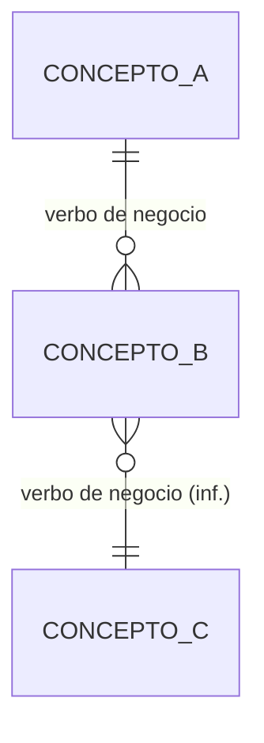

# IMD-NNN — Modelo de información conceptual de <producto o dominio>

> **Qué es y qué no es:** es un modelo **conceptual**. Muestra qué conceptos de negocio existen y cómo se relacionan. **No** es un modelo de datos: no define tablas, atributos técnicos, identificadores ni persistencia (eso corresponde a `data-model-designer`).
>
> **Procedencia:** <fuentes y su estado>. En los diagramas, las relaciones marcadas **(inf.)** son inferencias. El detalle de cada relación está en la sección 5.

## 1. Vista general

<Bloques de conceptos, en lenguaje de negocio, y la idea que los une.>

## 2. Diagrama — <bloque u horizonte>

**Conceptos derivados** (se calculan, no se registran):
- <Concepto derivado: cómo se calcula, fuente>

## 3. Diagrama — <otro bloque u horizonte, si hace falta>

<Otro diagrama con la misma convención. Indica qué conceptos son externos y en qué sistema viven.>

## 4. Conceptos

| Concepto | Nombre en diagrama | Qué es | Bloque | Glosario | Fuente | Horizonte |
|---|---|---|---|---|---|---|
| <Término del glosario> | <CONCEPTO_A> | <una frase en lenguaje de negocio> | <bloque> | <enlace a TRM-NNNN, o "Sin término" + pregunta> | <archivo:Lnn o BR-…> | <H1…> |

En "Nombre en diagrama" van uno o más nombres separados por coma. Un concepto derivado lleva `— (derivado)`.

## 5. Relaciones

Clasificación: **FACT** (lo dice la fuente), **INFERENCE** (deducción razonada desde fuentes citadas), **UNKNOWN** (necesario pero sin respaldo) y **RETIRADA** (ya no aplica, con motivo).

| ID | Relación | Cardinalidad | Clasificación | Fuente | Pregunta |
|---|---|---|---|---|---|
| R-01 | <Un A tiene B> | <1 : N, N : M, 0..1 : 1, UNKNOWN> | <FACT / INFERENCE / UNKNOWN, con el motivo si no es FACT> | <archivo:Lnn o BR-…> | <ID de la pregunta o —> |

## 6. Reglas que actúan sobre el modelo

| Regla | Sobre qué concepto | Qué impone |
|---|---|---|
| <BR-…> | <concepto> | <restricción en lenguaje de negocio> |

## 7. Preguntas abiertas del modelo

| ID | Pregunta | Afecta a | Responsable | Prioridad |
|---|---|---|---|---|
| IM-Q1 | <pregunta concreta> | <R-NN o concepto> | <rol> | Alta / Media / Baja |

## 8. Historial de cambios del modelo

| Fecha | Cambio | Relaciones o conceptos afectados | Fuente |
|---|---|---|---|
| <AAAA-MM-DD> | <alta, cambio o retiro> | <R-NN, concepto> | <fuente o decisión> |

## 9. Preparación y validación

- **Estado:** READY / CONDITIONAL / NOT READY para pasar a `data-model-designer`
- **Motivo:** <inferencias sin validar y preguntas que bloquean>
- **Validación por bloque:**
  - [ ] <Bloque> — <responsable> — <preguntas que debe responder>
- **Inferencias a aceptar o rechazar:** <R-NN, …>
