# LDM-001 — Modelo lógico de partes

- **Estado del gate (data-model-designer):** `REQUIRES_REVIEW`. Falta revisión humana; no hay `verified`. La ejecución de las pruebas está **PENDIENTE**: hay Docker (D28), pero Docker Desktop no está en marcha (ver [TST-001](tests/TST-001-pruebas-de-restricciones.md)).
- **Fuente:** [SPEC-001 §3, §4 y §6.1](../../requirement/specs/SPEC-001-gestion-de-colaboradores.md) y las reglas BR-PTY-01 a BR-PTY-20 de [BRC-001](../../business/rules/BRC-001-reglas-plataforma-gestion-formacion.md). Concepto: [IMD-002](../../business/information-model/IMD-002-modelo-conceptual-de-partes.md); cada entidad corresponde al concepto homónimo de SPEC-001 §3.
- **Modelo físico:** [PDM-001](PDM-001-modelo-fisico-de-partes.md). **Persistencia:** [ADR-003](../adrs/ADR-003-persistencia-mysql-y-postgresql.md).
- **Dueño de los datos:** el microservicio de partes (SPEC-001 §6.1, [ADR-001](../adrs/ADR-001-estructura-microui-angular-y-bff-nodejs.md)). El catálogo y la certificación referencian a la parte por su identificador; solo el BFF expone estos datos al frontend.

## 1. Alcance

**Incluye** las entidades de SPEC-001 §6.1: PARTY, PERSON, ORGANIZATION, PARTY_ROLE(_TYPE), PARTY_RELATIONSHIP(_TYPE), PARTY_IDENTIFICATION (con IDENTIFICATION_TYPE), CONTACT_MECHANISM, PARTY_CONTACT_MECHANISM, ROLE_LEVEL_ASSIGNMENT, ACCESS_IDENTITY, ANONYMIZATION_SETTING y ANONYMIZATION_NOTICE.

**No incluye** el catálogo de Rol-Nivel (lo posee otro servicio), la certificación, el registro de auditoría detallado (DM-Q-01), las pantallas ni el envío de correo (D19, D22).

## 2. Diagrama

```mermaid
erDiagram
    PARTY ||--o| PERSON : "es"
    PARTY ||--o| ORGANIZATION : "es"
    PARTY ||--o{ PARTY_ROLE : "participa como"
    PARTY_ROLE_TYPE ||--o{ PARTY_ROLE : "tipifica"
    PARTY_ROLE ||--o{ PARTY_RELATIONSHIP : "origen"
    PARTY_ROLE ||--o{ PARTY_RELATIONSHIP : "destino"
    PARTY_RELATIONSHIP_TYPE ||--o{ PARTY_RELATIONSHIP : "tipifica"
    PARTY ||--o{ PARTY_IDENTIFICATION : "se identifica con"
    IDENTIFICATION_TYPE ||--o{ PARTY_IDENTIFICATION : "tipifica"
    PARTY ||--o{ PARTY_CONTACT_MECHANISM : "usa"
    CONTACT_MECHANISM ||--o{ PARTY_CONTACT_MECHANISM : "se usa en"
    PERSON ||--o{ ROLE_LEVEL_ASSIGNMENT : "tiene asignado"
    PERSON ||--o| ACCESS_IDENTITY : "se vincula con"
    PERSON ||--o{ ANONYMIZATION_NOTICE : "motiva"
    PARTY_ROLE ||--o| ANONYMIZATION_NOTICE : "baja que inicia el plazo"
    ANONYMIZATION_NOTICE ||--o{ ANONYMIZATION_NOTICE_RECIPIENT : "se envía a"
    PERSON ||--o{ ANONYMIZATION_NOTICE_RECIPIENT : "Jefe de Ingeniería destinatario"
    CONTACT_MECHANISM ||--o{ ANONYMIZATION_NOTICE_RECIPIENT : "correo destino"

    PARTY {
        uuid party_id PK
        string party_kind "PERSON | ORGANIZATION"
    }
    PERSON {
        uuid party_id PK,FK
        uuid employee_code "GUID generado, único, no se reutiliza"
        string given_names "PII"
        string family_names "PII"
        string preferred_name "PII, opcional"
        timestamp anonymized_at
        string anonymized_by
    }
    ORGANIZATION {
        uuid party_id PK,FK
        string organization_name
    }
    PARTY_ROLE {
        uuid party_role_id PK
        uuid party_id FK
        string role_type_code FK
        date from_date
        date thru_date
        timestamp thru_recorded_at "registro de la baja"
    }
    PARTY_ROLE_TYPE {
        string code PK
        string applies_to_kind
    }
    PARTY_RELATIONSHIP {
        uuid party_relationship_id PK
        string relationship_type_code FK
        uuid from_party_role_id FK
        uuid to_party_role_id FK
        date from_date
        date thru_date
    }
    PARTY_RELATIONSHIP_TYPE {
        string code PK
    }
    PARTY_IDENTIFICATION {
        uuid party_identification_id PK
        uuid party_id FK
        string identification_type_code FK
        string identification_number "PII"
        string issuing_country_code
    }
    IDENTIFICATION_TYPE {
        string code PK
        string applies_to_kind
    }
    CONTACT_MECHANISM {
        uuid contact_mechanism_id PK
        string mechanism_type_code "EMAIL | PHONE | URL"
        string contact_value "PII"
    }
    PARTY_CONTACT_MECHANISM {
        uuid party_contact_mechanism_id PK
        uuid party_id FK
        uuid contact_mechanism_id FK
        string purpose_type_code "WORK_EMAIL | WORK_PHONE | PROFESSIONAL_PROFILE"
        string profile_platform_code "solo perfiles"
        date from_date
        date thru_date
    }
    ROLE_LEVEL_ASSIGNMENT {
        uuid role_level_assignment_id PK
        uuid person_party_id FK
        uuid catalog_role_id "ref. lógica al catálogo"
        uuid catalog_role_level_id "ref. lógica al catálogo"
        date from_date
        date thru_date
    }
    ACCESS_IDENTITY {
        uuid person_party_id PK,FK
        string keycloak_user_id "PII"
    }
    ANONYMIZATION_SETTING {
        int notice_after_days
    }
    ANONYMIZATION_NOTICE {
        uuid anonymization_notice_id PK
        uuid person_party_id FK
        uuid termination_party_role_id FK
        timestamp due_at
        string notice_status "PENDING | ATTENDED"
        string send_status "PENDING | SENT | FAILED | RETRYING | NOT_SENT"
        int send_attempts
    }
    ANONYMIZATION_NOTICE_RECIPIENT {
        uuid anonymization_notice_id PK,FK
        uuid recipient_party_id PK,FK
        uuid contact_mechanism_id PK,FK
    }
```

Los catálogos CONTACT_MECHANISM_TYPE, CONTACT_PURPOSE_TYPE y PROFILE_PLATFORM se omiten del diagrama; están en el [DDL](ddl/party-portable.sql).

## 3. Entidades

| Entidad | Qué guarda | Clave | Cardinalidades y reglas | Fuente |
|---|---|---|---|---|
| PARTY | Supertipo de Persona u Organización | `party_id` (UUID) | Exactamente un subtipo, fijado por `party_kind` (DM-03) | BR-PTY-02, D5 |
| PERSON | Individuo | `party_id` | Código obligatorio: un GUID que genera la aplicación al registrar a la persona (DM-12). Único entre **todas** las personas, anonimizadas incluidas: no se reutiliza. Campos mínimos (asr-BR-TRA-01) | BR-PTY-06, D9, D16, D25 |
| ORGANIZATION | COMSATEL, sus unidades y los proveedores; el tipo lo da su rol | `party_id` | Nombre obligatorio; el RUC va en PARTY_IDENTIFICATION | SPEC-001 §4, D10 |
| PARTY_ROLE / PARTY_ROLE_TYPE | Cómo participa una parte, con vigencia | `party_role_id` / `code` | Una parte tiene 0..n roles. El tipo solo aplica a su clase de parte | BR-PTY-02, BR-PTY-03, BR-PTY-13 |
| PARTY_RELATIONSHIP / _TYPE | Vínculo entre dos roles, con vigencia | `party_relationship_id` | Origen distinto de destino. Tipos: empleo, contratación, pertenencia, estructura, reporte. La relación de reporte (jefe directo) solo tiene como origen el rol de Empleado: un contratista no tiene jefe directo en COMSATEL | BR-PTY-04, BR-PTY-10, BR-PTY-19, D26 |
| PARTY_IDENTIFICATION / IDENTIFICATION_TYPE | Documento de la parte | `party_identification_id` | Única por tipo, número y país, sin contar anonimizadas. DNI, CE y pasaporte para personas; RUC para organizaciones | BR-PTY-07, D10 |
| CONTACT_MECHANISM | Correo, teléfono o URL | `contact_mechanism_id` | Una dirección de correo es un único medio, sin distinguir mayúsculas (DM-05) | BR-PTY-09, D8 |
| PARTY_CONTACT_MECHANISM | Uso del medio por una parte: propósito, plataforma y vigencia | `party_contact_mechanism_id` | Un correo laboral vigente pertenece a una sola parte. La plataforma es obligatoria solo en perfiles | BR-PTY-08, BR-PTY-09, D8, D13 |
| ROLE_LEVEL_ASSIGNMENT | Rol-Nivel del catálogo asignado a una persona | `role_level_assignment_id` | Una persona tiene 0..n asignaciones, con un solo nivel vigente por rol | BR-PTY-11, D5, D6 |
| ACCESS_IDENTITY | Identificador del usuario de Keycloak | `person_party_id` | 0..1 por persona; único | BR-PTY-16, D4 |
| ANONYMIZATION_SETTING | Plazo en días tras la baja | fila única (A-08) | Días > 0 | BR-PTY-15, D15, D17, D23 |
| ANONYMIZATION_NOTICE (+ _RECIPIENT) | Aviso de que una persona puede anonimizarse, sus destinatarios y el estado del envío | `anonymization_notice_id` | Un aviso por baja. Destinatarios: correos vigentes de todos los Jefes de Ingeniería vigentes | BR-PTY-15, D15, D18, D20 |

**Colaborador** no es una entidad: es una persona con un rol vigente de Empleado o de Contratista (BR-PTY-05, D7). Se obtiene con una consulta.

**Datos personales (PII):** `given_names`, `family_names`, `preferred_name`, `identification_number`, `contact_value` (de los medios de la persona) y `keycloak_user_id`. No son PII, a efectos de la anonimización: `employee_code` y las referencias de auditoría (D16).

## 4. Decisiones de diseño

Son propuestas del agente dentro del margen que deja SPEC-001. Requieren revisión.

| ID | Decisión | Por qué | Base |
|---|---|---|---|
| DM-01 | El valor anónimo de la PII es `NULL` | SPEC-001 §6.2 admite NULL o un marcador. NULL sale solo de los índices únicos en los dos motores | SPEC-001 §6.2 |
| DM-02 | PARTY_IDENTIFICATION, CONTACT_MECHANISM y ACCESS_IDENTITY llevan su propio `anonymized_at` | Un CHECK o un índice no puede consultar otra tabla. Así cada fila garantiza "anonimizada ⇔ sin PII" | BR-PTY-14 |
| DM-03 | `party_kind` en PARTY y claves foráneas compuestas (parte, clase) y (tipo, clase) | La base impide que una parte sea persona y organización a la vez, un DNI de organización o un rol de persona en una organización | BR-PTY-02, BR-PTY-03, BR-PTY-07 |
| DM-04 | En la base, "vigente" es `thru_date IS NULL` | Una columna generada o un índice parcial no puede usar la fecha actual. Una vigencia se cierra poniendo `thru_date` | D6, BR-PTY-12 |
| DM-05 | Una dirección de correo es un único CONTACT_MECHANISM; la unicidad del correo laboral vigente se aplica al uso (PARTY_CONTACT_MECHANISM) | Así "único entre vigentes" se resuelve en una sola tabla | BR-PTY-08 |
| DM-06 | Los tipos son tablas con clave natural (`code`) | Son ampliables y permiten CHECK por código (por ejemplo, la plataforma solo en perfiles) | SPEC-001 §6.1 |
| DM-07 | `catalog_role_id` y `catalog_role_level_id` son referencias lógicas, sin clave foránea física | El catálogo es de otro servicio (ADR-001). Se guarda el rol además del nivel para aplicar "un nivel vigente por rol" | SPEC-001 §6.2, D5 |
| DM-08 | PARTY_ROLE guarda `thru_recorded_at` y `thru_recorded_by` | D17 cuenta el plazo desde que se **registra** la baja, que puede no coincidir con `thru_date` | D17, BR-PTY-12 |
| DM-09 | Un aviso por baja (único por `termination_party_role_id`) y destinatarios en tabla hija | D18 y D20 piden varios destinatarios; evita avisos duplicados del proceso programado | D18, D20 |
| DM-10 | Las columnas de auditoría (`created_by`, `updated_by`, `anonymized_by`…) guardan el identificador del actor, sin clave foránea | Deben sobrevivir a la anonimización (D16) y admitir actores técnicos (`bootstrap`, proceso programado) | D16, BR-PTY-12 |
| DM-11 | Las vigencias son `DATE` | SPEC-001 habla de fechas desde y hasta | SPEC-001 §3 |
| DM-12 | El código de colaborador es un GUID que genera el microservicio de partes (aplicación) al registrar la persona, con el mismo formato que los demás UUID (`CHAR(36)`). La base no lo genera ni valida su formato; garantiza que sea obligatorio y único entre todas las personas | Igual que los demás identificadores (PDM-001 §2), el GUID es portable entre MySQL y PostgreSQL. Como nunca se reutiliza, la unicidad puede incluir a los anonimizados (resuelve DM-Q-02) | D25, BR-PTY-06 |

## 5. Restricciones y dónde se aplican

| Regla | Restricción | Dónde |
|---|---|---|
| BR-PTY-02 | Toda parte es exactamente Persona u Organización | Base: `party_kind` + FK compuesta (DM-03) |
| BR-PTY-03 | El tipo de rol corresponde a la clase de parte | Base: FK (tipo, clase) |
| BR-PTY-04 | Tipos de relación | Base: catálogo. Qué pares de roles admite cada tipo: aplicación (A-10) |
| BR-PTY-05 | Colaborador derivado | Consulta |
| BR-PTY-06 | Código obligatorio y único; GUID generado | Base: NOT NULL + UNIQUE simple (incluye anonimizados). Generación del GUID: aplicación (DM-12) |
| BR-PTY-07 | Tipos aceptados; única por tipo, número y país | Base: FK (tipo, clase) + UNIQUE |
| BR-PTY-08 | Correo laboral único entre vigentes | Base: unicidad condicional. Obligatorio para colaboradores y dominio según D13: aplicación |
| BR-PTY-09 | Medios y plataformas; plataforma solo en perfiles | Base: catálogos, FK (propósito, tipo de medio), CHECK |
| BR-PTY-10 | Contratista con contratación vigente | Aplicación (existencia entre filas) |
| BR-PTY-11 | Un nivel vigente por rol | Base: unicidad condicional |
| BR-PTY-12 | Sin sobrescribir ni borrar; auditoría | Base: columnas de auditoría. Prohibir DELETE: permisos de la cuenta de la aplicación (PDM-001 §6). Historial de cambios: DM-Q-01 |
| BR-PTY-13 | La baja cierra el rol | Base: CHECK de coherencia de `thru_*`. Proceso: aplicación |
| BR-PTY-14 | PII anonimizada, irreversible, unicidades sin anonimizadas | Base: CHECK "anonimizada ⇔ sin PII" y unicidades condicionales. Irreversibilidad, "no editar" y "solo tras la baja": aplicación |
| BR-PTY-15 | Aviso al vencer el plazo | Base: ANONYMIZATION_SETTING/NOTICE y CHECK de estados. Envío: aplicación (D19, D22) |
| BR-PTY-16 | 0..1 identificador de Keycloak | Base: PK = persona, UNIQUE |
| BR-PTY-17 | Quién edita qué | Aplicación y BFF |
| BR-PTY-18 | Aviso ante un segundo Jefe de Ingeniería | Aplicación; la base lo permite a propósito |
| BR-PTY-19 | Un contratista no tiene jefe directo: la relación de reporte solo parte de un rol de Empleado | Aplicación, al registrar la relación (como A-10). La base no puede comprobar el tipo del rol de origen sin repetirlo en PARTY_RELATIONSHIP; se puede reconsiderar si el arquitecto lo pide |
| BR-PTY-20 | Datos de las personas visibles para cualquier colaborador (alcance en P-52) | Aplicación y BFF; no afecta al esquema |

## 6. Supuestos

| ID | Supuesto | Por confirmar con |
|---|---|---|
| A-01 | Toda PERSON registrada tiene código de colaborador (el alta crea la persona con su código, SPEC-001 §4), por eso `employee_code` es NOT NULL | Jefe de Ingeniería |
| A-02 | Cambiar un nivel o un contacto el mismo día se registra con `thru_date` = `from_date` de la nueva vigencia | Jefe de Ingeniería |
| A-03 | La aplicación impide vigencias históricas solapadas; la base solo protege la vigencia abierta (DM-Q-06) | Arquitecto |
| A-04 | El país emisor se codifica con ISO 3166-1 alfa-2 | Jefe de Ingeniería |
| A-05 | Longitudes: nombres 100, número de documento 20, medio de contacto 500 caracteres. El código mide 36 (GUID, D25) | Jefe de Ingeniería |
| A-06 | Un medio de contacto puede reutilizarse entre partes (por ejemplo, un correo reasignado). Al anonimizar un medio compartido, se desvincula (PDM-001 §5) | Arquitecto |
| A-07 | El identificador de Keycloak cabe en 255 caracteres | Arquitecto |
| A-08 | Hay un solo plazo, en días, para toda la organización | Jefe de Ingeniería |
| A-09 | Estados del envío: PENDING, SENT, FAILED, RETRYING, NOT_SENT (este último, sin destinatarios; SPEC-001 §4) | Jefe de Ingeniería |
| A-10 | Qué pares de roles admite cada tipo de relación lo valida la aplicación | Arquitecto |

## 7. Preguntas abiertas

| ID | Pregunta | Responsable | Impacto |
|---|---|---|---|
| Q-01 | Formato y generación del código de colaborador (de SPEC-001) | Jefe de Ingeniería | **Respondida (D25):** GUID generado automáticamente. `employee_code` pasa a `CHAR(36)` con UNIQUE simple (DM-12) |
| Q-02 | ¿Un contratista tiene jefe directo en COMSATEL? (de SPEC-001) | Jefe de Ingeniería | **Respondida (D26):** no. Validación en la aplicación (BR-PTY-19, §5) |
| Q-05 | Quién ve los datos de otras personas (de SPEC-001, P-08) | Responsable de producto | **Respondida (D27):** cualquier colaborador (data abierta, BR-PTY-20). Sin cambio de esquema. El alcance (identificaciones, teléfono, anonimizados) sigue abierto en P-52 |
| Q-06 | Medio para ejecutar MySQL 8 y PostgreSQL (de SPEC-001) | Jefe de Ingeniería | **Respondida (D28):** Docker. La ejecución de TST-001 sigue pendiente mientras Docker Desktop no esté en marcha |
| Q-07 | Verificar la correspondencia con el UDM (Silverston) (de SPEC-001) | Arquitecto | **Respondida (D29):** no es necesario |
| Q-08 | Versión mínima de PostgreSQL (de SPEC-001) | Arquitecto | **Respondida (D30):** la versión estable más reciente. Las pruebas usan `postgres:latest` y registran la versión al ejecutar |
| DM-Q-01 | ¿Hace falta un historial de cambios campo a campo, además de las columnas de auditoría? BR-PTY-12 pide "quién cambió qué y cuándo" | Arquitecto + Jefe de Ingeniería | Tabla o servicio de auditoría |
| DM-Q-02 | BR-PTY-14 excluye a los anonimizados de la unicidad del código, pero D16 conserva el código para mostrar quién certificó. Si se reutiliza un código, dos personas lo comparten. ¿Se permite reutilizar códigos? | Jefe de Ingeniería | **Resuelta por D25:** el código es un GUID generado, que nunca se reutiliza. El conflicto con D16 desaparece: `employee_code` tiene un UNIQUE simple que incluye a los anonimizados (DM-12; prueba T05.7) |
| DM-Q-03 | ¿Distinguir mayúsculas y acentos en el código y en el número de documento? MySQL (`utf8mb4_0900_ai_ci`) no los distingue; PostgreSQL sí | Arquitecto | Resultado de la unicidad distinto por motor |
| DM-Q-04 | ¿`TIMESTAMP` o `TIMESTAMPTZ` en PostgreSQL? SPEC-001 fija `TIMESTAMP` en UTC | Arquitecto | Riesgo de guardar horas locales |
| DM-Q-05 | ¿UUID como `CHAR(36)` o `BINARY(16)`/`uuid` nativo? SPEC-001 deja la opción abierta | Arquitecto | Tamaño de índices |
| DM-Q-06 | ¿Se impiden en la base las vigencias solapadas (por ejemplo, con `EXCLUDE` en PostgreSQL, sin equivalente en MySQL)? | Arquitecto | Integridad del historial |
| DM-Q-07 | ¿Una persona puede tener más de un correo laboral vigente? | Jefe de Ingeniería | Unicidad adicional por persona |

## 8. Siguiente paso

Revisión humana de LDM-001 y PDM-001 y ejecución de [TST-001](tests/TST-001-pruebas-de-restricciones.md) cuando Docker Desktop esté en marcha (D28). Hasta entonces el estado es `REQUIRES_REVIEW` y no se prepara el handoff a desarrollo.
