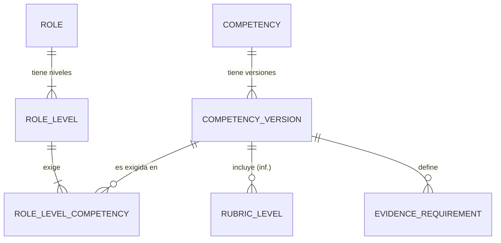

# LDM-002 — Modelo de datos del catálogo

- **Estado del gate (data-model-designer):** `REQUIRES_REVIEW`. Sin revisión humana; no hay `verified`.
- **Alcance (DSP-001):** roles, Rol-Nivel, competencias con versiones, rúbrica, requisitos de evidencia. **Fuera:** certificación, requerimientos, cursos, la asignación a personas (queda en party, [LDM-001](LDM-001-modelo-logico-de-partes.md) DM-07, con referencias lógicas a este catálogo).
- **Dueño de los datos:** el catalog-service, un servicio aparte de party (ADR-001; LDM-001 §1). Aún no existe; la decisión de crearlo y su stack van en un ADR (siguiente paso).
- **Modelo físico:** [ddl/catalog-postgresql.sql](ddl/catalog-postgresql.sql). Probado el 2026-10-03 en una base temporal del PostgreSQL del compose: 7 tablas se crean y 8 de 8 casos que deben fallar fallan y 3 de 3 que deben pasar pasan (sección 7). **No** hay variante MySQL: ADR-007 consolidó el desarrollo en PostgreSQL; ADR-003 la mantiene como opción pendiente.

## 1. Diagrama

## 2. Entidades

| Entidad (tabla) | Qué guarda | Clave | IMD / reglas |
|---|---|---|---|
| COMPETENCY (`tb_competency`) | La competencia, única en el catálogo, con estado `ACTIVE`/`INACTIVE` (no se elimina) | `pk_competency_id` | BR-CAT-07, BR-CAT-25 |
| COMPETENCY_VERSION | Una versión: DRAFT, APPROVED o DEPRECATED; quién y cuándo la aprobó | `pk_competency_version_id`; único (competencia, nº de versión) | R-44, BR-CAT-22, EVD-2026-0143/0144 |
| COMPETENCY_RUBRIC_LEVEL | Comportamiento y logro verificable de cada nivel L1–L4 de una versión | (versión, nivel) | R-45 (inferencia), BR-CAT-15/19 |
| EVIDENCE_REQUIREMENT | Requisito de evidencia por versión y nivel: categoría, descripción, requerido o deseado, curso opcional | `pk_evidence_requirement_id` | R-04, R-21, BR-ACR-07/08/12/17 |
| ROLE | Rol común a todos los productos; no se versiona | `pk_role_id` | BR-CAT-08/12, R-23 |
| ROLE_LEVEL | Nivel de rol: nombre y orden propios de cada rol | `pk_role_level_id`; único (rol, orden) y (rol, nombre) | BR-CAT-09, R-23 |
| ROLE_LEVEL_COMPETENCY | Competencia que exige un Rol-Nivel, con su nivel L esperado y la **versión** de la competencia | (Rol-Nivel, competencia) | R-24, R-46, BR-CAT-14/21 |

## 3. Decisiones de diseño

Son propuestas del agente dentro del margen de las fuentes. Requieren revisión.

| ID | Decisión | Por qué | Base |
|---|---|---|---|
| CM-01 | Las mismas convenciones de PDM-001: `tb_*`, `CHAR(36)` generado por el servicio, auditoría sin FK, vigencia como estado | Un solo estilo entre servicios | LDM-001 DM-04, DM-10, DM-12 |
| CM-02 | **Rol-Nivel apunta a una versión de competencia** y repite la competencia en la fila; FK compuesta (competencia, versión) | R-46: una versión nueva no altera las relaciones vigentes. La FK compuesta impide poner la versión de otra competencia y fija «una vez por Rol-Nivel» con la clave primaria | EVD-2026-0143, BR-CAT-21 |
| CM-03 | «Versión vigente» de una competencia = la APPROVED de mayor número; no se guarda una marca | Evita dos fuentes de verdad. La advertencia de «versión anterior referenciada» se calcula comparando la versión referida con la vigente | EVD-2026-0143 |
| CM-04 | A lo sumo un DRAFT por competencia (índice parcial único) | Evita ediciones paralelas de la misma competencia. **Supuesto del agente** | — |
| CM-05 | Aprobar exige `approved_by` y `approved_at` (CHECK); el estado `DEPRECATED` conserva ambos | Trazabilidad de quién aprobó | EVD-2026-0144 |
| CM-06 | La rúbrica no es una entidad propia: una fila por nivel L1–L4 de la versión | R-45 es inferencia (1 : 0..1); así se guarda con la versión sin imponer que estén los cuatro niveles (definición progresiva, BR-CAT-17) | R-45, BR-CAT-17 |
| CM-07 | Las tres categorías de evidencia son un CHECK: `FORMACION`, `PRACTICA_EVALUADA`, `DESEMPENO_PROYECTO` | BR-ACR-08 las fija; un CHECK basta mientras no cambien | BR-ACR-08 |
| CM-08 | `course_ref` es una referencia lógica sin FK, solo con categoría `FORMACION` | El curso pertenece a otro dominio; R-21 es 0..1 | R-21, ADR-001 |
| CM-09 | `row_version` en las tablas que se editan para concurrencia optimista | Dos jefes pueden editar el mismo rol; la segunda escritura debe fallar | — |
| CM-10 | Nombres únicos sin distinguir mayúsculas para competencias y roles | BR-CAT-07 dice que cada competencia existe una vez; para roles es **supuesto** | BR-CAT-07 |
| CM-11 | Sin borrado físico de versiones; un rol o nivel con asignaciones se desactiva | Las certificaciones y asignaciones lo referencian | EVD-2026-0143 |

## 4. Referencias desde otros servicios

Party guarda `catalog_role_id` y `catalog_role_level_id` sin FK (LDM-001 DM-07). Con este modelo son `pk_role_id` y `pk_role_level_id`. Certificación y requerimientos referenciarán la **versión** (`pk_competency_version_id`), nunca la competencia suelta (R-46).

## 5. Restricciones y dónde se aplican

| ID | Restricción | Dónde | Regla |
|---|---|---|---|
| — | Nivel L1–L4, categorías, estados, nombres no vacíos, unicidades, una vez por Rol-Nivel, versión de la competencia correcta, un DRAFT por competencia | **Base** (DDL, probado) | BR-CAT-02/07/21, BR-ACR-08 |
| CHK-A | Un rol tiene al menos un Rol-Nivel y cada Rol-Nivel al menos una competencia | Servicio (mínimo de cardinalidad; la base no lo puede) | BR-CAT-20 |
| CHK-B | No se exige un nivel L sin requisitos de evidencia definidos, y al menos uno debe ser «requerido» | Servicio, al guardar el Rol-Nivel y al aprobar la versión | BR-ACR-13 (confirmada, EVD-2026-0149) |
| CHK-C | Solo se aprueba una versión con quien tiene rol Jefe de Ingeniería o ADMIN; las rúbricas las aprueba el Jefe de Ingeniería | Servicio (autorización) | EVD-2026-0144, BR-CAT-19 |
| CHK-D | Editan roles el Jefe de Ingeniería y el Responsable de producto, sin límite por producto | Servicio (autorización) | BR-CAT-04/05, EVD-2026-0147/0150 |

## 6. Transacciones, concurrencia y operación

- **Aprobar una versión:** una transacción: pasa el DRAFT a APPROVED y, si hay otra APPROVED vigente, la pasa a DEPRECATED (decisión del 2026-10-03, DM-Q-02, BR-CAT-24). Solo se aprueba desde DRAFT. Con `row_version` en la competencia, dos aprobaciones simultáneas no se pisan.
- **Alta de un rol:** rol, niveles y competencias en una sola transacción (CHK-A exige el conjunto completo).
- **Índices:** los únicos de la sección 2 y `ix_evidence_by_version_level`, `ix_rlc_by_version` para «dónde se usa esta versión» (la advertencia de versión anterior).
- **Datos sensibles:** ninguno; no hay datos personales en el catálogo. **Retención:** indefinida (CM-11). **Multi-inquilino:** no aplica. **Copia y restauración:** las del PostgreSQL común (ADR-007).
- **Despliegue:** el servicio nuevo trae su propia migración (Alembic, como party); revertir es eliminar las 7 tablas, sin dependencias entrantes mientras nadie las referencie.

## 7. Verificación

Ejecutado en el PostgreSQL del compose (base temporal, eliminada después):

| Caso | Esperado | Resultado |
|---|---|---|
| Competencia duplicada por mayúsculas y espacios | falla | falla (`ux_competency_name`) |
| Segundo DRAFT de la misma competencia | falla | falla (`ux_competency_one_draft`) |
| APPROVED sin aprobador | falla | falla (`ck_competency_version_approval`) |
| Nuevo DRAFT tras aprobar la versión 1 | pasa | pasa |
| Competencia en un Rol-Nivel | pasa | pasa |
| La misma competencia, otra versión, en el mismo Rol-Nivel | falla | falla (clave primaria) |
| Versión de otra competencia | falla | falla (`fk_rlc_version_pair`) |
| Nivel L5 | falla | falla (`ck_rlc_level`) |
| Curso en una categoría distinta de formación | falla | falla (`ck_evidence_course`) |
| Curso en formación | pasa | pasa |
| Dos Rol-Nivel con el mismo orden | falla | falla (`ux_role_level_ordinal`) |
| Competencia con estado fuera de ACTIVE/INACTIVE | falla | falla (`ck_competency_status`) |
| Competencia nueva sin indicar estado | queda ACTIVE | queda ACTIVE (comprobado el 2026-10-03 en PostgreSQL 15 temporal) |
| Rol con estado `'active'` en minúsculas | falla | falla (`ck_role_status`; comprobado en PostgreSQL 15 temporal) |
| Desactivar una competencia | pasa | pasa |

No se probaron CHK-A a CHK-D (son del servicio, que no existe) ni la carga.

## 8. Preguntas abiertas

| ID | Respuesta (ianache, 2026-10-03) | Regla |
|---|---|---|
| DM-Q-01 | La versión incluye la rúbrica y los requisitos de evidencia. R-45 pasa de inferencia a hecho. | BR-CAT-23 |
| DM-Q-02 | La versión anterior pasa a DEPRECATED. No se aprueba sin pasar por DRAFT, para asegurar revisión y control. | BR-CAT-24 |
| DM-Q-03 | Solo se desactiva; no hay eliminaciones. Las competencias tienen estado ACTIVE o INACTIVE. | BR-CAT-25 |
| DM-Q-04 | Es correcto el rol ADMIN añadido en ADR-006: es una nueva decisión. | BR-CAT-26 |
| DM-Q-05 | Los requisitos de evidencia se versionan con la competencia. | BR-CAT-23 |
| DM-Q-06 | Todos los estados se escriben en mayúsculas. `tb_role.status` pasa a `'ACTIVE'`/`'INACTIVE'` (aplicado en el DDL). | BR-CAT-27 |
| DM-Q-07 | Una competencia INACTIVE se puede reactivar; los Rol-Nivel que ya la usan la conservan y uno nuevo puede usarla. | BR-CAT-28 |
| DM-Q-08 | Un Rol-Nivel nuevo solo puede usar una competencia después de reactivarla. Reactivan los mismos que desactivan (Jefe de Ingeniería y ADMIN). | BR-CAT-28, 29 |

**Efecto en el modelo (aplicado el 2026-10-03):** `tb_competency` tiene la columna `status` (`ACTIVE`/`INACTIVE`, por defecto `ACTIVE`, `ck_competency_status`) en `ddl/catalog-postgresql.sql`; «aprobar solo desde DRAFT» es una regla entre filas y la aplica el servicio. `tb_role.status` pasa también a `'ACTIVE'`/`'INACTIVE'` (BR-CAT-27, DM-Q-06). Un Rol-Nivel que ya usa una competencia la conserva al desactivarla y al reactivarla, y uno nuevo solo puede usarla si está `ACTIVE` (DM-Q-07, DM-Q-08); esa comprobación es del servicio, no del DDL, porque cruza `tb_role_level_competency` y `tb_competency`.

## 9. Siguiente paso

1. ADR del catalog-service (stack, esquema propio en la misma instancia PostgreSQL, relación con party y el BFF).
2. API-SPEC del catálogo (`api-designer`), con CHK-A a CHK-D como reglas de negocio de los endpoints.
3. Revisión humana de este modelo. DM-Q-01 a DM-Q-05 respondidas el 2026-10-03; falta reflejar el estado ACTIVE/INACTIVE de la competencia en el DDL.
