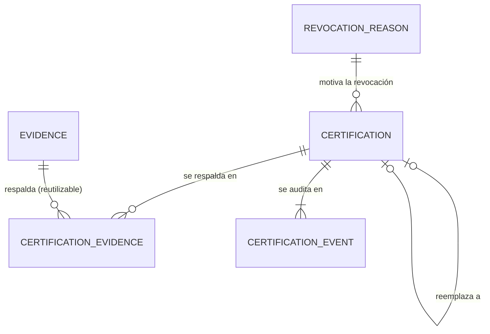

# LDM-003 — Modelo de datos de certificaciones

- **Estado del gate (data-model-designer):** `REQUIRES_REVIEW`. Sin revisión humana; no hay `verified`.
- **Alcance (DSP-002):** certificaciones de nivel L1–L4, evidencias, la calificación de cada evidencia, motivos de revocación y el registro de auditoría. **Fuera:** la pantalla de perfil (US-004, es una lectura de este modelo), certificados de curso, propuestas de la IA (H3) y la lectura de GitLab.
- **Dueño de los datos:** el certification-service ([ADR-013](../adrs/ADR-013-certification-service-como-microservicio-propio.md), aceptado). Aún no existe.
- **Modelo físico:** [ddl/certification-postgresql.sql](ddl/certification-postgresql.sql). Probado el 2026-10-04 en una base temporal del PostgreSQL del compose: 33 casos, 19 que deben fallar (fallan) y 14 que deben pasar (pasan) (§7). Una primera versión de este documento dijo «25 casos» por error: eran 27 (17 + 10); con la evaluación no aprobada son 33. Se repitió tras pasar las columnas de actor a `CHAR(36)` (CE-14) con el mismo resultado. Sin variante MySQL (ADR-007).

## 1. Diagrama



Las personas, competencias, versiones y requisitos son referencias lógicas a party y al catálogo (sin clave foránea, ADR-013).

## 2. Entidades

| Entidad (tabla) | Qué guarda | Fuente |
|---|---|---|
| CERTIFICATION (`tb_certification`) | El nivel L1–L4 certificado a una persona en una competencia, con la versión de la competencia, el evaluador y el estado ACTIVE, REPLACED o REVOKED | US-003, IMD-001 R-05, R-06, R-46 |
| EVIDENCE (`tb_evidence`) | La evidencia: entidad propia y reutilizable; categoría, descripción, URL opcional y curso opcional | EVD-2026-0204, 0211, 0213 |
| CERTIFICATION_EVIDENCE (`tb_certification_evidence`) | Vínculo muchos a muchos: qué requisito intenta cumplir la pieza, si era requerido o deseado al certificar y la calificación CUMPLE o NO_CUMPLE | R-07, R-20, EVD-2026-0205, 0210, 0214 |
| CERTIFICATION_EVENT (`tb_certification_event`) | Registro de auditoría de solo inserción: certificada, reemplazada, revocada, con actor y fecha; en la revocación, motivo y descripción | BR-ACR-03, EVD-2026-0194 |
| REVOCATION_REASON (`tb_revocation_reason`) | Catálogo ampliable de motivos: `ERROR_DE_REGISTRO`, `EVIDENCIA_INVALIDA`, `REQUISITOS_NO_CUMPLIDOS`, `OTRO` | EVD-2026-0195, 0197, 0200 |
| `vw_current_certified_level` | Vista: el nivel certificado vigente por persona y competencia, el más alto de las vigentes | EVD-2026-0186 |

## 3. Decisiones de diseño

Propuestas del agente dentro del margen de las decisiones. Requieren revisión.

| ID | Decisión | Por qué | Base |
|---|---|---|---|
| CE-01 | Convenciones de PDM-001 y LDM-002: `tb_*`, ids `CHAR(36)` del servicio, estados en mayúsculas, auditoría sin FK | Un solo estilo entre servicios | LDM-001, LDM-002, BR-CAT-27 |
| CE-02 | La evidencia es una tabla propia y se vincula a la certificación por una tabla de unión con el requisito | Una evidencia respalda varias competencias o niveles (R-20 y R-07 N:M) | EVD-2026-0204, 0213 |
| CE-03 | Estados `ACTIVE`, `REPLACED`, `REVOKED` y `NOT_APPROVED`; los tres últimos son finales y no se modifican; no se borra nada | Una certificación se revoca o se recertifica y no se borra | BR-ACR-15, EVD-2026-0185 |
| CE-04 | Recertificar = en una transacción, la anterior pasa a REPLACED apuntando a la nueva y se inserta la nueva; la clave foránea es diferida | Crea una certificación nueva del mismo nivel que reemplaza la anterior | EVD-2026-0192 |
| CE-05 | El nivel vigente no se guarda: es el más alto de las certificaciones ACTIVE (vista) | Evita dos fuentes de verdad | EVD-2026-0186 |
| CE-06 | Un disparador impide insertar una certificación vigente de nivel inferior a una vigente | No se certifica un nivel inferior | EVD-2026-0187 |
| CE-07 | El registro de auditoría lo escribe un disparador en cada transición y no se puede modificar ni borrar | La auditoría debe existir aunque falle el servicio | EVD-2026-0194, BR-ACR-03 |
| CE-08 | La revocación exige motivo tipificado (FK al catálogo) y descripción de 10 a 1000 caracteres, por restricción | Reglas de la revocación | EVD-2026-0194, 0196, 0201 |
| CE-09 | Cada vínculo guarda `requirement_is_required` (instantánea de si era requerido o deseado) | Permite decidir después cómo «refuerza» una deseada sin cambiar las tablas | EVD-2026-0205 |
| CE-10 | La calificación es por vínculo evidencia–requisito: `CUMPLE` o `NO_CUMPLE` | El evaluador califica cada pieza | EVD-2026-0210, 0214 |
| CE-11 | La certificación guarda la versión de la competencia vigente al certificar | Una versión nueva no altera lo vigente | IMD-001 R-46, EVD-2026-0143 |
| CE-12 | La URL de la evidencia solo admite `http` o `https`; GitLab y otros orígenes son solo URL | Las evidencias de GitLab son referencias | EVD-2026-0211 |
| CE-13 | Quién ve qué (por ejemplo, la descripción de la revocación solo para la persona certificada, los evaluadores, el Jefe de Ingeniería y ADMIN) **no se aplica en la base**: lo filtra la API | La visibilidad por rol es de la capa de servicio | BR-TRA-07, EVD-2026-0206, 0209 |
| CE-14 | Las columnas de actor de las cuatro tablas de certificación son `CHAR(36)` (código de party), no el nombre de usuario | EVD-2026-0222 decide que el actor de la auditoría es el código de party; el catálogo de motivos conserva `VARCHAR(100)` por su siembra técnica | EVD-2026-0222, BR-ACR-23 |
| CE-15 | La evaluación no aprobada se guarda como una fila de `tb_certification` con estado `NOT_APPROVED` (final), con sus calificaciones y su evento `NOT_APPROVED`; no entra en el índice de vigentes ni en el nivel vigente. En ella `certified_by` y `certified_at` son el evaluador y la fecha de la evaluación | EVD-2026-0224: se registra la evaluación no aprobada. Se reutiliza la tabla para no duplicar calificaciones y auditoría | EVD-2026-0224, BR-ACR-24 |

## 4. Transiciones de una certificación

```
ACTIVE ──(recertificar)──▶ REPLACED   (apunta a la certificación nueva)
ACTIVE ──(revocar)───────▶ REVOKED    (motivo tipificado + descripción)
NOT_APPROVED (evaluación no aprobada): se inserta ya en ese estado
REPLACED, REVOKED y NOT_APPROVED: finales
```

## 5. Restricciones y dónde se aplican

| ID | Restricción | Dónde | Regla |
|---|---|---|---|
| — | Nivel L1–L4, estados, coherencia de datos por estado, una vigente por persona-competencia-nivel, no certificar nivel inferior, estados finales, auditoría inmutable, motivo existente, descripción de 10 a 1000, URL válida, curso solo en FORMACION, calificación válida, vínculo único | **Base** (DDL, probado) | EVD-2026-0187, 0194, 0201, 0211 |
| CHK-A | Cada requisito **requerido** del nivel tiene al menos una pieza calificada CUMPLE; no hay equivalencias | Servicio (necesita el catálogo) | BR-ACR-09, 12, 18, EVD-2026-0202, 0208 |
| CHK-B | Solo certifica quien tiene el rol `evaluador`; cualquier usuario con él puede certificar a cualquier colaborador | Servicio (autorización) | BR-ACR-02, EVD-2026-0199, 0200 |
| CHK-C | Solo revocan el Jefe de Ingeniería o ADMIN; el motivo debe estar `ACTIVE` | Servicio | EVD-2026-0191, 0197 |
| CHK-D | La versión de la competencia está aprobada y el nivel tiene requisitos definidos, con al menos uno requerido | Servicio (necesita el catálogo) | BR-ACR-13, EVD-2026-0149 |
| CHK-E | Dos certificaciones simultáneas de la misma persona y competencia no se pisan | Servicio: bloqueo por persona y competencia | CE-06 (el disparador no es serializable) |
| CHK-F | La evidencia pertenece a la persona certificada | Servicio | R-20, EVD-2026-0215 |
| CHK-G | Visibilidad por rol de la descripción de la revocación | Servicio (API) | BR-TRA-07 |
| CHK-H | La evidencia la registra el propio colaborador certificado (EVD-2026-0215) | Servicio | BR-ACR-20 |
| CHK-I | Recertificar exige evidencias nuevas, que no respaldaron la certificación que se reemplaza (EVD-2026-0216, 0220); se aplica «al menos una» (EVD-2026-0220 no precisa si basta una) | Servicio | BR-ACR-21 |
| CHK-K | El servicio traduce el usuario de Keycloak (el que llega en `X-User-Name`) a su código de party mediante el vínculo de identidad de US-022 y rechaza al usuario que no lo tiene (DM-Q-07) | Servicio / BFF | BR-ACR-23, US-022 |
| CHK-J | La persona certificada es un colaborador vigente y no está anonimizada (EVD-2026-0217, 0218): se consulta a party, o lo orquesta el BFF como en API-SPEC-004 | Servicio / BFF | BR-ACR-22, BR-TRA-08 |

## 6. Transacciones, concurrencia y operación

- **Certificar:** certificación, evidencias nuevas y vínculos en una transacción.
- **Recertificar:** una transacción: la anterior pasa a REPLACED y se inserta la nueva (CE-04). Si falla el INSERT, la anterior sigue vigente (probado T13).
- **Concurrencia:** `row_version` en la certificación; el índice único parcial impide dos vigentes del mismo nivel. **Riesgo:** dos inserciones simultáneas de niveles distintos podrían dejar vigentes un nivel inferior y uno superior si ninguna ve a la otra; por eso CHK-E exige un bloqueo en el servicio.
- **Índices:** los únicos y los de apoyo de la §2; `ix_cert_by_person_competency` sirve a la vista y a US-004.
- **Datos sensibles:** la descripción de una revocación puede contener información delicada sobre una persona (se restringe en la API, CE-13). La descripción de una evidencia puede incluir datos personales (DM-Q-05).
- **Retención:** indefinida; no hay borrado. Si la persona se anonimiza, sus evidencias no se anonimizan y sus certificaciones solo las ve ADMIN (EVD-2026-0218, BR-TRA-08): el bloqueo es de la API, no de la base. Las evidencias de una certificación revocada siguen disponibles (EVD-2026-0219).
- **Despliegue:** migración propia (Alembic) del servicio nuevo; revertir es eliminar las tablas, la vista, las funciones y los disparadores, sin dependencias entrantes mientras nadie los referencie.

## 7. Verificación

Ejecutado en el PostgreSQL del compose, en una base temporal que se eliminó después:

| Caso | Esperado | Resultado |
|---|---|---|
| Motivos sembrados (4) | 4 | 4 |
| Certificar L2 genera el evento CERTIFIED | 1 | 1 |
| Segunda vigente del mismo nivel | falla | falla (`ux_cert_active_level`) |
| Nivel inferior teniendo uno superior vigente | falla | falla (disparador) |
| Nivel superior; la vista devuelve L3 | pasa | pasa |
| Revocar sin motivo ni descripción | falla | falla (`ck_cert_state_data`) |
| Descripción de 9 caracteres | falla | falla (`ck_cert_revoke_description`) |
| Motivo inexistente | falla | falla (`fk_cert_revoke_reason`) |
| Revocar bien: evento REVOKED con motivo; la vista vuelve a L2 | pasa | pasa |
| Descripción de más de 1000 caracteres | falla | falla (tipo `VARCHAR(1000)`) |
| REVOKED vuelve a ACTIVE | falla | falla (disparador) |
| Recertificar en una transacción; evento REPLACED con el actor | pasa | pasa |
| REPLACED sin certificación que la reemplace | falla | falla (`ck_cert_state_data`) |
| Reemplazo por una certificación inexistente | falla al confirmar | falla (`fk_cert_replaced_by`) |
| Modificar el nivel de una certificación | falla | falla (disparador) |
| Evidencia con URL no http, o con curso fuera de FORMACION | falla | falla |
| Evidencia GitLab con URL válida | pasa | pasa |
| Una misma evidencia respalda dos certificaciones | pasa | pasa |
| Vínculo repetido; calificación inválida | falla | falla |
| Modificar o borrar el registro de auditoría | falla | falla (disparador) |
| Motivo en minúsculas | falla | falla (`ck_revocation_reason_code`) |
| Motivo nuevo en mayúsculas (ampliable) | pasa | pasa |
| Otra persona certificada en L1 de la misma competencia | pasa | pasa |

Evaluación no aprobada (2026-10-04): un L3 `NOT_APPROVED` con un L2 vigente pasa y genera el evento `NOT_APPROVED`; el nivel vigente sigue en L2; otra evaluación no aprobada del mismo nivel pasa; revocarla falla (estado final); `NOT_APPROVED` con datos de revocación falla; sus calificaciones se guardan.

No se probaron CHK-A a CHK-G (son del servicio, que no existe), la carga ni dos transacciones simultáneas reales.

## 8. Preguntas abiertas

| ID | Pregunta | Responsable | Bloquea |
|---|---|---|---|
| ~~DM-Q-01~~ | ~~¿Quién registra una evidencia: el colaborador, el evaluador o ambos? En H1 un evaluador puede registrar a mano evidencia de GitLab (RCP-Q2, abierta)~~ **Respondida (ianache, 2026-10-04):** las registra el colaborador (EVD-2026-0215). | Jefe de Ingeniería | CHK-F y la API |
| ~~DM-Q-02~~ | ~~¿Recertificar exige nuevas evidencias o puede reutilizar las anteriores?~~ **Respondida (ianache, 2026-10-04):** recertificar exige nuevas evidencias (EVD-2026-0216). | Jefe de Ingeniería | La API de recertificación |
| ~~DM-Q-03~~ | ~~¿La persona certificada debe ser un colaborador vigente? (como US-019-Q1)~~ **Respondida (ianache, 2026-10-04):** sí, un colaborador vigente (EVD-2026-0217). | Jefe de Ingeniería | CHK-B |
| ~~DM-Q-04~~ | ~~**Aclaración de la pregunta:** el registro de auditoría guarda *quién* certificó, calificó o revocó. ¿Con qué dato se identifica a esa persona: el **nombre de usuario** de Keycloak (legible, es lo que ya guardan party y el catálogo en `created_by`), el **identificador interno** (un UUID estable que no cambia aunque se renombre el usuario) o el **código de colaborador** de party? Hoy las columnas son `VARCHAR(100)` y valen para cualquiera de los tres~~ **Respondida (ianache, 2026-10-04):** se usa el código de party (EVD-2026-0222). | Arquitectura | Auditoría |
| ~~DM-Q-07~~ | ~~¿Qué identifica en la auditoría a un usuario que **no tiene código de party**? Un ADMIN es un rol de plataforma y puede no ser colaborador (SCR-016-Q19), y revocar o recertificar lo permite a ADMIN (EVD-2026-0191). Además, el servicio debe traducir el usuario de Keycloak a su código de party (vínculo de US-022)~~ **Respondida (ianache, 2026-10-04):** un usuario sin código de party se muestra solo con el nombre de su rol (EVD-2026-0226). | Jefe de Ingeniería | La revocación por ADMIN |
| ~~DM-Q-08~~ | ~~De la evaluación no aprobada (EVD-2026-0224): ¿quién la ve? Es una información delicada sobre una persona y BR-TRA-06 abre las certificaciones a cualquier colaborador. Se propone, como valor por defecto restrictivo, la persona evaluada, los evaluadores, el Jefe de Ingeniería y ADMIN. ¿Lleva un motivo o una descripción?~~ **Respondida (ianache, 2026-10-04):** la ven el colaborador evaluado, el Jefe de Ingeniería y ADMIN (EVD-2026-0229). **Sin responder:** si lleva un motivo o una descripción. | Jefe de Ingeniería | La API de consulta |
| DM-Q-09 | Del motivo de una evaluación no aprobada (EVD-2026-0231): ¿es tipificado (catálogo ampliable) o texto libre? ¿Largo de la descripción? Hoy `tb_certification` no tiene columnas para el motivo ni la descripción de una evaluación no aprobada: se añaden al decidirlo | Jefe de Ingeniería | La API y el DDL |
| ~~DM-Q-05~~ | ~~Si se anonimiza a una persona (US-024), ¿qué pasa con la descripción de sus evidencias y con sus certificaciones?~~ **Respondida (ianache, 2026-10-04):** las evidencias no se anonimizan y las certificaciones solo las ve ADMIN (EVD-2026-0218). | Jefe de Ingeniería | Retención |
| ~~DM-Q-06~~ | ~~Si una certificación se revoca, ¿las evidencias que solo la respaldaban siguen disponibles para otras? (se supone que sí)~~ **Respondida (ianache, 2026-10-04):** siguen disponibles (EVD-2026-0219). | Jefe de Ingeniería | — |

## 9. Siguiente paso

1. API-SPEC del certification-service (`api-designer`): alta de certificación, recertificar, revocar, consulta del nivel certificado vigente (la que necesita API-SPEC-004), evidencias y la visibilidad por rol de BR-TRA-07.
2. Responder DM-Q-01 a DM-Q-06 y revisar este modelo.
3. FLW, SCR y GEN de UXR-003 y UXR-004 (el DCP los exige).
