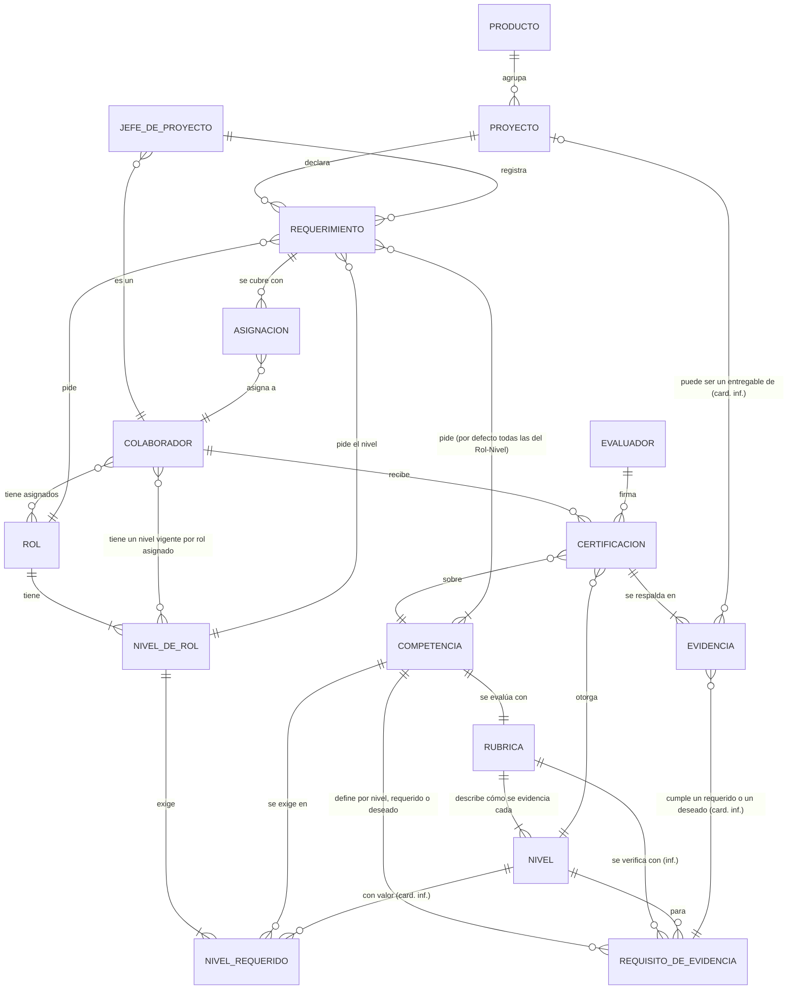
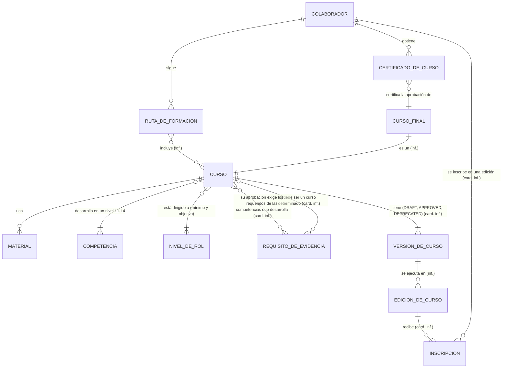
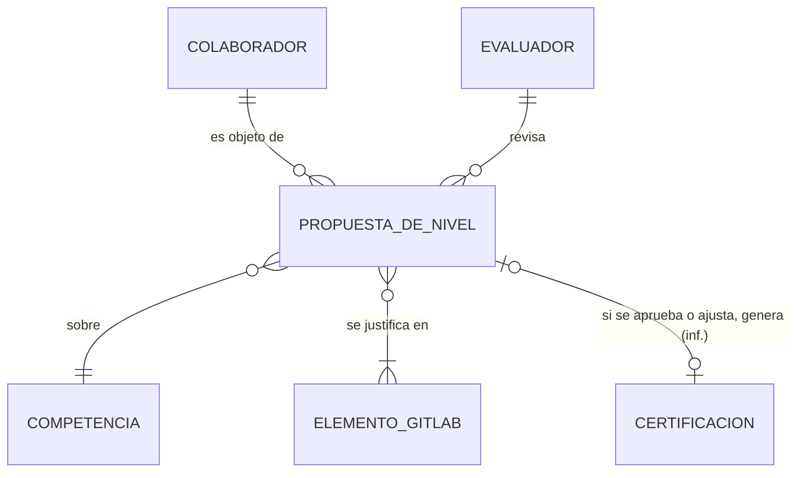

# IMD-001 — Modelo de información conceptual

> **Qué es y qué no es:** es un modelo **conceptual**. Muestra qué conceptos de negocio existen y cómo se relacionan. **No** es un modelo de datos: no define tablas, atributos técnicos, identificadores ni persistencia (eso corresponde a `data-model-designer`).
>
> **Procedencia:** VIS-001 §4 (L56-L59), BRC-001 y el glosario GLS-001. Desde el 2026-09-27, las personas, las organizaciones y la asignación de Rol-Nivel se modelan en [IMD-002](IMD-002-modelo-conceptual-de-partes.md), a partir de [SPEC-001](../../requirement/specs/SPEC-001-gestion-de-colaboradores.md) y las reglas BR-PTY-*. También el 2026-09-27 se incorporaron las decisiones EVD-2026-0096 a EVD-2026-0105 de ianache (Jefe de Ingeniería) sobre niveles de rol, requisitos de evidencia, rúbricas, requerimientos y gestores del programa (BR-CAT-09, BR-CAT-14, BR-CAT-15, BR-ACR-09, BR-REQ-07 y BR-PRG-01 revisadas; BR-CAT-16 a BR-CAT-19, BR-ACR-12, BR-REQ-10, BR-PRF-02 y BR-PRG-02 nuevas). Las fuentes están en `draft`. En los diagramas, las relaciones marcadas **(inf.)** son inferencias, no hechos. El detalle de cada una está en la tabla de relaciones.

## 1. Vista general

Hay cuatro bloques de conceptos:

1. **Catálogo (qué se exige):** roles, competencias, niveles y la evidencia concreta que demuestra cada nivel. Es un catálogo único, común a todos los productos.
2. **Personas y certificación (qué se demuestra):** colaboradores, evidencias, certificaciones y el nivel certificado resultante.
3. **Demanda (qué piden los proyectos):** proyectos, requerimientos y asignaciones.
4. **Formación e IA (H2 y H3):** rutas de formación, cursos, certificados de curso y propuestas de nivel de la IA.

La **brecha** une el catálogo con las personas: es el nivel requerido menos el nivel certificado (VIS-001:L59).

## 2. Diagrama H1 — Catálogo, certificación y demanda

Los **roles y las competencias no pertenecen a ningún producto** (BR-CAT-07, BR-CAT-08). El producto solo agrupa proyectos, y un mismo rol (por ejemplo, Developer) se pide en proyectos de cualquier producto.

Un **rol tiene niveles de rol**, que las fuentes también llaman **Rol-Nivel**. No hay una cantidad general: los niveles y sus nombres se definen al registrar cada rol, por ejemplo Developer Junior (Nivel 1), (Nivel 2) y (Nivel 3), y no son iguales para todos los roles (BR-CAT-09, decisión de ianache (Jefe de Ingeniería), 2026-09-27, P-26 y P-36). Cada Rol-Nivel establece sus competencias y el nivel L1–L4 esperado en cada una (BR-CAT-10, BR-CAT-14). **No hay que confundir** el nivel de rol con la escala L1–L4, que mide el dominio de una competencia. Si la plataforma registra solo el nombre y las competencias de cada nivel, o también sus criterios, está abierto (P-40).

**Fuera de alcance** (BR-CAT-18): en la organización los niveles de rol se asocian con una escala salarial y con criterios como los años de experiencia en el rol o la formación técnica, y determinan las responsabilidades del colaborador, que recoge el [MOF](../glossary/terms/TRM-0101-mof.md) (Manual de Operaciones y Funciones). Nada de eso se modela aquí. Una **competencia transversal**, como el trabajo en equipo, se asigna a los roles que la exigen (BR-CAT-11).

Cada competencia tiene una **rúbrica** que describe, para cada nivel L1–L4, el comportamiento y el logro visible y verificable que se espera, y que se verifica a través de evidencias (BR-CAT-15, precisada el 2026-09-27). La define y aprueba el Jefe de Ingeniería (BR-CAT-19). Rúbrica y requisito de evidencia se tratan como cosas distintas: la rúbrica dice qué se espera y el requisito, con qué evidencia se verifica (R-33). Es una **inferencia a confirmar** registrada en BRC-001 P-37.

Los **requisitos de evidencia** de cada competencia y nivel los define el Jefe de Ingeniería, responsable de las capacitaciones (BR-CAT-16), de forma progresiva: no hace falta definir todos los niveles de todas las competencias a la vez (BR-CAT-17). Cada requisito se declara **[requerido](../glossary/terms/TRM-0099-evidencia-requerida.md)** (se debe satisfacer siempre) o **[deseado](../glossary/terms/TRM-0100-evidencia-deseada.md)** (puede o no presentarse; si se presenta, refuerza la certificación). Es un calificador de la relación entre la competencia y nivel y su requisito (R-04), no un concepto propio (BR-ACR-12). Certificar un nivel exige todas las evidencias requeridas (BR-ACR-09). Si se puede certificar o exigir un nivel sin requisitos definidos está abierto (P-39), y cómo refuerza una evidencia deseada, también (P-41).

El requerimiento pide un **rol y un nivel de rol** (BR-REQ-08). Por defecto asume todas las competencias de ese Rol-Nivel, y el Jefe de proyecto que lo registra puede retirar las que no considere necesarias, pero no agregar otras (BR-REQ-07, BR-REQ-09, BR-REQ-10; AMB-06 resuelta el 2026-09-27). No indica niveles de competencia: toma del catálogo los niveles L1–L4 esperados para ese Rol-Nivel (BR-REQ-06).

**Roles iniciales del catálogo** (BR-CAT-12): analista funcional, developer, analista QA, analista BI, diseñador UX, diseñador UI y jefe de proyecto; se pueden definir otros. El **Jefe de proyecto** es un colaborador que desempeña un rol del catálogo y tiene su propio perfil de competencias y nivel de rol (BR-CAT-13); si es el mismo rol que "jefe de proyecto" está abierto (P-30). El **Evaluador** y el **Jefe de Ingeniería** son solo gestores del programa (BR-PRG-01). Por ahora quedan fuera del proceso de evaluación, aunque sus roles también tienen competencias definidas (BR-PRG-02, respuesta a P-31).

**Colaborador** es un concepto derivado: una persona con un rol vigente de Empleado o de Contratista (BR-PTY-05, SPEC-001 D7). Se mantiene en los diagramas como vista, y su estructura (persona, roles de la parte, relaciones, contactos) está en [IMD-002](IMD-002-modelo-conceptual-de-partes.md). Una persona puede tener **varios roles** del catálogo asignados, con **un solo nivel de rol vigente por rol**, mediante la asignación de Rol-Nivel que registra el Jefe de Ingeniería (BR-PTY-11, BR-PTY-17; IMD-002 R-16 a R-18). Al registrar a un colaborador se le asigna un **nivel inicial** del rol que se le asigna; después se evalúa la evolución de sus competencias del rol por cursos o por su desempeño en proyectos (BR-PRF-02, respuesta a P-28). Cómo se decide el paso al siguiente nivel está abierto (P-42). El Evaluador y el Jefe de Ingeniería son roles de la parte (BR-PTY-03); el Jefe de proyecto es un Rol-Nivel del catálogo asignado con la asignación de Rol-Nivel (SPEC-001:L96-L97).

**Conceptos derivados** (se calculan, no se registran):
- **Nivel certificado vigente:** el nivel de la certificación más reciente de un colaborador en una competencia. Es una inferencia, porque VIS-001:L76 habla de "historial" (P-14).
- **Brecha:** por colaborador y competencia, nivel requerido menos nivel certificado vigente (VIS-001:L59; P-12).
- **Candidato:** un colaborador cuyo nivel certificado alcanza el nivel del requerimiento (VIS-001:L42, L119; P-16).

## 3. Diagrama H2 y H3 — Formación, certificados de curso e IA

- **CURSO** vive en Google Classroom, **MATERIAL** en Google Drive, **ELEMENTO_GITLAB** (issue, MR, milestone) en GitLab y el PDF del **CERTIFICADO_DE_CURSO** en docsuite. La plataforma los referencia y no los hospeda (VIS-001:L87, L91-L96).
- **El certificado de curso no tiene relación con el nivel:** no certifica ninguno (BR-CER-02). Si aprobar un curso cuenta como evidencia, está abierto (P-07).
- **Aprobación de un curso (R-36):** la plataforma propone aprobarlo cuando se cumplen los requisitos de evidencia **requeridos** de las competencias que desarrolla (BR-CER-06, precisada por P-47); las evidencias salen de evaluaciones y de artefactos producidos en los proyectos (BR-FOR-04), y los objetivos del curso se alinean con esas competencias en los niveles de los roles designados (BR-FOR-03). Quién concluye la aprobación sigue abierto: la propuesta de un Instructor por edición de curso (BR-FOR-05) está solo en consideración, así que el Instructor no se modela (IM-Q10, P-49).
- **Versiones, ediciones e inscripciones (R-37 a R-39, 2026-09-27):** un curso tiene versiones DRAFT → APPROVED → DEPRECATED, que aprueba el Jefe de Ingeniería o un ADMIN; solo las APPROVED admiten inscripciones nuevas, y aprobar una versión depreca la anterior. El colaborador se inscribe en una edición y termina el curso en ella, sin homologar versiones (BR-FOR-06 a BR-FOR-10). El diagrama se divide en dos (formación e IA) porque superaba los 15 conceptos.
- **La ruta de formación** nace de la brecha (VIS-001:L79). Cómo se arma no está definido (P-18).

## 4. Conceptos

| Concepto | Nombre en diagrama | Qué es | Bloque | Glosario | Fuente | Horizonte |
|---|---|---|---|---|---|---|
| Producto | PRODUCTO | Uno de los 4 productos en alcance; agrupa proyectos, no roles | Demanda | [TRM-0047](../glossary/terms/TRM-0047-producto.md) (revisar definición: IM-Q9) | VIS-001:L23; BR-CAT-08 | H1 |
| Rol | ROL | Función común a todos los productos (por ejemplo, Developer o Analista de Calidad), con niveles de rol y un conjunto de competencias por nivel | Catálogo | [TRM-0055](../glossary/terms/TRM-0055-rol.md) | VIS-001:L56; BR-CAT-08 a BR-CAT-10 | H1 |
| Nivel de rol | NIVEL_DE_ROL | Nivel en que se desempeña un rol (Rol-Nivel, por ejemplo Developer Junior (Nivel 1)); cada rol define sus niveles al registrarse, sin una cantidad general; establece sus competencias y el nivel L1–L4 esperado en cada una | Catálogo | [TRM-0066](../glossary/terms/TRM-0066-nivel-de-rol.md) | BR-CAT-09, BR-CAT-10, BR-CAT-14 | H1 |
| Competencia | COMPETENCIA | Capacidad única del catálogo, que varios roles y productos pueden exigir y que un colaborador certifica. Puede ser [transversal](../glossary/terms/TRM-0067-competencia-transversal.md) (por ejemplo, trabajo en equipo) | Catálogo | [TRM-0014](../glossary/terms/TRM-0014-competencia.md) | VIS-001:L56-L57; BR-CAT-07, BR-CAT-11 | H1 |
| Rúbrica | RUBRICA | Descripción, para cada nivel L1–L4 de una competencia, del comportamiento y el logro visible y verificable que se espera, verificado con evidencias; la define y aprueba el Jefe de Ingeniería | Catálogo | [TRM-0069](../glossary/terms/TRM-0069-rubrica.md) | BR-CAT-15, BR-CAT-19 | H1 |
| Nivel | NIVEL | Valor de la escala L1–L4 | Catálogo | [TRM-0020](../glossary/terms/TRM-0020-escala-de-niveles-de-dominio.md) | VIS-001:L62-L69 | H1 |
| Nivel requerido | NIVEL_REQUERIDO | Nivel L1–L4 esperado que un Rol-Nivel establece para cada una de sus competencias | Catálogo | [TRM-0043](../glossary/terms/TRM-0043-nivel-requerido.md) | VIS-001:L71; BR-CAT-03, BR-CAT-14 | H1 |
| Requisito de evidencia | REQUISITO_DE_EVIDENCIA | Lo que un colaborador debe cumplir para certificar un nivel de una competencia en el rol que tiene asignado: una o varias evidencias concretas, cada una requerida o deseada; lo define el Jefe de Ingeniería | Catálogo | [TRM-0068](../glossary/terms/TRM-0068-requisito-de-evidencia.md) | BR-ACR-07 a BR-ACR-10, BR-ACR-12; BR-CAT-16, BR-CAT-17 | H1 |
| Colaborador | COLABORADOR | Persona con perfil de competencias. Es un concepto derivado: persona con un rol vigente de Empleado o de Contratista, modelada en [IMD-002](IMD-002-modelo-conceptual-de-partes.md); se mantiene aquí como vista | Personas | [TRM-0013](../glossary/terms/TRM-0013-colaborador.md) (revisar definición: GQ-18) | VIS-001:L41, L57; BR-PTY-05 | H1 |
| Evaluador | EVALUADOR | Persona que revisa evidencias y certifica; junto con el Jefe de Ingeniería, es solo gestor del programa y por ahora queda fuera del proceso de evaluación | Personas | [TRM-0021](../glossary/terms/TRM-0021-evaluador.md) (confirmar lectura: GQ-31) | VIS-001:L46, L80; BR-PRG-01, BR-PRG-02 | H1 |
| Certificación | CERTIFICACION | Registro de un nivel otorgado a un colaborador en una competencia: quién, cuándo y con qué evidencia | Personas | [TRM-0001](../glossary/terms/TRM-0001-acreditacion.md) | VIS-001:L80; BR-ACR-01 a 07 | H1 |
| Evidencia | EVIDENCIA | Lo que el colaborador presenta para cumplir un requisito de evidencia: un curso aprobado, una práctica o un entregable concreto, por ejemplo el plan de pruebas de un sprint de un proyecto real | Personas | [TRM-0022](../glossary/terms/TRM-0022-evidencia.md) | VIS-001:L57, L71; BR-ACR-11 | H1 |
| Nivel certificado | — (derivado) | Nivel vigente de un colaborador en una competencia | Derivado | [TRM-0042](../glossary/terms/TRM-0042-nivel-acreditado.md) | VIS-001:L57 | H1 |
| Proyecto | PROYECTO | Proyecto de un producto | Demanda | [TRM-0050](../glossary/terms/TRM-0050-proyecto.md) | VIS-001:L58 | H1 |
| Jefe de proyecto | JEFE_DE_PROYECTO | Colaborador que desempeña el rol de jefe de proyecto, declara los requerimientos de su proyecto y tiene su propio perfil de competencias y nivel de rol | Demanda | [TRM-0038](../glossary/terms/TRM-0038-lider-de-proyecto.md) | VIS-001:L42, L77; BR-CAT-13 | H1 |
| Requerimiento | REQUERIMIENTO | Rol y nivel de rol que necesita un proyecto; por defecto con todas las competencias del Rol-Nivel, de las que el Jefe de proyecto puede retirar algunas; los niveles L1–L4 se toman del catálogo | Demanda | [TRM-0052](../glossary/terms/TRM-0052-requerimiento-de-proyecto.md) (revisar definición: GQ-32) | VIS-001:L58; BR-REQ-06 a BR-REQ-08, BR-REQ-10 | H1 |
| Asignación | ASIGNACION | Vínculo entre un requerimiento y un colaborador | Demanda | [TRM-0004](../glossary/terms/TRM-0004-asignacion.md) | VIS-001:L58 | H1 |
| Brecha | — (derivado) | Nivel requerido menos nivel certificado | Derivado | [TRM-0005](../glossary/terms/TRM-0005-brecha.md) | VIS-001:L59 | H1 |
| Ruta de formación | RUTA_DE_FORMACION | Secuencia de formación generada a partir de la brecha | Formación | [TRM-0057](../glossary/terms/TRM-0057-ruta-de-formacion.md) | VIS-001:L79 | H2 |
| Curso / Material | CURSO, MATERIAL | Curso en Classroom, diseñado para desarrollar competencias en un nivel L1–L4 para ciertos roles y niveles de rol, y su material en Drive | Formación (externo) | [TRM-0029](../glossary/terms/TRM-0029-google-classroom.md), [TRM-0030](../glossary/terms/TRM-0030-google-drive.md) | VIS-001:L32, L93-L94; BR-FOR-01, BR-FOR-03, BR-CER-06 | H2 |
| Curso final | CURSO_FINAL | Curso cuya aprobación se certifica | Formación | [TRM-0017](../glossary/terms/TRM-0017-curso-final.md) | VIS-001:L82 | H2 |
| Certificado de curso | CERTIFICADO_DE_CURSO | Constancia de aprobación del curso final; no equivale a un nivel | Formación | [TRM-0008](../glossary/terms/TRM-0008-certificado.md) | VIS-001:L82 | H2 |
| Versión de curso | VERSION_DE_CURSO | Cada diseño de un curso en el tiempo, con estado DRAFT, APPROVED o DEPRECATED | Formación | [TRM-0104](../glossary/terms/TRM-0104-version-de-curso.md) | BR-FOR-06 a BR-FOR-09 (EVD-2026-0116) | H2 |
| Edición de curso | EDICION_DE_CURSO | Ejecución de una versión de un curso, en la que se inscriben colaboradores | Formación | [TRM-0102](../glossary/terms/TRM-0102-edicion-de-curso.md) | BR-FOR-10 (EVD-2026-0116) | H2 |
| Inscripción | INSCRIPCION | Registro de un colaborador en una edición de un curso | Formación | [TRM-0103](../glossary/terms/TRM-0103-inscripcion.md) | BR-FOR-08, BR-FOR-10 (EVD-2026-0116) | H2 |
| Propuesta de nivel | PROPUESTA_DE_NIVEL | Nivel que la IA propone con justificación | IA | [TRM-0049](../glossary/terms/TRM-0049-propuesta-de-nivel.md) | VIS-001:L81 | H3 |
| Elemento de GitLab | ELEMENTO_GITLAB | Issue, MR o milestone usado como evidencia | IA (externo) | [TRM-0035](../glossary/terms/TRM-0035-issue.md), [TRM-0041](../glossary/terms/TRM-0041-mr.md), [TRM-0040](../glossary/terms/TRM-0040-milestone.md) | VIS-001:L81 | H3 |

Los KPI y el tablero de capacidad no son conceptos del modelo: son vistas calculadas sobre él (VIS-001:L83, L117-L124). La escala salarial, el MOF y los criterios de nivel de rol tampoco lo son: están fuera de alcance (BR-CAT-18). "Requerida" y "deseada" no son conceptos: califican la relación R-04.

## 5. Relaciones

Clasificación: **FACT** (lo dice la fuente), **INFERENCE** (deducción del agente) y **UNKNOWN** (la fuente no permite saberlo).

| ID | Relación | Cardinalidad | Clasificación | Fuente | Pregunta |
|---|---|---|---|---|---|
| R-01 | Un producto tiene roles | — | RETIRADA: los roles son independientes de los productos (BR-CAT-08, decisión ianache (Jefe de Ingeniería), 2026-09-26) | VIS-001:L56; BR-CAT-08 | — |
| R-02 | Un rol exige competencias, cada una con un nivel requerido | — | RETIRADA: las competencias se definen por nivel de rol; la reemplazan R-23 y R-24 (decisión ianache (Jefe de Ingeniería), 2026-09-26) | VIS-001:L56, L71; BR-CAT-10 | — |
| R-03 | Una competencia se puede exigir en varios roles y productos | N : M | FACT (decisión ianache (Jefe de Ingeniería), 2026-09-26) | BR-CAT-07 | — |
| R-04 | Cada competencia y nivel tiene uno o varios requisitos de evidencia; cada uno es una evidencia concreta de una de las tres categorías y se declara **requerido** o **deseado** (calificador de la relación). Los define el Jefe de Ingeniería, de forma progresiva | 1 : N (competencia) × 1 : N (nivel); 0..N requisitos por competencia y nivel mientras la definición es progresiva (1..N cuando está definida) | FACT (decisión ianache (Jefe de Ingeniería), 2026-09-27: calificador requerido/deseado, BR-ACR-12; definición progresiva, BR-CAT-17; P-22 confirmada, EVD-2026-0097) · posible dependencia del rol: UNKNOWN (AMB-05) | BR-ACR-07 a BR-ACR-10, BR-ACR-12, BR-ACR-13; BR-CAT-16, BR-CAT-17 | P-24 (respondida), P-34, P-39 (respondida el 2026-09-27: un nivel con 0 requisitos no se certifica ni se exige, BR-ACR-13; que tenga al menos uno requerido es inferencia a confirmar) |
| R-05 | Un colaborador recibe certificaciones a lo largo del tiempo | 1 : N | FACT (historial) | VIS-001:L76, L80 | P-14 |
| R-06 | Una certificación es de una competencia y otorga un nivel | N : 1 | FACT | VIS-001:L57, L80 | — |
| R-07 | Una certificación se respalda en las evidencias que cumplen **todos los requisitos requeridos** de esa competencia y nivel, y puede incluir evidencias de requisitos deseados, que la refuerzan | 1 : N (una por requisito requerido, como mínimo, más 0..N de requisitos deseados) | FACT (revisada por decisión ianache (Jefe de Ingeniería), 2026-09-27: antes decía "todos" los requisitos) | BR-ACR-01, BR-ACR-07, BR-ACR-09, BR-ACR-12 | P-23 (equivalencias), P-41 |
| R-08 | Una certificación la firma un evaluador humano | N : 1 | FACT | BR-ACR-02, BR-ACR-04 | RCP-Q1 |
| R-09 | Un proyecto pertenece a un producto | N : 1 | FACT | VIS-001:L58 | — |
| R-10 | Un proyecto declara requerimientos | 1 : N | FACT | VIS-001:L58, L77 | US2-Q1 |
| R-11 | Un requerimiento pide un rol | N : 1 | FACT ("Rol + Competencias + Nivel") | VIS-001:L58 | P-10 |
| R-12 | Un requerimiento indica un nivel por cada competencia | — | RETIRADA: el requerimiento no indica niveles; los hereda del rol (BR-REQ-06, decisión del 2026-09-26) | VIS-001:L58; BR-REQ-06 | — |
| R-13 | Un requerimiento se cubre con asignaciones de colaboradores | 1 : N | FACT (la relación) · UNKNOWN (cuántas personas) | VIS-001:L58 | US2-Q3, P-05 |
| R-14 | Un colaborador sigue rutas de formación que nacen de su brecha | 1 : N | FACT (la relación) · UNKNOWN (reglas) | VIS-001:L79 | P-18 |
| R-15 | Un certificado de curso certifica la aprobación de un curso final y no otorga nivel | N : 1 | FACT | VIS-001:L82; BR-CER-01, BR-CER-02 | GQ-06, P-07 |
| R-16 | Una propuesta de nivel es sobre un colaborador y una competencia, y se justifica en elementos de GitLab | N : 1; N : M | FACT | VIS-001:L81; BR-IA-02 | P-13 |
| R-17 | Una propuesta aprobada o ajustada genera una certificación firmada por el evaluador | 0..1 : 0..1 | INFERENCE: BRC-001 dice que la propuesta entra al mismo flujo de certificación | BR-IA-02, BR-ACR-04 | — |
| R-18 | Un Jefe de proyecto es un colaborador con perfil de competencias y nivel de rol | N : 1 | FACT (decisión ianache (Jefe de Ingeniería), 2026-09-26, BR-CAT-13). Desde el 2026-09-27: el Jefe de proyecto es un Rol-Nivel del catálogo que se asigna a la persona con la asignación de Rol-Nivel (SPEC-001:L97; IMD-002 R-16, R-17), y el Evaluador y el Jefe de Ingeniería son roles de la parte (BR-PTY-03; IMD-002 R-03). Desde el 2026-09-27 (respuesta a P-31, BR-PRG-01, BR-PRG-02): el Evaluador y el Jefe de Ingeniería son solo gestores del programa y por ahora quedan fuera del proceso de evaluación, aunque sus roles tienen competencias definidas. Si además son colaboradores: UNKNOWN (IMD-002 R-28) | BR-CAT-13, BR-PTY-03, BR-PTY-11, BR-PRG-01, BR-PRG-02 | P-30, P-31 (respondida), IMD-002 IM-Q3, IMD-002 IM-Q7 |
| R-19 | Un requerimiento toma del catálogo los niveles requeridos de las competencias que pide; no puede exigir un nivel sin requisitos de evidencia definidos (BR-ACR-13, 2026-09-27) | 1 : N | FACT (decisión) | BR-REQ-06, BR-ACR-13 | P-25, P-39 (respondida) |
| R-20 | Una evidencia de una certificación cumple uno de los requisitos de evidencia de esa competencia y nivel, requerido o deseado | N : 1 | FACT (relación, BR-ACR-07, BR-ACR-09 y BR-ACR-12) · INFERENCE (cardinalidad) | BR-ACR-07, BR-ACR-09, BR-ACR-12 | P-23 (equivalencias), P-35 |
| R-21 | Un requisito de evidencia de la categoría formación puede ser un curso determinado | 0..1 : 1 | FACT (relación, decisión) · INFERENCE (cardinalidad) | BR-ACR-08 | P-07, IM-Q8 |
| R-22 | Un mismo rol se puede pedir en proyectos de cualquier producto | N : M (a través del requerimiento) | FACT (decisión) | BR-CAT-08 | — |
| R-23 | Un rol tiene niveles de rol; la cantidad y los nombres los define cada rol al registrarse (por ejemplo, Developer Junior (Nivel 1) a (Nivel 3)) | 1 : N (N variable por rol) | FACT (decisión; revisada el 2026-09-27 por ianache (Jefe de Ingeniería): antes decía "varios Junior y varios Senior") | BR-CAT-09 | P-26 (respondida), P-36 (respondida), P-40 |
| R-24 | Un nivel de rol exige un conjunto de competencias, cada una con un nivel L1–L4 esperado. Desde el 2026-09-27: un rol tiene al menos una competencia (BR-CAT-20); una competencia no se repite dentro de un rol (BR-CAT-21; *interpretación a confirmar:* una sola vez por Rol-Nivel, con un solo nivel L esperado, y los niveles superiores del rol pueden exigirla con un L mayor); y un Rol-Nivel no puede exigir un nivel de competencia que no tenga requisitos de evidencia definidos (BR-ACR-13) | 1 : N (1..N por rol, FACT; 1..N por cada Rol-Nivel, INFERENCE); por Rol-Nivel y competencia, a lo sumo un nivel esperado (INFERENCE, interpretación de BR-CAT-21) | FACT (decisión; BR-CAT-20, BR-CAT-21 y BR-ACR-13, respuestas a US1-Q1 y P-39 de ianache (Jefe de Ingeniería), 2026-09-27) | BR-CAT-10, BR-CAT-14, BR-CAT-20, BR-CAT-21, BR-ACR-13 | P-36 (respondida), P-39 (respondida), US1-Q1 (respondida; interpretación de BR-CAT-21 a confirmar) |
| R-25 | Una competencia transversal se asigna a varios roles | N : M | FACT (decisión) | BR-CAT-11 | — |
| R-26 | Un requerimiento pide por defecto todas las competencias de su Rol-Nivel; el Jefe de proyecto que lo registra puede retirar algunas, y nunca pide competencias de fuera del Rol-Nivel | N : M | FACT (decisión: BR-REQ-07 precisada, BR-REQ-09, BR-REQ-10). AMB-06 resuelta por ianache (Jefe de Ingeniería), 2026-09-27, P-38 | BR-REQ-07, BR-REQ-09, BR-REQ-10 | P-38 (respondida) |
| R-27 | Un requerimiento indica un nivel de rol | N : 1 | FACT (decisión) | BR-REQ-08 | — |
| R-28 | Un colaborador tiene, por cada rol asignado, un solo nivel de rol vigente | Por colaborador y rol: 0..1 vigente; por colaborador: 0..N | FACT (decisión ianache (Jefe de Ingeniería), 2026-09-27, SPEC-001 D6; BR-PTY-11): el nivel de rol se asigna con la asignación de Rol-Nivel (IMD-002 R-16 a R-18). Al registrar al colaborador se le asigna un nivel inicial del rol asignado, y después se evalúa su evolución por cursos o desempeño en proyectos (BR-PRF-02, respuesta a P-28, 2026-09-27). Para escalar a un nivel superior de su rol, el colaborador debe haber cumplido las competencias de los niveles inferiores (BR-PRF-03, decisión del 2026-09-27, respuesta a US1-Q1). Quién decide el paso y si basta con eso: UNKNOWN | BR-PTY-11, BR-PRF-01, BR-PRF-02, BR-PRF-03, BR-CAT-13 | P-28 (respondida), P-42 (parcialmente respondida) |
| R-29 | Un colaborador tiene asignados uno o varios roles | N : M | FACT (decisión ianache (Jefe de Ingeniería), 2026-09-27, SPEC-001 D6; BR-PRF-01, BR-PTY-11): varios roles, un nivel vigente por rol, asignados por el Jefe de Ingeniería (BR-PTY-17; IMD-002 R-18) | BR-PRF-01, BR-PTY-11, BR-PTY-17 | P-33 (respondida) |
| R-30 | Una evidencia puede ser un entregable concreto de un proyecto. Desde el 2026-09-27, también para la aprobación de un curso: sus evidencias salen de evaluaciones y de artefactos producidos durante la participación del colaborador en los proyectos (BR-FOR-04) | 0..1 : N | FACT (relación, decisión; BR-FOR-04, respuesta a P-47) · INFERENCE (cardinalidad: un entregable proviene de un proyecto) | BR-ACR-11, BR-FOR-04 | P-35, IM-Q10 |
| R-31 | Una competencia tiene una rúbrica | 1 : 1 | FACT (decisión: "por cada competencia… una rúbrica") | BR-CAT-15 | P-37 |
| R-32 | La rúbrica describe, para cada nivel L1–L4, cómo se evidencia la competencia | 1 : 4 | FACT (decisión) | BR-CAT-15 | — |
| R-33 | Lo que la rúbrica describe para cada nivel se verifica con los requisitos de evidencia de ese nivel; son cosas distintas (antes: "la rúbrica detalla los requisitos") | 1 : N | INFERENCE (revisada el 2026-09-27): la rúbrica describe el comportamiento y el logro verificable, que "se verifica a través de evidencias" (BR-CAT-15); BRC-001 P-37 lo registra como inferencia a confirmar | BR-CAT-15, BR-CAT-19, BR-ACR-07 | P-37 (respondida; inferencia a confirmar) |
| R-34 | Un curso desarrolla una o varias competencias en un nivel L1–L4. Son las competencias del Rol-Nivel objetivo que selecciona quien diseña el curso; no necesariamente todas | N : M | FACT (decisión) | BR-FOR-01, BR-FOR-02 | P-07, P-46 |
| R-35 | Un curso está dirigido a uno o varios roles; para cada uno define un nivel de rol mínimo y un nivel de rol objetivo (calificador de la relación) | N : M | FACT (decisión) | BR-FOR-01 | P-46 |
| R-36 | La aprobación de un curso exige los requisitos de evidencia **requeridos** de las competencias que el curso desarrolla, en el nivel en que las desarrolla (a través de R-34 y R-04); cuando se cumplen, la plataforma propone aprobarlo, y la propuesta no aprueba por sí sola. Los deseados no intervienen en la propuesta | N : M | FACT (relación, decisión ianache (Jefe de Ingeniería), 2026-09-27, respuesta a P-47; EVD-2026-0112) · INFERENCE (cardinalidad: un curso desarrolla varias competencias, cada una con varios requisitos, y un requisito puede servir a varios cursos que desarrollan la misma competencia y nivel) | BR-CER-06, BR-CER-07, BR-ACR-12, BR-FOR-03 | P-07, IM-Q10, P-49 |
| R-37 | Un curso tiene versiones; cada versión está en DRAFT (al crearse), APPROVED o DEPRECATED (calificador). La aprueba el Jefe de Ingeniería o un ADMIN, y al aprobarla la APPROVED anterior pasa a DEPRECATED | 1 : N (una o varias versiones por curso; a lo sumo una APPROVED a la vez) | FACT (relación y estados, decisión ianache (Jefe de Ingeniería), 2026-09-27, respuesta a P-02; EVD-2026-0116) · INFERENCE (cardinalidad: cada versión es de un solo curso; "a lo sumo una APPROVED" se deduce de BR-FOR-09) | BR-FOR-06, BR-FOR-07, BR-FOR-09 | P-50, P-51 |
| R-38 | Una edición de curso es una ejecución de una versión de curso | N : 1 | INFERENCE: la decisión dice que el inscrito termina en su edición "para no tener que homologar versiones", lo que ata cada edición a una versión; que la edición existe y recibe inscripciones es FACT (BR-FOR-10) | BR-FOR-10 (EVD-2026-0116); EVD-2026-0113 (hipótesis, "ejecución de un curso") | P-51, IM-Q10 |
| R-39 | Un colaborador se inscribe en una edición de curso (inscripción); solo las versiones APPROVED admiten inscripciones nuevas, y el inscrito termina el curso en esa edición, sin homologar versiones | Colaborador 1 : N inscripciones; edición 1 : N inscripciones | FACT (relación, decisión; BR-FOR-08, BR-FOR-10) · INFERENCE (cardinalidades) | BR-FOR-08, BR-FOR-10 | P-51 |

## 6. Reglas que actúan sobre el modelo

| Regla | Sobre qué concepto | Qué impone |
|---|---|---|
| BR-CAT-02 | Nivel requerido, Certificación | Solo valores L1–L4 |
| BR-CAT-03 | Rol | Cada competencia del rol tiene nivel requerido |
| BR-CAT-04 | Catálogo | Lo gobierna el Jefe de Ingeniería |
| BR-CAT-08 | Rol | Es común a todos los productos |
| BR-CAT-09, BR-CAT-10 | Rol, Nivel de rol | Un rol tiene niveles, definidos al registrar el rol y sin una cantidad general, y sus competencias se definen por nivel |
| BR-CAT-11 | Competencia | Puede ser transversal a varios roles |
| BR-REQ-07 | Requerimiento | Por defecto asume todas las competencias del Rol-Nivel; puede quedarse con solo algunas |
| BR-REQ-10 | Requerimiento | Solo el Jefe de proyecto que lo registra puede retirar competencias de las que aporta el Rol-Nivel |
| BR-CAT-12 | Rol | Roles iniciales: analista funcional, developer, analista QA, analista BI, diseñador UX, diseñador UI, jefe de proyecto; el catálogo admite más |
| BR-CAT-13 | Jefe de proyecto | Es un rol con perfil de competencias y nivel de rol |
| BR-PRG-01 | Evaluador | Junto con el Jefe de Ingeniería, gestiona el programa; son solo gestores |
| BR-PRG-02 | Evaluador | Junto con el Jefe de Ingeniería, queda por ahora fuera del proceso de evaluación, aunque sus roles tienen competencias definidas |
| BR-ACR-10 | Requisito de evidencia | Determina lo que el colaborador debe cumplir para certificar un nivel en su rol asignado |
| BR-ACR-11 | Evidencia | Puede ser un entregable concreto de un proyecto real |
| BR-CAT-14 | Nivel de rol | Cada Rol-Nivel establece sus competencias y el nivel L1–L4 esperado |
| BR-CAT-16 | Requisito de evidencia | Lo define el Jefe de Ingeniería, responsable de las capacitaciones, por competencia y nivel |
| BR-CAT-17 | Requisito de evidencia | Se define de forma progresiva; no hace falta definir todos los niveles de todas las competencias a la vez |
| BR-CAT-18 | Nivel de rol | Escala salarial, responsabilidades (MOF) y criterios de nivel quedan fuera de alcance (confirmada el 2026-09-27, P-40) |
| BR-CAT-20 | Rol, Competencia (R-24) | Un rol tiene al menos una competencia; una misma competencia puede repetirse en varios roles |
| BR-CAT-21 | Rol, Nivel de rol, Competencia (R-24) | Una competencia no se repite dentro de un rol (interpretación a confirmar: una vez por Rol-Nivel, con un solo nivel L esperado) |
| BR-ACR-13 | Requisito de evidencia, Certificación, Nivel de rol, Requerimiento (R-04, R-19, R-24) | Un nivel de competencia sin requisitos de evidencia definidos no se certifica ni se exige en un Rol-Nivel o requerimiento |
| BR-TRA-02 | Catálogo | Todos los colaboradores lo consultan en modo lectura |
| BR-CAT-15 | Rúbrica | Una por competencia; describe el comportamiento y el logro visible y verificable de cada nivel L1–L4, verificado con evidencias |
| BR-CAT-19 | Rúbrica | La define y aprueba el Jefe de Ingeniería |
| BR-REQ-08 | Requerimiento | Indica el nivel de rol |
| BR-REQ-09 | Requerimiento | No pide competencias de fuera de su Rol-Nivel |
| BR-FOR-01 | Curso | Se diseña para desarrollar competencias en un nivel L1–L4, para ciertos roles; por cada rol define un nivel de rol mínimo y uno objetivo |
| BR-FOR-02 | Curso, Competencia | Desarrolla solo las competencias del Rol-Nivel objetivo que selecciona quien lo diseña |
| BR-FOR-03 | Curso, Competencia, Nivel de rol | Sus objetivos se alinean con las competencias que desarrolla, en los niveles de los roles designados |
| BR-FOR-06 | Versión de curso (R-37) | Un curso tiene versiones: DRAFT (al crearse), APPROVED y DEPRECATED |
| BR-FOR-07 | Versión de curso (R-37) | Solo el Jefe de Ingeniería o un usuario ADMIN la aprueba (DRAFT → APPROVED) |
| BR-FOR-08 | Versión de curso, Inscripción (R-39) | Solo las versiones APPROVED admiten inscripciones nuevas |
| BR-FOR-09 | Versión de curso (R-37) | Al aprobar una versión, la APPROVED anterior pasa a DEPRECATED |
| BR-FOR-10 | Inscripción, Edición de curso (R-38, R-39) | El inscrito termina el curso en su edición; no se homologan versiones |
| BR-FOR-04 | Evidencia, Curso | Las evidencias que respaldan la aprobación de un curso salen de evaluaciones y de artefactos producidos durante la participación en los proyectos |
| BR-CER-06 | Curso, Requisito de evidencia (R-36) | Cuando se cumplen los requisitos de evidencia requeridos de las competencias que el curso desarrolla, la plataforma propone aprobarlo; la propuesta no lo aprueba por sí sola (precisada el 2026-09-27, P-47) |
| BR-BRE-04 | Brecha (derivado), Colaborador | El colaborador ve sus propias brechas; no declara un rol al que aspira |
| BR-BRE-05 | Brecha (derivado), Requerimiento | La búsqueda muestra también candidatos bajo el nivel, ordenados de menor a mayor brecha por defecto |
| BR-BRE-06 | Brecha (derivado) | Las brechas agregadas las consultan el Jefe de Ingeniería, el Jefe de proyecto y los usuarios con privilegios de ADMIN |
| BR-TER-01 | Certificación | Para las competencias de la persona se usa "certificar"; el programa se acredita |
| BR-PRF-01 | Colaborador | Tiene uno o varios roles asignados, con un nivel vigente por rol |
| BR-PRF-03 | Colaborador, Nivel de rol (R-28) | Para escalar a un nivel superior de su rol debe haber cumplido las competencias de los niveles inferiores |
| BR-PRF-02 | Colaborador, Nivel de rol | Al registrarlo se le asigna un nivel inicial del rol; su evolución se evalúa después por cursos o desempeño en proyectos |
| BR-PTY-05 | Colaborador | Es una persona con un rol vigente de Empleado o de Contratista (derivado; IMD-002) |
| BR-PTY-11 | Colaborador, Rol, Nivel de rol | Varios roles asignados, un solo nivel vigente por rol; cambiar de nivel cierra la asignación anterior |
| BR-ACR-01, BR-ACR-07 | Certificación | Al menos una evidencia, del tipo definido para esa competencia y nivel |
| BR-ACR-02, BR-ACR-04 | Certificación | Solo la firma un evaluador humano; nunca es automática |
| BR-ACR-03 | Certificación | Registra quién, cuándo y con qué evidencia |
| BR-CER-02 | Certificado de curso | No otorga ningún nivel |
| BR-IA-02 | Propuesta de nivel | Siempre con justificación; termina aprobada, ajustada o rechazada |
| BR-CAT-07 | Competencia | Existe una sola vez en el catálogo y se comparte entre roles y productos |
| BR-REQ-06 | Requerimiento | Hereda del rol las competencias y niveles; no los indica |
| BR-ACR-08 | Requisito de evidencia | Es una evidencia concreta de una de las tres categorías |
| BR-ACR-09 | Certificación | Exige todas las evidencias **requeridas** definidas para esa competencia y nivel |
| BR-ACR-12 | Requisito de evidencia (R-04) | Cada requisito se declara requerido (siempre) o deseado (opcional; refuerza la certificación) |

## 7. Preguntas abiertas del modelo

Las preguntas existentes están en BRC-001 (P-nn), USC-001 y las historias (US-nnn-Qn), RCP-001 (RCP-Qn) y el glosario (GQ-nn). Estas son nuevas:

| ID | Pregunta | Afecta a | Responsable | Prioridad |
|---|---|---|---|---|
| IM-Q1 | ¿Una competencia es única en el catálogo y puede exigirse en varios roles y productos, o cada rol tiene sus propias competencias? | R-03, R-04 | Jefe de Ingeniería | Respondida (ianache (Jefe de Ingeniería), 2026-09-26): catálogo único compartido (BR-CAT-07) |
| IM-Q2 | ¿Un requerimiento indica un nivel por cada competencia, o un solo nivel para todas? | R-12 | Responsable de producto | Respondida (ianache (Jefe de Ingeniería), 2026-09-26): hereda del rol (BR-REQ-06). Nota: la respondió el Jefe de Ingeniería; su responsable era el Responsable de producto |
| IM-Q3 | ¿Evaluadores, Jefes de proyecto y el Jefe de Ingeniería también tienen perfil de competencias como colaboradores? | R-18 | Responsable de producto | Parcialmente respondida (ianache (Jefe de Ingeniería), 2026-09-26): el Jefe de proyecto sí (BR-CAT-13); Evaluador y Jefe de Ingeniería gestionan el programa (BR-PRG-01), y su perfil queda en P-31. Desde el 2026-09-27 son roles de la parte (BR-PTY-03); si también deben ser colaboradores sigue en IMD-002 IM-Q3. P-31 respondida el 2026-09-27: son solo gestores y quedan fuera del proceso de evaluación, aunque sus roles tienen competencias definidas (BR-PRG-02) |
| IM-Q4 | ¿Un rol pertenece a un solo producto, o puede existir en varios? | R-01 | Jefe de Ingeniería | Respondida (ianache (Jefe de Ingeniería), 2026-09-26): los roles son independientes de los productos (BR-CAT-08) |
| IM-Q5 | ¿"Requisito de evidencia" (BR-ACR-07) debe entrar al glosario con ese nombre? | Glosario | Jefe de Ingeniería | Respondida (ianache (Jefe de Ingeniería), 2026-09-26): sí; término TRM-0068 creado en `draft` |
| IM-Q6 | ¿Un requerimiento puede pedir solo algunas de las competencias del rol, o siempre todas? | R-19, R-26 | Responsable de producto | Respondida (ianache (Jefe de Ingeniería), 2026-09-26): puede pedir solo algunas (BR-REQ-07) |
| IM-Q7 | ¿Se revisa la definición de TRM-0052 (Requerimiento de proyecto)? | Glosario | Jefe de Ingeniería | Respondida (ianache (Jefe de Ingeniería), 2026-09-26): definición revisada y aprobada |
| IM-Q8 | ¿Las evidencias concretas (cursos, prácticas, entregables) se reutilizan entre varias competencias y niveles, o cada requisito describe la suya? | R-04, R-21 | Jefe de Ingeniería | Parcialmente respondida (ianache (Jefe de Ingeniería), 2026-09-26): la evidencia es algo concreto, como un entregable de un proyecto real (BR-ACR-11), distinto del requisito que la exige. La reutilización queda en P-35 |
| IM-Q9 | ¿Se revisan las definiciones de Catálogo de competencias, Rol y Producto? | Glosario | Jefe de Ingeniería | Respondida (ianache (Jefe de Ingeniería), 2026-09-26): rol con competencias por nivel de rol y competencias transversales; definiciones revisadas y aprobadas |
| P-25 | ¿Un requerimiento indica el nivel de rol que necesita? | R-27, R-19 | Responsable de producto | Respondida (ianache (Jefe de Ingeniería), 2026-09-26): sí (BR-REQ-08) |
| P-21 | ¿Quién define el tipo de evidencia de cada competencia y nivel? | R-04 | Jefe de Ingeniería | Respondida (ianache (Jefe de Ingeniería), 2026-09-27): el Jefe de Ingeniería, responsable de las capacitaciones (BR-CAT-16) |
| P-23 | ¿Una competencia y nivel puede exigir más de una evidencia? ¿El evaluador puede aceptar una evidencia equivalente? | R-04, R-07, R-20 | Jefe de Ingeniería | Parcialmente respondida (ianache (Jefe de Ingeniería), 2026-09-27): cada requisito es requerido o deseado y se exigen todos los requeridos (BR-ACR-09, BR-ACR-12). Siguen abiertas las equivalencias |
| P-24 | ¿Hay que definir los requisitos de evidencia para los cuatro niveles de cada competencia? | R-04 | Jefe de Ingeniería | Respondida (ianache (Jefe de Ingeniería), 2026-09-27): se definen de forma progresiva; lo ideal es tenerlos todos (BR-CAT-17) |
| P-26 | ¿Cuántos niveles de rol hay y cómo se relacionan con L1–L4? | R-23, R-24 | Jefe de Ingeniería | Respondida (ianache (Jefe de Ingeniería), 2026-09-27): no hay una cantidad general; cada rol define sus niveles al registrarse (BR-CAT-09) y cada Rol-Nivel fija el nivel L1–L4 esperado (BR-CAT-14). Escala salarial y MOF, fuera de alcance (BR-CAT-18) |
| P-27 | ¿Una competencia transversal aplica automáticamente a todos los roles, o se asigna? | R-25 | Jefe de Ingeniería | Respondida: se asigna a los roles (BR-CAT-11) |
| P-28 | ¿Un colaborador tiene un nivel de rol? ¿Se certifica o se deduce de sus competencias? | R-28 | Jefe de Ingeniería | Respondida (ianache (Jefe de Ingeniería), 2026-09-27, SPEC-001 D6 y respuesta a P-28): el nivel de rol se asigna con la asignación de Rol-Nivel, uno vigente por rol (BR-PTY-11); al registrar al colaborador se asigna un nivel inicial y su evolución se evalúa después por cursos o desempeño en proyectos (BR-PRF-02). Ver P-42 |
| P-29 | ¿Un requerimiento puede pedir una competencia que no pertenece a su rol? | R-26 | Responsable de producto | Respondida: no (BR-REQ-09) |
| P-30 | ¿Líder de proyecto y jefe de proyecto son lo mismo? | R-18 | Jefe de Ingeniería | Respondida: sí; el término pasa a llamarse Jefe de proyecto, con Líder de proyecto como sinónimo |
| P-31 | ¿El Evaluador y el Jefe de Ingeniería también tienen un perfil de competencias como colaboradores, o solo gestionan el programa? | R-18 | Jefe de Ingeniería | Respondida (ianache (Jefe de Ingeniería), 2026-09-27): son solo gestores del programa y por ahora quedan fuera del proceso de evaluación, aunque sus roles tienen competencias definidas (BR-PRG-01, BR-PRG-02). Si deben ser colaboradores sigue en IMD-002 IM-Q3 e IM-Q7 |
| P-32 | ¿"Certificar" un nivel equivale a acreditarlo? | Requisito de evidencia | Jefe de Ingeniería | Respondida (ianache (Jefe de Ingeniería), 2026-09-26): se usa "certificar" (BR-TER-01) |
| P-33 | ¿Un colaborador tiene asignado un solo rol o puede tener varios? ¿Quién le asigna el rol y con qué nivel de rol? | R-04, R-28, R-29 | Jefe de Ingeniería | Respondida (ianache (Jefe de Ingeniería), 2026-09-27, SPEC-001 D6, D11): varios roles, un nivel vigente por rol; los asigna el Jefe de Ingeniería (BR-PTY-11, BR-PTY-17) |
| P-34 | ¿El requisito de evidencia varía según el rol? | R-04, R-29 | Jefe de Ingeniería | Parcialmente respondida (inferencia): la rúbrica es por competencia (BR-CAT-15); el rol fija el nivel esperado, no la evidencia (confirmar) |
| P-35 | ¿Una misma evidencia (por ejemplo, un plan de pruebas de un proyecto) puede respaldar varias competencias o varios niveles, o solo uno? | R-20, R-30 | Jefe de Ingeniería | Media |
| P-36 | ¿Cómo se combinan Junior/Senior con la numeración 1 a 4 del Rol-Nivel (por ejemplo, ¿Junior 1-2 y Senior 3-4, o Junior 1-4 y Senior 1-4?)? ¿Todos los roles tienen los mismos niveles? | R-23, R-24 | Jefe de Ingeniería | Respondida (ianache (Jefe de Ingeniería), 2026-09-27): los niveles y sus nombres se definen al registrar cada rol, por ejemplo Developer Junior (Nivel 1) a (Nivel 3); no son iguales para todos los roles (BR-CAT-09) |
| P-37 | ¿La rúbrica de una competencia contiene los requisitos de evidencia de cada nivel, o son cosas distintas? ¿Quién define y aprueba las rúbricas? | R-31, R-33 | Jefe de Ingeniería | Respondida (ianache (Jefe de Ingeniería), 2026-09-27): la rúbrica define el comportamiento y el logro visible y verificable, que se verifica con evidencias; la define y aprueba el Jefe de Ingeniería (BR-CAT-15, BR-CAT-19). Inferencia a confirmar: son cosas distintas (R-33) |
| P-38 | La respuesta a P-29 sugiere que un requerimiento pide el Rol-Nivel completo ("las competencias definidas para el rol y nivel son las idóneas"), pero BR-REQ-07 permite pedir solo algunas competencias del rol. ¿Sigue vigente BR-REQ-07? | R-26 | Jefe de Ingeniería | Respondida (ianache (Jefe de Ingeniería), 2026-09-27): sí; por defecto se asumen todas las competencias del Rol-Nivel y el Jefe de proyecto puede retirar algunas (BR-REQ-07, BR-REQ-10). AMB-06 resuelta |
| P-39 | Mientras la definición es progresiva (BR-CAT-17), ¿se puede certificar un nivel de una competencia que aún no tiene requisitos de evidencia definidos? ¿Y exigirlo en un Rol-Nivel o en un requerimiento? | R-04, R-24, R-19 | Jefe de Ingeniería | Respondida (ianache (Jefe de Ingeniería), 2026-09-27): no; siempre debe haber forma de evidenciar (BR-ACR-13). Inferencia a confirmar: al menos un requisito requerido |
| P-40 | ¿La plataforma registra solo el nombre y las competencias de cada nivel de rol, o también sus criterios (años de experiencia en el rol, formación técnica)? Se supone que no (BR-CAT-18) | R-23 | Jefe de Ingeniería | Respondida (ianache (Jefe de Ingeniería), 2026-09-27): por ahora no; son parte del MOF, fuera de alcance (BR-CAT-18) |
| P-41 | ¿Cómo "refuerza" una evidencia deseada la certificación? ¿Solo queda registrada o cambia algo (confianza, búsqueda de candidatos, propuesta de la IA)? | R-07, R-20 | Jefe de Ingeniería | Media — nueva (derivada de P-23); ver GLS-001 GQ-29 |
| P-42 | ¿Cómo se decide el paso de un colaborador al siguiente nivel de su rol? ¿Lo decide una persona (quién) a partir de las competencias certificadas, o se deduce cuando alcanza los niveles L1–L4 esperados del Rol-Nivel siguiente? | R-28; IMD-002 R-16, R-17 | Jefe de Ingeniería | Alta — parcialmente respondida (ianache (Jefe de Ingeniería), 2026-09-27, en US1-Q1): para escalar debe haber cumplido las competencias de los niveles inferiores (BR-PRF-03). Siguen abiertos quién decide el paso y si hace falta cumplir también las del nivel destino |
| P-43 | ¿Contra qué Rol-Nivel ve el colaborador su brecha: el asignado, el siguiente de su rol u otros? | Brecha (derivado), R-28 | Jefe de Ingeniería | Alta — nueva (BRC-001) |
| P-46 | ¿Quién diseña los cursos y registra su nivel mínimo, nivel objetivo y competencias? ¿Cómo se relaciona el nivel de rol mínimo con los niveles L1–L4? | R-34, R-35 | Jefe de Ingeniería | Alta — nueva (BRC-001) |
| IM-Q10 | Si se confirma la propuesta de BR-FOR-05 (P-49), ¿entran al modelo como conceptos **Instructor** (colaborador asignado a una edición de curso, que evalúa a los inscritos), **Edición de curso** (ejecución de un curso) e **Inscripción** (colaborador inscrito en una edición)? Hoy son candidatos: la fuente es una propuesta en consideración (EVD-2026-0113, hipótesis), no un hecho, y no tienen término en el glosario (GLS-001 GQ-33). También: ¿"evaluación" (BR-FOR-04) es un concepto propio o una forma de evidencia? **Parcialmente respondida (2026-09-27):** la respuesta a P-02 (EVD-2026-0116, BR-FOR-06 a BR-FOR-10) atestigua como hechos la edición de curso y la inscripción, que entran al modelo con Versión de curso (R-37 a R-39; GLS-001 TRM-0102 a TRM-0104, en `draft`). Siguen abiertos el **Instructor** (P-49, propuesta en consideración) y "evaluación" | R-36, R-30, R-38; Curso, Evidencia, Edición de curso | Jefe de Ingeniería | Alta — Instructor depende de P-49 |
| P-50 | ¿El catálogo (roles, niveles de rol, competencias, rúbricas y requisitos de evidencia) también se versiona con DRAFT, APPROVED y DEPRECATED? ¿Qué pasa con los requerimientos y certificaciones vigentes cuando cambia? | Catálogo, R-04, R-24, R-37 (por analogía) | Jefe de Ingeniería | Alta — nueva (BRC-001, resto de P-02) |
| P-51 | ¿Una edición en curso de una versión que pasa a DEPRECATED sigue hasta terminar (se supone que sí, por BR-FOR-10)? ¿Cómo se relaciona una versión con el curso de Classroom? | R-37, R-38, R-39 | Jefe de Ingeniería + Gestión de formación | Media — nueva (BRC-001) |

## 8. Historial de cambios del modelo

| Fecha | Cambio | Relaciones o conceptos afectados | Fuente |
|---|---|---|---|
| 2026-09-26 | Alta del modelo: 22 conceptos y 18 relaciones | R-01 a R-18 | VIS-001, BRC-001 (incluida BR-ACR-07), GLS-001 |
| 2026-09-26 | Adaptación a la plantilla de `af-conceptual-model-designer` (columna "Nombre en diagrama", historial, preparación) | — | — |
| 2026-09-26 | IM-Q1, IM-Q2 y P-22 respondidas por ianache (Jefe de Ingeniería), 2026-09-26: R-03 pasa a FACT; R-12 RETIRADA; R-04 actualizada; altas R-19, R-20 y R-21; IM-Q6 a IM-Q8 nuevas | R-03, R-04, R-12, R-19 a R-21; Competencia, Requerimiento, Requisito de evidencia | BR-CAT-07, BR-REQ-06, BR-ACR-08 (EVD-2026-0053 a 0055) |
| 2026-09-26 | IM-Q4 respondida por ianache (Jefe de Ingeniería), 2026-09-26: roles independientes de los productos. R-01 RETIRADA; alta de R-22; se quita PRODUCTO–ROL del diagrama; Producto pasa al bloque Demanda; IM-Q9 nueva | R-01, R-22; Producto, Rol | BR-CAT-08 (EVD-2026-0056) |
| 2026-09-26 | P-23 respondida en parte por ianache (Jefe de Ingeniería), 2026-09-26: varios requisitos de evidencia por competencia y nivel, todos obligatorios | R-04, R-07, R-20 | BR-ACR-09 (EVD-2026-0057) |
| 2026-09-26 | IM-Q6 e IM-Q9 respondidas por ianache (Jefe de Ingeniería), 2026-09-26: concepto nuevo Nivel de rol; competencias por rol y nivel de rol; competencias transversales; el requerimiento pide todas o algunas competencias. R-02 RETIRADA; R-19 actualizada; altas R-23 a R-28 | R-02, R-19, R-23 a R-28; Rol, Nivel de rol, Competencia, Nivel requerido, Requerimiento | BR-CAT-09 a BR-CAT-11, BR-REQ-07 (EVD-2026-0058 a 0060) |
| 2026-09-26 | IM-Q3 respondida en parte por ianache (Jefe de Ingeniería), 2026-09-26: el Jefe de proyecto es un colaborador con perfil; Evaluador y Jefe de Ingeniería gestionan el programa; roles iniciales del catálogo. R-18 pasa a FACT (Jefe de proyecto); R-28 pasa a INFERENCE; arista JEFE_DE_PROYECTO–COLABORADOR; P-30 y P-31 nuevas | R-18, R-28; Jefe de proyecto, Evaluador, Rol | BR-CAT-12, BR-CAT-13, BR-PRG-01 (EVD-2026-0061 a 0063) |
| 2026-09-26 | IM-Q5 respondida por ianache (Jefe de Ingeniería), 2026-09-26: término Requisito de evidencia (TRM-0068); el colaborador tiene un rol asignado. Alta de R-29 y de la arista COLABORADOR–ROL; R-04 y R-28 actualizadas; ambigüedad AMB-05; P-32 a P-34 nuevas | R-04, R-28, R-29; Colaborador, Requisito de evidencia | BR-ACR-10, BR-PRF-01 (EVD-2026-0064, 0065) |
| 2026-09-26 | IM-Q8 respondida en parte por ianache (Jefe de Ingeniería), 2026-09-26: una evidencia puede ser un entregable concreto de un proyecto. Alta de R-30 y de la arista EVIDENCIA–PROYECTO; P-35 nueva | R-30; Evidencia | BR-ACR-11 (EVD-2026-0066) |
| 2026-09-26 | P-25, P-26 (en parte) y P-27 respondidas por ianache (Jefe de Ingeniería), 2026-09-26, y rúbrica por competencia: concepto nuevo Rúbrica; aristas REQUERIMIENTO–NIVEL_DE_ROL, COMPETENCIA–RUBRICA, RUBRICA–NIVEL y RUBRICA–REQUISITO_DE_EVIDENCIA (inf.); R-24, R-25 y R-27 pasan a FACT; altas R-31 a R-33; P-36 y P-37 nuevas | R-24, R-25, R-27, R-31 a R-33; Nivel de rol, Rúbrica, Nivel requerido, Requerimiento | BR-CAT-11, BR-CAT-14, BR-CAT-15, BR-REQ-06, BR-REQ-08 (EVD-2026-0067 a 0071) |
| 2026-09-26 | P-29 y P-30 respondidas por ianache (Jefe de Ingeniería), 2026-09-26: el requerimiento no pide competencias de fuera del rol (R-26 actualizada, AMB-06 y P-38); Jefe de proyecto pasa a llamarse Jefe de proyecto en todo el modelo (concepto y diagrama) | R-26; Jefe de proyecto | BR-REQ-09 (EVD-2026-0072, 0073) |
| 2026-09-26 | Respuesta de ianache (Jefe de Ingeniería), 2026-09-26 a P-32: los cursos se diseñan para desarrollar competencias en un nivel L1–L4 para ciertos roles y niveles de rol. Aristas CURSO–COMPETENCIA y CURSO–NIVEL_DE_ROL; altas R-34 y R-35. P-32 sigue abierta | R-34, R-35; Curso | BR-FOR-01 (EVD-2026-0074) |
| 2026-09-26 | Terminología (ianache (Jefe de Ingeniería), 2026-09-26): "acreditar" pasa a "certificar" para las competencias de la persona, y el documento de aprobación de un curso pasa a "certificado de curso". Conceptos CERTIFICACION y CERTIFICADO_DE_CURSO en los diagramas; los IDs no cambian | Certificación, Nivel certificado, Certificado de curso | BR-TER-01 (EVD-2026-0075) |
| 2026-09-27 | SPEC-001 (decisiones de ianache (Jefe de Ingeniería), 2026-09-27): Colaborador pasa a concepto derivado, modelado en IMD-002; P-33 respondida y P-28 parcialmente respondida por D6 (varios roles, un nivel vigente por rol). R-28 pasa de INFERENCE a FACT (con resto UNKNOWN en P-28); R-29 pasa a N : M y FACT; R-18 actualizada (Evaluador y Jefe de Ingeniería son roles de la parte; Jefe de proyecto es un Rol-Nivel asignado). Arista COLABORADOR–ROL pasa a N : M y alta de la arista COLABORADOR–NIVEL_DE_ROL | R-18, R-28, R-29; Colaborador | BR-PTY-03, BR-PTY-05, BR-PTY-11, BR-PTY-17 (EVD-2026-0078 a 0080, 0084); IMD-002 |
| 2026-09-27 | P-21, P-24, P-26 y P-36 respondidas y P-23 en parte por ianache (Jefe de Ingeniería), 2026-09-27: se quita el supuesto "Rol-Nivel 1 a 4" (cada rol define sus niveles al registrarse); R-04 gana el calificador requerido/deseado y la cardinalidad 0..N por definición progresiva; R-07 exige solo los requisitos requeridos; R-20 y R-23 actualizadas; etiquetas de las aristas COMPETENCIA–REQUISITO_DE_EVIDENCIA y EVIDENCIA–REQUISITO_DE_EVIDENCIA; reglas BR-CAT-16 a BR-CAT-18 y BR-ACR-12; escala salarial y MOF fuera de alcance; P-39 a P-41 nuevas | R-04, R-07, R-20, R-23, R-24; Nivel de rol, Requisito de evidencia | BR-CAT-09, BR-CAT-14, BR-CAT-16 a BR-CAT-18, BR-ACR-09, BR-ACR-12 (EVD-2026-0096 a 0101); GLS-001 TRM-0099 a TRM-0101 |
| 2026-09-27 | P-28, P-31, P-37 y P-38 respondidas por ianache (Jefe de Ingeniería), 2026-09-27: la rúbrica describe el comportamiento y el logro verificable y la aprueba el Jefe de Ingeniería (R-33 revisada, sigue INFERENCE; arista RUBRICA–REQUISITO_DE_EVIDENCIA pasa a "se verifica con (inf.)"); el requerimiento asume por defecto todas las competencias del Rol-Nivel y el Jefe de proyecto puede retirar algunas (R-26 actualizada, AMB-06 resuelta; etiqueta de la arista REQUERIMIENTO–COMPETENCIA); nivel inicial al registrar al colaborador (R-28 actualizada); Evaluador y Jefe de Ingeniería, solo gestores y fuera de la evaluación (R-18 actualizada); reglas BR-CAT-19, BR-REQ-10, BR-PRF-02 y BR-PRG-02; P-42 nueva | R-18, R-26, R-28, R-33; Rúbrica, Evaluador, Requerimiento | BR-CAT-15, BR-CAT-19, BR-REQ-07, BR-REQ-10, BR-PRF-02, BR-PRG-01, BR-PRG-02 (EVD-2026-0102 a 0105); GLS-001 GQ-31, GQ-32 |
| 2026-09-27 | P-15 a P-18 de USC-001 respondidas por ianache (Jefe de Ingeniería), 2026-09-27: R-34 limita las competencias de un curso a las que selecciona su diseñador del Rol-Nivel objetivo (BR-FOR-02); R-35 gana el calificador nivel de rol mínimo / objetivo y la arista CURSO–NIVEL_DE_ROL lo refleja; reglas de brecha BR-BRE-04 a BR-BRE-06 sobre el concepto derivado Brecha; preguntas P-43 y P-46 |
| 2026-09-27 | P-47 respondida y P-48 en parte por ianache (Jefe de Ingeniería), 2026-09-27: alta de R-36 (la aprobación de un curso exige los requisitos de evidencia requeridos de las competencias que desarrolla) y de la arista CURSO–REQUISITO_DE_EVIDENCIA; R-30 gana BR-FOR-04 (evidencias de evaluaciones y artefactos de proyectos); reglas BR-FOR-03, BR-FOR-04 y BR-CER-06 (precisada). La propuesta de P-48 (Instructor por edición de curso, BR-FOR-05) está solo en consideración: no se agregan conceptos; IM-Q10 nueva | R-30, R-36; Curso, Requisito de evidencia, Evidencia | BR-CER-06, BR-FOR-03, BR-FOR-04 (EVD-2026-0112); BR-FOR-05 (EVD-2026-0113, hipótesis) → P-49 |
| 2026-09-27 | P-39, P-40 y US1-Q1 respondidas, y P-02 y P-42 en parte, por ianache (Jefe de Ingeniería), 2026-09-27, en UXR-001: conceptos nuevos Versión de curso, Edición de curso e Inscripción (pasan la prueba de concepto: se registran y tienen reglas); altas R-37 (FACT, cardinalidad inferida), R-38 (INFERENCE) y R-39 (FACT, cardinalidades inferidas) y sus aristas; el diagrama de H2 y H3 se divide en formación e IA; R-04, R-19, R-24 y R-28 actualizadas; reglas BR-CAT-20, BR-CAT-21, BR-ACR-13, BR-FOR-06 a BR-FOR-10, BR-PRF-03 y BR-TRA-02; IM-Q10 respondida en parte (el Instructor sigue abierto); P-50 y P-51 agregadas | R-04, R-19, R-24, R-28, R-37 a R-39; Versión de curso, Edición de curso, Inscripción, Nivel de rol | EVD-2026-0114 a 0118, EVD-2026-0125; GLS-001 TRM-0102 a TRM-0104 |

## 9. Preparación y validación

- **Estado:** CONDITIONAL para pasar a `data-model-designer`
- **Motivo:** el núcleo de H1 está sostenido por decisiones del 2026-09-26: catálogo único, Rol-Nivel con nivel L1–L4 esperado por competencia (con niveles de rol definidos por cada rol, decisión del 2026-09-27), rúbrica por competencia, requerimiento con rol y nivel de rol, y evidencias concretas. El 2026-09-27 se respondieron P-39 (BR-ACR-13), P-40 (BR-CAT-18) y US1-Q1 (BR-CAT-20, BR-CAT-21), y P-42 en parte (BR-PRF-03). Quedan preguntas de prioridad alta: quién decide el paso al siguiente nivel de rol (resto de P-42); el versionado del catálogo (P-50); confirmar las interpretaciones de BR-ACR-13 (al menos un requisito requerido) y BR-CAT-21 (una vez por Rol-Nivel); confirmar que la rúbrica y el requisito de evidencia son cosas distintas (inferencia de P-37, R-33); y confirmar que el requisito no varía por rol (P-34). Siguen abiertas P-05 (asignación), P-23 (equivalencias) y P-41 (cómo refuerza una evidencia deseada). P-26, P-28, P-31, P-36, P-37 y P-38 quedaron respondidas el 2026-09-27 (AMB-06 resuelta). H2 y H3 siguen con reglas abiertas (P-18, P-07, P-49, P-51); el criterio de aprobación de un curso (R-36, P-47) y el versionado de cursos con ediciones e inscripciones (R-37 a R-39, P-02) quedaron definidos el 2026-09-27.
- **Validación por bloque:**
  - [ ] Catálogo y certificación — Jefe de Ingeniería — R-33 (inferencia de P-37), interpretaciones de BR-ACR-13 y BR-CAT-21, P-41, P-42 (resto), P-50, P-30, P-34, P-35, P-23 (equivalencias)
  - [ ] Demanda — Responsable de producto — P-29, P-05; revisar las decisiones IM-Q2, IM-Q6, P-25 y P-38 (tomadas por el Jefe de Ingeniería)
  - [ ] Formación e IA — Jefe de Ingeniería y Gestión de formación — P-07, P-18, P-49, P-51 e IM-Q10 (Instructor, candidato); R-38 (inferencia: una edición pertenece a una versión)
- **Inferencias a aceptar o rechazar:** R-17, R-33 (lo que describe la rúbrica se verifica con los requisitos de evidencia; son cosas distintas) R-38 (una edición es de una versión) y las cardinalidades de R-20, R-21, R-24 (por Rol-Nivel), R-30, R-36, R-37 y R-39. R-28 y R-29 dejaron de ser inferencias el 2026-09-27 (SPEC-001 D6, BR-PTY-11)
