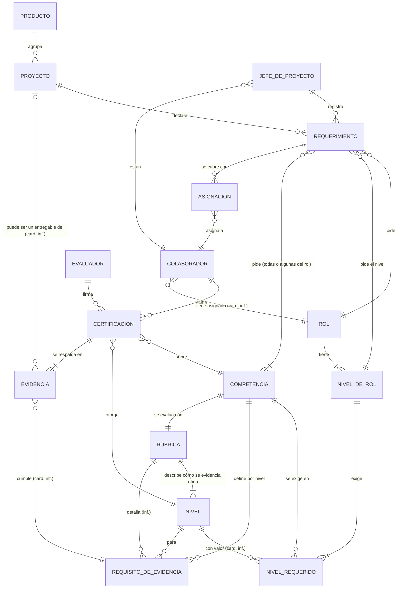
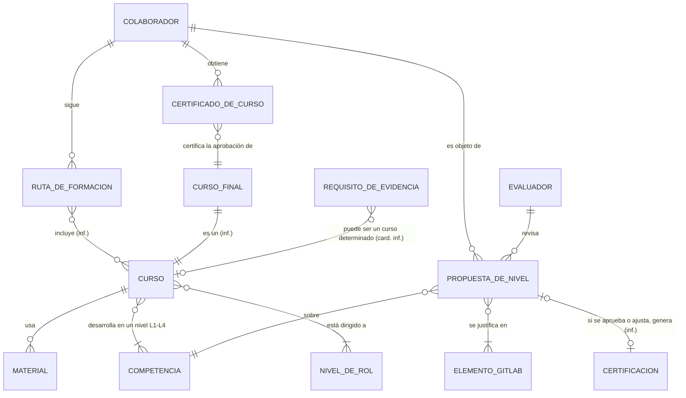

# IMD-001 — Modelo de información conceptual

> **Qué es y qué no es:** es un modelo **conceptual**. Muestra qué conceptos de negocio existen y cómo se relacionan. **No** es un modelo de datos: no define tablas, atributos técnicos, identificadores ni persistencia (eso corresponde a `data-model-designer`).
>
> **Procedencia:** VIS-001 §4 (L56-L59), BRC-001 y el glosario GLS-001. Las fuentes están en `draft`. En los diagramas, las relaciones marcadas **(inf.)** son inferencias, no hechos. El detalle de cada una está en la tabla de relaciones.

## 1. Vista general

Hay cuatro bloques de conceptos:

1. **Catálogo (qué se exige):** roles, competencias, niveles y la evidencia concreta que demuestra cada nivel. Es un catálogo único, común a todos los productos.
2. **Personas y certificación (qué se demuestra):** colaboradores, evidencias, certificaciones y el nivel certificado resultante.
3. **Demanda (qué piden los proyectos):** proyectos, requerimientos y asignaciones.
4. **Formación e IA (H2 y H3):** rutas de formación, cursos, certificados de curso y propuestas de nivel de la IA.

La **brecha** une el catálogo con las personas: es el nivel requerido menos el nivel certificado (VIS-001:L59).

## 2. Diagrama H1 — Catálogo, certificación y demanda

Los **roles y las competencias no pertenecen a ningún producto** (BR-CAT-07, BR-CAT-08). El producto solo agrupa proyectos, y un mismo rol (por ejemplo, Developer) se pide en proyectos de cualquier producto.

Un **rol tiene niveles de rol**, numerados del 1 al 4, que las fuentes también llaman **Rol-Nivel** (por ejemplo, Developer Junior Nivel 1). Cada Rol-Nivel establece sus competencias y el nivel L1–L4 esperado en cada una (BR-CAT-09, BR-CAT-10, BR-CAT-14). **No hay que confundir** el nivel de rol con la escala L1–L4, que mide el dominio de una competencia. Cómo se combinan Junior/Senior con 1 a 4 está abierto (P-36). Una **competencia transversal**, como el trabajo en equipo, se asigna a los roles que la exigen (BR-CAT-11).

Cada competencia tiene una **rúbrica** que describe, para cada nivel L1–L4, cómo se evidencia la competencia (BR-CAT-15). Si la rúbrica contiene los requisitos de evidencia está abierto (P-37).

El requerimiento pide un **rol y un nivel de rol** (BR-REQ-08), y todas o algunas de sus competencias (BR-REQ-07). No indica niveles de competencia: toma del catálogo los niveles L1–L4 esperados para ese Rol-Nivel (BR-REQ-06).

**Roles iniciales del catálogo** (BR-CAT-12): analista funcional, developer, analista QA, analista BI, diseñador UX, diseñador UI y jefe de proyecto; se pueden definir otros. El **Jefe de proyecto** es un colaborador que desempeña un rol del catálogo y tiene su propio perfil de competencias y nivel de rol (BR-CAT-13); si es el mismo rol que "jefe de proyecto" está abierto (P-30). El **Evaluador** y el **Jefe de Ingeniería** gestionan el programa (BR-PRG-01).

**Conceptos derivados** (se calculan, no se registran):
- **Nivel certificado vigente:** el nivel de la certificación más reciente de un colaborador en una competencia. Es una inferencia, porque VIS-001:L76 habla de "historial" (P-14).
- **Brecha:** por colaborador y competencia, nivel requerido menos nivel certificado vigente (VIS-001:L59; P-12).
- **Candidato:** un colaborador cuyo nivel certificado alcanza el nivel del requerimiento (VIS-001:L42, L119; P-16).

## 3. Diagrama H2 y H3 — Formación, certificados de curso e IA

- **CURSO** vive en Google Classroom, **MATERIAL** en Google Drive, **ELEMENTO_GITLAB** (issue, MR, milestone) en GitLab y el PDF del **CERTIFICADO_DE_CURSO** en docsuite. La plataforma los referencia y no los hospeda (VIS-001:L87, L91-L96).
- **El certificado de curso no tiene relación con el nivel:** no certifica ninguno (BR-CER-02). Si aprobar un curso cuenta como evidencia, está abierto (P-07).
- **La ruta de formación** nace de la brecha (VIS-001:L79). Cómo se arma no está definido (P-18).

## 4. Conceptos

| Concepto | Nombre en diagrama | Qué es | Bloque | Glosario | Fuente | Horizonte |
|---|---|---|---|---|---|---|
| Producto | PRODUCTO | Uno de los 4 productos en alcance; agrupa proyectos, no roles | Demanda | [TRM-0047](../glossary/terms/TRM-0047-producto.md) (revisar definición: IM-Q9) | VIS-001:L23; BR-CAT-08 | H1 |
| Rol | ROL | Función común a todos los productos (por ejemplo, Developer o Analista de Calidad), con niveles de rol y un conjunto de competencias por nivel | Catálogo | [TRM-0055](../glossary/terms/TRM-0055-rol.md) | VIS-001:L56; BR-CAT-08 a BR-CAT-10 | H1 |
| Nivel de rol | NIVEL_DE_ROL | Nivel 1 a 4 en que se desempeña un rol (Rol-Nivel, por ejemplo Developer Junior Nivel 1); establece sus competencias y el nivel L1–L4 esperado en cada una | Catálogo | [TRM-0066](../glossary/terms/TRM-0066-nivel-de-rol.md) | BR-CAT-09, BR-CAT-10, BR-CAT-14 | H1 |
| Competencia | COMPETENCIA | Capacidad única del catálogo, que varios roles y productos pueden exigir y que un colaborador certifica. Puede ser [transversal](../glossary/terms/TRM-0067-competencia-transversal.md) (por ejemplo, trabajo en equipo) | Catálogo | [TRM-0014](../glossary/terms/TRM-0014-competencia.md) | VIS-001:L56-L57; BR-CAT-07, BR-CAT-11 | H1 |
| Rúbrica | RUBRICA | Descripción, para cada nivel L1–L4 de una competencia, de cómo se evidencia la competencia | Catálogo | [TRM-0069](../glossary/terms/TRM-0069-rubrica.md) | BR-CAT-15 | H1 |
| Nivel | NIVEL | Valor de la escala L1–L4 | Catálogo | [TRM-0020](../glossary/terms/TRM-0020-escala-de-niveles-de-dominio.md) | VIS-001:L62-L69 | H1 |
| Nivel requerido | NIVEL_REQUERIDO | Nivel L1–L4 esperado que un Rol-Nivel establece para cada una de sus competencias | Catálogo | [TRM-0043](../glossary/terms/TRM-0043-nivel-requerido.md) | VIS-001:L71; BR-CAT-03, BR-CAT-14 | H1 |
| Requisito de evidencia | REQUISITO_DE_EVIDENCIA | Lo que un colaborador debe cumplir para certificar un nivel de una competencia en el rol que tiene asignado: una o varias evidencias concretas, todas obligatorias | Catálogo | [TRM-0068](../glossary/terms/TRM-0068-requisito-de-evidencia.md) | BR-ACR-07 a BR-ACR-10 | H1 |
| Colaborador | COLABORADOR | Persona con perfil de competencias | Personas | [TRM-0013](../glossary/terms/TRM-0013-colaborador.md) | VIS-001:L41, L57 | H1 |
| Evaluador | EVALUADOR | Persona que revisa evidencias y certifica; junto con el Jefe de Ingeniería, gestiona el programa | Personas | [TRM-0021](../glossary/terms/TRM-0021-evaluador.md) | VIS-001:L46, L80; BR-PRG-01 | H1 |
| Certificación | CERTIFICACION | Registro de un nivel otorgado a un colaborador en una competencia: quién, cuándo y con qué evidencia | Personas | [TRM-0001](../glossary/terms/TRM-0001-acreditacion.md) | VIS-001:L80; BR-ACR-01 a 07 | H1 |
| Evidencia | EVIDENCIA | Lo que el colaborador presenta para cumplir un requisito de evidencia: un curso aprobado, una práctica o un entregable concreto, por ejemplo el plan de pruebas de un sprint de un proyecto real | Personas | [TRM-0022](../glossary/terms/TRM-0022-evidencia.md) | VIS-001:L57, L71; BR-ACR-11 | H1 |
| Nivel certificado | — (derivado) | Nivel vigente de un colaborador en una competencia | Derivado | [TRM-0042](../glossary/terms/TRM-0042-nivel-acreditado.md) | VIS-001:L57 | H1 |
| Proyecto | PROYECTO | Proyecto de un producto | Demanda | [TRM-0050](../glossary/terms/TRM-0050-proyecto.md) | VIS-001:L58 | H1 |
| Jefe de proyecto | JEFE_DE_PROYECTO | Colaborador que desempeña el rol de jefe de proyecto, declara los requerimientos de su proyecto y tiene su propio perfil de competencias y nivel de rol | Demanda | [TRM-0038](../glossary/terms/TRM-0038-lider-de-proyecto.md) | VIS-001:L42, L77; BR-CAT-13 | H1 |
| Requerimiento | REQUERIMIENTO | Rol y nivel de rol que necesita un proyecto, con todas o algunas de sus competencias; los niveles L1–L4 se toman del catálogo | Demanda | [TRM-0052](../glossary/terms/TRM-0052-requerimiento-de-proyecto.md) | VIS-001:L58; BR-REQ-06 a BR-REQ-08 | H1 |
| Asignación | ASIGNACION | Vínculo entre un requerimiento y un colaborador | Demanda | [TRM-0004](../glossary/terms/TRM-0004-asignacion.md) | VIS-001:L58 | H1 |
| Brecha | — (derivado) | Nivel requerido menos nivel certificado | Derivado | [TRM-0005](../glossary/terms/TRM-0005-brecha.md) | VIS-001:L59 | H1 |
| Ruta de formación | RUTA_DE_FORMACION | Secuencia de formación generada a partir de la brecha | Formación | [TRM-0057](../glossary/terms/TRM-0057-ruta-de-formacion.md) | VIS-001:L79 | H2 |
| Curso / Material | CURSO, MATERIAL | Curso en Classroom, diseñado para desarrollar competencias en un nivel L1–L4 para ciertos roles y niveles de rol, y su material en Drive | Formación (externo) | [TRM-0029](../glossary/terms/TRM-0029-google-classroom.md), [TRM-0030](../glossary/terms/TRM-0030-google-drive.md) | VIS-001:L32, L93-L94; BR-FOR-01 | H2 |
| Curso final | CURSO_FINAL | Curso cuya aprobación se certifica | Formación | [TRM-0017](../glossary/terms/TRM-0017-curso-final.md) | VIS-001:L82 | H2 |
| Certificado de curso | CERTIFICADO_DE_CURSO | Constancia de aprobación del curso final; no equivale a un nivel | Formación | [TRM-0008](../glossary/terms/TRM-0008-certificado.md) | VIS-001:L82 | H2 |
| Propuesta de nivel | PROPUESTA_DE_NIVEL | Nivel que la IA propone con justificación | IA | [TRM-0049](../glossary/terms/TRM-0049-propuesta-de-nivel.md) | VIS-001:L81 | H3 |
| Elemento de GitLab | ELEMENTO_GITLAB | Issue, MR o milestone usado como evidencia | IA (externo) | [TRM-0035](../glossary/terms/TRM-0035-issue.md), [TRM-0041](../glossary/terms/TRM-0041-mr.md), [TRM-0040](../glossary/terms/TRM-0040-milestone.md) | VIS-001:L81 | H3 |

Los KPI y el tablero de capacidad no son conceptos del modelo: son vistas calculadas sobre él (VIS-001:L83, L117-L124).

## 5. Relaciones

Clasificación: **FACT** (lo dice la fuente), **INFERENCE** (deducción del agente) y **UNKNOWN** (la fuente no permite saberlo).

| ID | Relación | Cardinalidad | Clasificación | Fuente | Pregunta |
|---|---|---|---|---|---|
| R-01 | Un producto tiene roles | — | RETIRADA: los roles son independientes de los productos (BR-CAT-08, decisión ianache (Jefe de Ingeniería), 2026-09-26) | VIS-001:L56; BR-CAT-08 | — |
| R-02 | Un rol exige competencias, cada una con un nivel requerido | — | RETIRADA: las competencias se definen por nivel de rol; la reemplazan R-23 y R-24 (decisión ianache (Jefe de Ingeniería), 2026-09-26) | VIS-001:L56, L71; BR-CAT-10 | — |
| R-03 | Una competencia se puede exigir en varios roles y productos | N : M | FACT (decisión ianache (Jefe de Ingeniería), 2026-09-26) | BR-CAT-07 | — |
| R-04 | Cada competencia y nivel tiene uno o varios requisitos de evidencia; cada uno es una evidencia concreta de una de las tres categorías | 1 : N (competencia) × 1 : N (nivel); 1..N requisitos por competencia y nivel | FACT (decisión) · posible dependencia del rol: UNKNOWN (AMB-05) | BR-ACR-07 a BR-ACR-10 | P-24, P-34 |
| R-05 | Un colaborador recibe certificaciones a lo largo del tiempo | 1 : N | FACT (historial) | VIS-001:L76, L80 | P-14 |
| R-06 | Una certificación es de una competencia y otorga un nivel | N : 1 | FACT | VIS-001:L57, L80 | — |
| R-07 | Una certificación se respalda en las evidencias que cumplen **todos** los requisitos de evidencia de esa competencia y nivel | 1 : N (una por requisito, como mínimo) | FACT | BR-ACR-01, BR-ACR-07, BR-ACR-09 | P-23 (equivalencias) |
| R-08 | Una certificación la firma un evaluador humano | N : 1 | FACT | BR-ACR-02, BR-ACR-04 | RCP-Q1 |
| R-09 | Un proyecto pertenece a un producto | N : 1 | FACT | VIS-001:L58 | — |
| R-10 | Un proyecto declara requerimientos | 1 : N | FACT | VIS-001:L58, L77 | US2-Q1 |
| R-11 | Un requerimiento pide un rol | N : 1 | FACT ("Rol + Competencias + Nivel") | VIS-001:L58 | P-10 |
| R-12 | Un requerimiento indica un nivel por cada competencia | — | RETIRADA: el requerimiento no indica niveles; los hereda del rol (BR-REQ-06, decisión del 2026-09-26) | VIS-001:L58; BR-REQ-06 | — |
| R-13 | Un requerimiento se cubre con asignaciones de colaboradores | 1 : N | FACT (la relación) · UNKNOWN (cuántas personas) | VIS-001:L58 | US2-Q3, P-05 |
| R-14 | Un colaborador sigue rutas de formación que nacen de su brecha | 1 : N | FACT (la relación) · UNKNOWN (reglas) | VIS-001:L79 | P-18 |
| R-15 | Un certificado de curso certifica la aprobación de un curso final y no otorga nivel | N : 1 | FACT | VIS-001:L82; BR-CER-01, BR-CER-02 | GQ-06, P-07 |
| R-16 | Una propuesta de nivel es sobre un colaborador y una competencia, y se justifica en elementos de GitLab | N : 1; N : M | FACT | VIS-001:L81; BR-IA-02 | P-13 |
| R-17 | Una propuesta aprobada o ajustada genera una certificación firmada por el evaluador | 0..1 : 0..1 | INFERENCE: BRC-001 dice que la propuesta entra al mismo flujo de certificación | BR-IA-02, BR-ACR-04 | — |
| R-18 | Un Jefe de proyecto es un colaborador con perfil de competencias y nivel de rol | N : 1 | FACT (decisión ianache (Jefe de Ingeniería), 2026-09-26, BR-CAT-13). Para Evaluador y Jefe de Ingeniería: UNKNOWN | BR-CAT-13 | P-30, P-31 |
| R-19 | Un requerimiento toma del catálogo los niveles requeridos de las competencias que pide | 1 : N | FACT (decisión) | BR-REQ-06 | P-25 |
| R-20 | Una evidencia de una certificación cumple uno de los requisitos de evidencia de esa competencia y nivel | N : 1 | FACT (relación, BR-ACR-07 y BR-ACR-09) · INFERENCE (cardinalidad) | BR-ACR-07, BR-ACR-09 | P-23 (equivalencias) |
| R-21 | Un requisito de evidencia de la categoría formación puede ser un curso determinado | 0..1 : 1 | FACT (relación, decisión) · INFERENCE (cardinalidad) | BR-ACR-08 | P-07, IM-Q8 |
| R-22 | Un mismo rol se puede pedir en proyectos de cualquier producto | N : M (a través del requerimiento) | FACT (decisión) | BR-CAT-08 | — |
| R-23 | Un rol tiene niveles de rol (varios Junior y varios Senior) | 1 : N | FACT (decisión) | BR-CAT-09 | P-26 |
| R-24 | Un nivel de rol exige un conjunto de competencias, cada una con un nivel L1–L4 esperado | 1 : N | FACT (decisión) | BR-CAT-10, BR-CAT-14 | P-36 |
| R-25 | Una competencia transversal se asigna a varios roles | N : M | FACT (decisión) | BR-CAT-11 | — |
| R-26 | Un requerimiento pide todas o algunas de las competencias de su rol, nunca competencias de fuera del rol | N : M | FACT (decisión: BR-REQ-07, BR-REQ-09) · CONFLICT posible sobre "algunas" (AMB-06) | BR-REQ-07, BR-REQ-09 | P-38 |
| R-27 | Un requerimiento indica un nivel de rol | N : 1 | FACT (decisión) | BR-REQ-08 | — |
| R-28 | Un colaborador tiene un nivel de rol | N : 1 | INFERENCE: el colaborador tiene un rol asignado (BR-PRF-01) y el Jefe de proyecto tiene nivel de rol (BR-CAT-13); se generaliza a todo colaborador | BR-PRF-01, BR-CAT-13 | P-28, P-33 |
| R-29 | Un colaborador tiene asignado un rol | N : 1 | FACT (relación, decisión) · INFERENCE (cardinalidad: la fuente habla de "el rol", en singular) | BR-PRF-01 | P-33 |
| R-30 | Una evidencia puede ser un entregable concreto de un proyecto | 0..1 : N | FACT (relación, decisión) · INFERENCE (cardinalidad: un entregable proviene de un proyecto) | BR-ACR-11 | P-35 |
| R-31 | Una competencia tiene una rúbrica | 1 : 1 | FACT (decisión: "por cada competencia… una rúbrica") | BR-CAT-15 | P-37 |
| R-32 | La rúbrica describe, para cada nivel L1–L4, cómo se evidencia la competencia | 1 : 4 | FACT (decisión) | BR-CAT-15 | — |
| R-33 | La rúbrica detalla los requisitos de evidencia de cada nivel | 1 : N | INFERENCE: ambos describen lo que se espera evidenciar por competencia y nivel (BR-CAT-15, BR-ACR-07) | BR-CAT-15, BR-ACR-07 | P-37 |
| R-34 | Un curso desarrolla una o varias competencias en un nivel L1–L4 | N : M | FACT (decisión) | BR-FOR-01 | P-07 |
| R-35 | Un curso está dirigido a uno o varios roles y niveles de rol | N : M | FACT (decisión) | BR-FOR-01 | — |

## 6. Reglas que actúan sobre el modelo

| Regla | Sobre qué concepto | Qué impone |
|---|---|---|
| BR-CAT-02 | Nivel requerido, Certificación | Solo valores L1–L4 |
| BR-CAT-03 | Rol | Cada competencia del rol tiene nivel requerido |
| BR-CAT-04 | Catálogo | Lo gobierna el Jefe de Ingeniería |
| BR-CAT-08 | Rol | Es común a todos los productos |
| BR-CAT-09, BR-CAT-10 | Rol, Nivel de rol | Un rol tiene niveles, y sus competencias se definen por nivel |
| BR-CAT-11 | Competencia | Puede ser transversal a varios roles |
| BR-REQ-07 | Requerimiento | Puede pedir solo algunas competencias del rol |
| BR-CAT-12 | Rol | Roles iniciales: analista funcional, developer, analista QA, analista BI, diseñador UX, diseñador UI, jefe de proyecto; el catálogo admite más |
| BR-CAT-13 | Jefe de proyecto | Es un rol con perfil de competencias y nivel de rol |
| BR-PRG-01 | Evaluador | Junto con el Jefe de Ingeniería, gestiona el programa |
| BR-ACR-10 | Requisito de evidencia | Determina lo que el colaborador debe cumplir para certificar un nivel en su rol asignado |
| BR-ACR-11 | Evidencia | Puede ser un entregable concreto de un proyecto real |
| BR-CAT-14 | Nivel de rol | Cada Rol-Nivel (1 a 4) establece sus competencias y el nivel L1–L4 esperado |
| BR-CAT-15 | Rúbrica | Una por competencia; describe cómo se evidencia cada nivel L1–L4 |
| BR-REQ-08 | Requerimiento | Indica el nivel de rol |
| BR-REQ-09 | Requerimiento | No pide competencias de fuera de su Rol-Nivel |
| BR-FOR-01 | Curso | Se diseña para desarrollar competencias en un nivel L1–L4, para ciertos roles y niveles de rol |
| BR-TER-01 | Certificación | Para las competencias de la persona se usa "certificar"; el programa se acredita |
| BR-PRF-01 | Colaborador | Tiene un rol asignado |
| BR-ACR-01, BR-ACR-07 | Certificación | Al menos una evidencia, del tipo definido para esa competencia y nivel |
| BR-ACR-02, BR-ACR-04 | Certificación | Solo la firma un evaluador humano; nunca es automática |
| BR-ACR-03 | Certificación | Registra quién, cuándo y con qué evidencia |
| BR-CER-02 | Certificado de curso | No otorga ningún nivel |
| BR-IA-02 | Propuesta de nivel | Siempre con justificación; termina aprobada, ajustada o rechazada |
| BR-CAT-07 | Competencia | Existe una sola vez en el catálogo y se comparte entre roles y productos |
| BR-REQ-06 | Requerimiento | Hereda del rol las competencias y niveles; no los indica |
| BR-ACR-08 | Requisito de evidencia | Es una evidencia concreta de una de las tres categorías |
| BR-ACR-09 | Certificación | Exige todas las evidencias definidas para esa competencia y nivel |

## 7. Preguntas abiertas del modelo

Las preguntas existentes están en BRC-001 (P-nn), USC-001 y las historias (US-nnn-Qn), RCP-001 (RCP-Qn) y el glosario (GQ-nn). Estas son nuevas:

| ID | Pregunta | Afecta a | Responsable | Prioridad |
|---|---|---|---|---|
| IM-Q1 | ¿Una competencia es única en el catálogo y puede exigirse en varios roles y productos, o cada rol tiene sus propias competencias? | R-03, R-04 | Jefe de Ingeniería | Respondida (ianache (Jefe de Ingeniería), 2026-09-26): catálogo único compartido (BR-CAT-07) |
| IM-Q2 | ¿Un requerimiento indica un nivel por cada competencia, o un solo nivel para todas? | R-12 | Responsable de producto | Respondida (ianache (Jefe de Ingeniería), 2026-09-26): hereda del rol (BR-REQ-06). Nota: la respondió el Jefe de Ingeniería; su responsable era el Responsable de producto |
| IM-Q3 | ¿Evaluadores, Jefes de proyecto y el Jefe de Ingeniería también tienen perfil de competencias como colaboradores? | R-18 | Responsable de producto | Parcialmente respondida (ianache (Jefe de Ingeniería), 2026-09-26): el Jefe de proyecto sí (BR-CAT-13); Evaluador y Jefe de Ingeniería gestionan el programa (BR-PRG-01), y su perfil queda en P-31 |
| IM-Q4 | ¿Un rol pertenece a un solo producto, o puede existir en varios? | R-01 | Jefe de Ingeniería | Respondida (ianache (Jefe de Ingeniería), 2026-09-26): los roles son independientes de los productos (BR-CAT-08) |
| IM-Q5 | ¿"Requisito de evidencia" (BR-ACR-07) debe entrar al glosario con ese nombre? | Glosario | Jefe de Ingeniería | Respondida (ianache (Jefe de Ingeniería), 2026-09-26): sí; término TRM-0068 creado en `draft` |
| IM-Q6 | ¿Un requerimiento puede pedir solo algunas de las competencias del rol, o siempre todas? | R-19, R-26 | Responsable de producto | Respondida (ianache (Jefe de Ingeniería), 2026-09-26): puede pedir solo algunas (BR-REQ-07) |
| IM-Q7 | ¿Se revisa la definición de TRM-0052 (Requerimiento de proyecto)? | Glosario | Jefe de Ingeniería | Respondida (ianache (Jefe de Ingeniería), 2026-09-26): definición revisada y aprobada |
| IM-Q8 | ¿Las evidencias concretas (cursos, prácticas, entregables) se reutilizan entre varias competencias y niveles, o cada requisito describe la suya? | R-04, R-21 | Jefe de Ingeniería | Parcialmente respondida (ianache (Jefe de Ingeniería), 2026-09-26): la evidencia es algo concreto, como un entregable de un proyecto real (BR-ACR-11), distinto del requisito que la exige. La reutilización queda en P-35 |
| IM-Q9 | ¿Se revisan las definiciones de Catálogo de competencias, Rol y Producto? | Glosario | Jefe de Ingeniería | Respondida (ianache (Jefe de Ingeniería), 2026-09-26): rol con competencias por nivel de rol y competencias transversales; definiciones revisadas y aprobadas |
| P-25 | ¿Un requerimiento indica el nivel de rol que necesita? | R-27, R-19 | Responsable de producto | Respondida (ianache (Jefe de Ingeniería), 2026-09-26): sí (BR-REQ-08) |
| P-26 | ¿Cuántos niveles de rol hay y cómo se relacionan con L1–L4? | R-23, R-24 | Jefe de Ingeniería | Parcialmente respondida: Rol-Nivel 1 a 4 con nivel L1–L4 esperado por competencia (BR-CAT-14); resto en P-36 |
| P-27 | ¿Una competencia transversal aplica automáticamente a todos los roles, o se asigna? | R-25 | Jefe de Ingeniería | Respondida: se asigna a los roles (BR-CAT-11) |
| P-28 | ¿Un colaborador tiene un nivel de rol? ¿Se certifica o se deduce de sus competencias? | R-28 | Jefe de Ingeniería | Alta — parcialmente respondida (BR-CAT-13) |
| P-29 | ¿Un requerimiento puede pedir una competencia que no pertenece a su rol? | R-26 | Responsable de producto | Respondida: no (BR-REQ-09) |
| P-30 | ¿Líder de proyecto y jefe de proyecto son lo mismo? | R-18 | Jefe de Ingeniería | Respondida: sí; el término pasa a llamarse Jefe de proyecto, con Líder de proyecto como sinónimo |
| P-31 | ¿El Evaluador y el Jefe de Ingeniería también tienen un perfil de competencias como colaboradores, o solo gestionan el programa? | R-18 | Jefe de Ingeniería | Baja |
| P-32 | ¿"Certificar" un nivel equivale a acreditarlo? | Requisito de evidencia | Jefe de Ingeniería | Respondida (ianache (Jefe de Ingeniería), 2026-09-26): se usa "certificar" (BR-TER-01) |
| P-33 | ¿Un colaborador tiene asignado un solo rol o puede tener varios? ¿Quién le asigna el rol y con qué nivel de rol? | R-04, R-29 | Jefe de Ingeniería | Alta |
| P-34 | ¿El requisito de evidencia varía según el rol? | R-04, R-29 | Jefe de Ingeniería | Parcialmente respondida (inferencia): la rúbrica es por competencia (BR-CAT-15); el rol fija el nivel esperado, no la evidencia (confirmar) |
| P-35 | ¿Una misma evidencia (por ejemplo, un plan de pruebas de un proyecto) puede respaldar varias competencias o varios niveles, o solo uno? | R-20, R-30 | Jefe de Ingeniería | Media |
| P-36 | ¿Cómo se combinan Junior/Senior con la numeración 1 a 4 del Rol-Nivel (por ejemplo, ¿Junior 1-2 y Senior 3-4, o Junior 1-4 y Senior 1-4?)? ¿Todos los roles tienen los mismos niveles? | R-23, R-24 | Jefe de Ingeniería | Alta |
| P-37 | ¿La rúbrica de una competencia contiene los requisitos de evidencia de cada nivel, o son cosas distintas? ¿Quién define y aprueba las rúbricas? | R-31, R-33 | Jefe de Ingeniería | Alta |
| P-38 | La respuesta a P-29 sugiere que un requerimiento pide el Rol-Nivel completo ("las competencias definidas para el rol y nivel son las idóneas"), pero BR-REQ-07 permite pedir solo algunas competencias del rol. ¿Sigue vigente BR-REQ-07? | R-26 | Jefe de Ingeniería | Alta |

## 8. Historial de cambios del modelo

| Fecha | Cambio | Relaciones o conceptos afectados | Fuente |
|---|---|---|---|
| 2026-09-26 | Alta del modelo: 22 conceptos y 18 relaciones | R-01 a R-18 | VIS-001, BRC-001 (incluida BR-ACR-07), GLS-001 |
| 2026-09-26 | Adaptación a la plantilla de `af-conceptual-model-designer` (columna "Nombre en diagrama", historial, preparación) | — | — |
| 2026-09-26 | IM-Q1, IM-Q2 y P-22 respondidas por ianache (Jefe de Ingeniería), 2026-09-26: R-03 pasa a FACT; R-12 RETIRADA; R-04 actualizada; altas R-19, R-20 y R-21; IM-Q6 a IM-Q8 nuevas | R-03, R-04, R-12, R-19 a R-21; Competencia, Requerimiento, Requisito de evidencia | BR-CAT-07, BR-REQ-06, BR-ACR-08 (EVD-2026-0053 a 0055) |
| 2026-09-26 | IM-Q4 respondida por ianache (Jefe de Ingeniería), 2026-09-26: roles independientes de los productos. R-01 RETIRADA; alta de R-22; se quita PRODUCTO–ROL del diagrama; Producto pasa al bloque Demanda; IM-Q9 nueva | R-01, R-22; Producto, Rol | BR-CAT-08 (EVD-2026-0056) |
| 2026-09-26 | P-23 respondida en parte por ianache (Jefe de Ingeniería), 2026-09-26: varios requisitos de evidencia por competencia y nivel, todos obligatorios | R-04, R-07, R-20 | BR-ACR-09 (EVD-2026-0057) |
| 2026-09-26 | IM-Q6 e IM-Q9 respondidas por ianache (Jefe de Ingeniería), 2026-09-26: concepto nuevo Nivel de rol; competencias por rol y nivel de rol; competencias transversales; el requerimiento pide todas o algunas competencias. R-02 RETIRADA; R-19 actualizada; altas R-23 a R-28 | R-02, R-19, R-23 a R-28; Rol, Nivel de rol, Competencia, Nivel requerido, Requerimiento | BR-CAT-09 a BR-CAT-11, BR-REQ-07 (EVD-2026-0058 a 0060) |
| 2026-09-26 | IM-Q3 respondida en parte por ianache (Jefe de Ingeniería), 2026-09-26: el Jefe de proyecto es un colaborador con perfil; Evaluador y Jefe de Ingeniería gestionan el programa; roles iniciales del catálogo. R-18 pasa a FACT (Jefe de proyecto); R-28 pasa a INFERENCE; arista JEFE_DE_PROYECTO–COLABORADOR; P-30 y P-31 nuevas | R-18, R-28; Jefe de proyecto, Evaluador, Rol | BR-CAT-12, BR-CAT-13, BR-PRG-01 (EVD-2026-0061 a 0063) |
| 2026-09-26 | IM-Q5 respondida por ianache (Jefe de Ingeniería), 2026-09-26: término Requisito de evidencia (TRM-0068); el colaborador tiene un rol asignado. Alta de R-29 y de la arista COLABORADOR–ROL; R-04 y R-28 actualizadas; ambigüedad AMB-05; P-32 a P-34 nuevas | R-04, R-28, R-29; Colaborador, Requisito de evidencia | BR-ACR-10, BR-PRF-01 (EVD-2026-0064, 0065) |
| 2026-09-26 | IM-Q8 respondida en parte por ianache (Jefe de Ingeniería), 2026-09-26: una evidencia puede ser un entregable concreto de un proyecto. Alta de R-30 y de la arista EVIDENCIA–PROYECTO; P-35 nueva | R-30; Evidencia | BR-ACR-11 (EVD-2026-0066) |
| 2026-09-26 | P-25, P-26 (en parte) y P-27 respondidas por ianache (Jefe de Ingeniería), 2026-09-26, y rúbrica por competencia: concepto nuevo Rúbrica; aristas REQUERIMIENTO–NIVEL_DE_ROL, COMPETENCIA–RUBRICA, RUBRICA–NIVEL y RUBRICA–REQUISITO_DE_EVIDENCIA (inf.); R-24, R-25 y R-27 pasan a FACT; altas R-31 a R-33; P-36 y P-37 nuevas | R-24, R-25, R-27, R-31 a R-33; Nivel de rol, Rúbrica, Nivel requerido, Requerimiento | BR-CAT-11, BR-CAT-14, BR-CAT-15, BR-REQ-06, BR-REQ-08 (EVD-2026-0067 a 0071) |
| 2026-09-26 | P-29 y P-30 respondidas por ianache (Jefe de Ingeniería), 2026-09-26: el requerimiento no pide competencias de fuera del rol (R-26 actualizada, AMB-06 y P-38); Jefe de proyecto pasa a llamarse Jefe de proyecto en todo el modelo (concepto y diagrama) | R-26; Jefe de proyecto | BR-REQ-09 (EVD-2026-0072, 0073) |
| 2026-09-26 | Respuesta de ianache (Jefe de Ingeniería), 2026-09-26 a P-32: los cursos se diseñan para desarrollar competencias en un nivel L1–L4 para ciertos roles y niveles de rol. Aristas CURSO–COMPETENCIA y CURSO–NIVEL_DE_ROL; altas R-34 y R-35. P-32 sigue abierta | R-34, R-35; Curso | BR-FOR-01 (EVD-2026-0074) |
| 2026-09-26 | Terminología (ianache (Jefe de Ingeniería), 2026-09-26): "acreditar" pasa a "certificar" para las competencias de la persona, y el documento de aprobación de un curso pasa a "certificado de curso". Conceptos CERTIFICACION y CERTIFICADO_DE_CURSO en los diagramas; los IDs no cambian | Certificación, Nivel certificado, Certificado de curso | BR-TER-01 (EVD-2026-0075) |

## 9. Preparación y validación

- **Estado:** CONDITIONAL para pasar a `data-model-designer`
- **Motivo:** el núcleo de H1 está sostenido por decisiones del 2026-09-26: catálogo único, Rol-Nivel con nivel L1–L4 esperado por competencia, rúbrica por competencia, requerimiento con rol y nivel de rol, y evidencias concretas. Quedan preguntas de prioridad alta: si un requerimiento puede pedir solo algunas competencias del rol o siempre el Rol-Nivel completo (P-38, AMB-06); cómo se combinan Junior/Senior con 1 a 4 (P-36); si la rúbrica contiene los requisitos de evidencia (P-37); si todo colaborador tiene nivel de rol y quién asigna el rol (P-28, P-33); y confirmar que el requisito no varía por rol (P-34). Siguen abiertas P-05 (asignación) y P-23 (equivalencias). H2 y H3 siguen con reglas abiertas (P-18, P-07).
- **Validación por bloque:**
  - [ ] Catálogo y certificación — Jefe de Ingeniería — P-36, P-37, P-28, P-30 a P-35, P-23 (equivalencias)
  - [ ] Demanda — Responsable de producto — P-29, P-05; revisar las decisiones IM-Q2, IM-Q6 y P-25
  - [ ] Formación e IA — Jefe de Ingeniería y Gestión de formación — P-07, P-18
- **Inferencias a aceptar o rechazar:** R-17, R-28 (todo colaborador tiene un nivel de rol), R-33 (la rúbrica detalla los requisitos de evidencia) y las cardinalidades de R-20, R-21, R-29 y R-30
