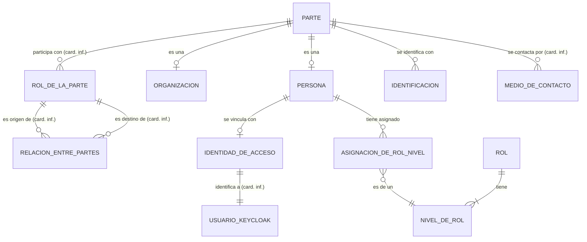
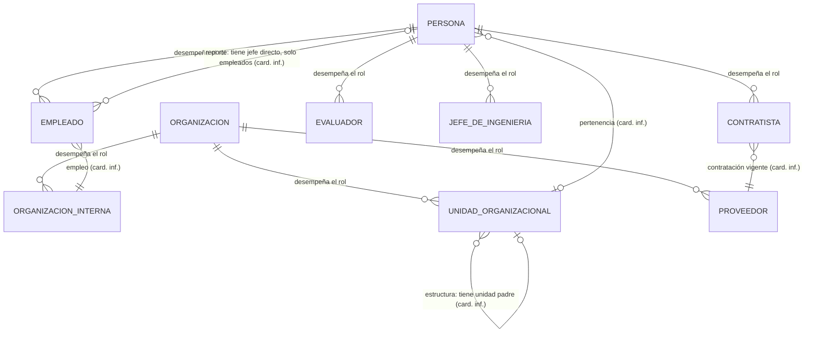
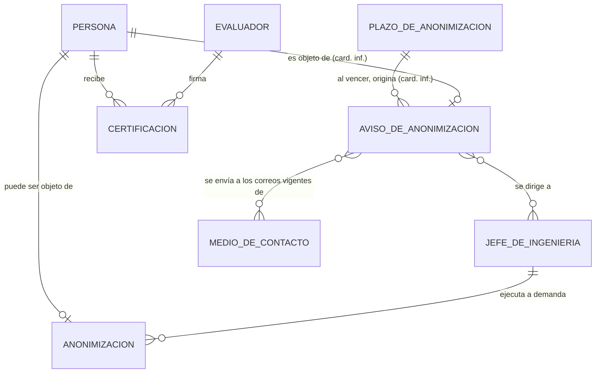

# IMD-002 — Modelo de información conceptual de partes

> **Qué es y qué no es:** es un modelo **conceptual**. Muestra qué conceptos de negocio existen y cómo se relacionan. **No** es un modelo de datos: no define tablas, atributos técnicos, identificadores ni persistencia (eso corresponde a `data-model-designer`, que parte de este modelo y de SPEC-001 §6).
>
> **Procedencia:** [SPEC-001](../../requirement/specs/SPEC-001-gestion-de-colaboradores.md) §2 a §5 (decisiones D1 a D24 de ianache, Jefe de Ingeniería, 2026-09-27), las reglas BR-PTY-01 a BR-PTY-18 de [BRC-001](../rules/BRC-001-reglas-plataforma-gestion-formacion.md) (evidencias EVD-2026-0076 a EVD-2026-0095), el glosario [GLS-001](../glossary/GLS-001-glosario-de-negocio.md) (términos TRM-0070 a TRM-0098) y [IMD-001](IMD-001-modelo-de-informacion-conceptual.md) para los conceptos del catálogo y la certificación. Todas las fuentes están en `draft`. La alineación con el patrón Party del Universal Data Model es una decisión de SPEC-001 (D5) cuya correspondencia con la fuente original no se verificó; el decisor resolvió que no hace falta verificarla (SPEC-001 Q-07, D29). En los diagramas, las relaciones marcadas **(inf.)** son inferencias y **(card. inf.)** indica que solo la cardinalidad es inferida. El detalle de cada relación está en la sección 6. También el 2026-09-27 se incorporaron las decisiones EVD-2026-0103 y EVD-2026-0105 de BRC-001 (ianache, Jefe de Ingeniería, en respuesta a P-28 y P-31): nivel inicial de Rol-Nivel al registrar a un colaborador (BR-PRF-02) y Evaluador y Jefe de Ingeniería como solo gestores del programa, fuera del proceso de evaluación (BR-PRG-01 revisada, BR-PRG-02). Después, también el 2026-09-27, se incorporaron SPEC-001 D25 a D27 (EVD-2026-0119 a 0121): el código de colaborador lo genera la plataforma (BR-PTY-06), un contratista no tiene jefe directo (BR-PTY-19) y los datos de las personas son data abierta para cualquier colaborador (BR-PTY-20, permiso: no se modela aquí; alcance en P-52).
>
> - **Alcance:** información maestra de colaboradores (empleados y contratistas), personas que cumplen roles del programa, organizaciones (COMSATEL, sus unidades y los proveedores), su historial por vigencias, el vínculo con Keycloak, la asignación de Rol-Nivel y la anonimización.
> - **Consumidor previsto:** `data-model-designer` (modelo lógico y físico de SPEC-001 §6), `af-user-story-refiner` (historias C1 a C11) y los responsables humanos (Jefe de Ingeniería).

## 1. Vista general

Hay cuatro bloques de conceptos:

1. **Núcleo de partes:** toda [parte](../glossary/terms/TRM-0070-parte.md) es una [persona](../glossary/terms/TRM-0071-persona.md) o una [organización](../glossary/terms/TRM-0072-organizacion.md). La parte se identifica con sus [identificaciones](../glossary/terms/TRM-0081-identificacion.md), se contacta por sus [medios de contacto](../glossary/terms/TRM-0084-medio-de-contacto.md) y participa con [roles de la parte](../glossary/terms/TRM-0073-rol-de-la-parte.md), que se vinculan entre sí con [relaciones entre partes](../glossary/terms/TRM-0074-relacion-entre-partes.md) (BR-PTY-02).
2. **Roles y estructura organizacional:** los tipos de rol (Empleado, Contratista, Evaluador, Jefe de Ingeniería; Organización interna, Unidad organizacional, Proveedor) y los cinco tipos de relación: empleo, contratación, pertenencia, estructura y reporte (BR-PTY-03, BR-PTY-04).
3. **Vínculos con otros dominios:** la [identidad de acceso](../glossary/terms/TRM-0089-identidad-de-acceso.md) vincula a la persona con su usuario de [Keycloak](../glossary/terms/TRM-0090-keycloak.md) (BR-PTY-16), y la [asignación de Rol-Nivel](../glossary/terms/TRM-0088-asignacion-de-rol-nivel.md) le asigna un nivel de rol del catálogo de IMD-001 (BR-PTY-11).
4. **Baja y anonimización:** la [baja](../glossary/terms/TRM-0094-baja.md) cierra la vigencia del rol de Empleado o de Contratista; al vencer el [plazo de anonimización](../glossary/terms/TRM-0097-plazo-de-anonimizacion.md) la plataforma genera un [aviso de anonimización](../glossary/terms/TRM-0098-aviso-de-anonimizacion.md) para el Jefe de Ingeniería, que decide si ejecuta la [anonimización](../glossary/terms/TRM-0096-anonimizacion.md) (BR-PTY-13 a BR-PTY-15).

La idea que los une es la [vigencia](../glossary/terms/TRM-0092-vigencia.md): roles, relaciones, medios de contacto y asignaciones tienen fecha desde y hasta, y un cambio cierra la vigencia anterior y abre otra, sin sobrescribir ni borrar (BR-PTY-12). La única excepción es la anonimización, que reemplaza los [datos personales](../glossary/terms/TRM-0095-datos-personales.md) y deja registro (BR-PTY-14). La plataforma es el sistema de registro de esta [información maestra](../glossary/terms/TRM-0091-informacion-maestra.md), sin integración con RR. HH. (BR-PTY-01), y la mantiene el Jefe de Ingeniería (BR-PTY-17).

**El rol del catálogo no es un rol de la parte** (SPEC-001:L98, enfoque A). Empleado o Evaluador dicen cómo participa una persona en la organización; Developer o Jefe de proyecto son roles del catálogo de competencias, que se asignan con la asignación de Rol-Nivel.

## 2. Diagrama — Núcleo de partes y vínculos con otros dominios

- **Externos:** **USUARIO_KEYCLOAK** vive en Keycloak; la plataforma solo guarda el identificador y no aprovisiona usuarios (BR-PTY-16, ADR-002). **ROL** y **NIVEL_DE_ROL** pertenecen al catálogo de competencias modelado en [IMD-001](IMD-001-modelo-de-informacion-conceptual.md) (R-23 de IMD-001); aquí solo se muestran como destino de la asignación.
- La cuenta de Gmail empresarial que envía los correos (SPEC-001 D19) y HashiCorp Vault, que guarda sus credenciales (D22), no son conceptos de negocio: son medios técnicos del envío del aviso y quedan para la arquitectura (ADR-004 previsto).

**Conceptos derivados** (se calculan, no se registran):
- **[Colaborador](../glossary/terms/TRM-0013-colaborador.md):** persona con un rol vigente de Empleado o de Contratista; no es una entidad propia (BR-PTY-05, SPEC-001 D7). Sustituye al concepto registrado COLABORADOR de IMD-001 (ver R-18, R-28 y R-29 de IMD-001).
- **Nivel de rol vigente de una persona en un rol:** la asignación de Rol-Nivel vigente de esa persona para ese rol; hay como máximo una (BR-PTY-11).
- **[Jefe directo](../glossary/terms/TRM-0080-jefe-directo.md):** la persona destino de la relación de reporte vigente de un empleado (BR-PTY-04). Un contratista no tiene jefe directo en COMSATEL (BR-PTY-19).

## 3. Diagrama — Roles de la parte y relaciones entre partes

- Cada concepto de rol de este diagrama (EMPLEADO, CONTRATISTA, EVALUADOR, JEFE_DE_INGENIERIA, ORGANIZACION_INTERNA, UNIDAD_ORGANIZACIONAL, PROVEEDOR) es un **tipo de rol de la parte** (ROL_DE_LA_PARTE del diagrama anterior), con su vigencia. Los tipos son ampliables (BR-PTY-03).
- Cada arista entre roles es una **relación entre partes** de un tipo: empleo, contratación, pertenencia, estructura o reporte (BR-PTY-04). En el diagrama se dibujan directamente entre los roles para que se lean mejor; en el modelo son RELACION_ENTRE_PARTES con rol origen y rol destino (R-04).
- COMSATEL es la organización con el rol de Organización interna (SPEC-001:L86; [TRM-0015](../glossary/terms/TRM-0015-comsatel.md)).

## 4. Diagrama — Baja, anonimización y aviso

- **CERTIFICACION** pertenece al bloque de certificación de [IMD-001](IMD-001-modelo-de-informacion-conceptual.md) (R-05 y R-08 de IMD-001). Aparece aquí porque explica por qué la persona no se borra (BR-PTY-13) y por qué el código de colaborador y las referencias de auditoría no se anonimizan (BR-PTY-14).
- El aviso de anonimización se **registra** (fecha, destinatarios, si fue atendido y si el envío se hizo o falló; SPEC-001:L169), pero su origen es una condición derivada: el vencimiento del plazo.

**Conceptos derivados** (se calculan, no se registran):
- **Persona dada de baja ([Baja](../glossary/terms/TRM-0094-baja.md)):** persona sin rol vigente de Empleado ni de Contratista; se obtiene del cierre de la vigencia de esos roles (BR-PTY-13).
- **Vencimiento del plazo:** una persona dada de baja cuya fecha de registro de la baja más el plazo de anonimización ya pasó (BR-PTY-15, SPEC-001 D17). Qué fecha exacta cuenta está en IM-Q1.
- **Destinatarios del aviso:** las personas con rol vigente de Jefe de Ingeniería y sus medios de contacto de tipo correo vigentes (BR-PTY-15, BR-PTY-18).

## 5. Conceptos

| Concepto | Nombre en diagrama | Qué es | Bloque | Glosario | Fuente | Horizonte |
|---|---|---|---|---|---|---|
| Parte | PARTE | Supertipo de toda persona u organización de la información maestra | Núcleo | [TRM-0070](../glossary/terms/TRM-0070-parte.md) | SPEC-001:L84; BR-PTY-02 | H1 (inf.) |
| Persona | PERSONA | Individuo; se registra con nombres, apellidos y, opcional, nombre preferido; la plataforma le genera su código de colaborador | Núcleo | [TRM-0071](../glossary/terms/TRM-0071-persona.md) | SPEC-001:L85, L106; BR-PTY-02, BR-PTY-06 | H1 (inf.) |
| Organización | ORGANIZACION | COMSATEL, sus unidades internas o un proveedor; se registra con su nombre y su RUC si aplica; también, por decisión de 2026-10-03, su correo laboral y teléfono laboral y el código y la ubicación (unidad) | Núcleo | [TRM-0072](../glossary/terms/TRM-0072-organizacion.md) | SPEC-001:L86, L109; BR-PTY-02 | H1 (inf.) |
| Rol de la parte | ROL_DE_LA_PARTE | Forma en que una parte participa, de un tipo ampliable, con vigencia | Núcleo | [TRM-0073](../glossary/terms/TRM-0073-rol-de-la-parte.md) | SPEC-001:L87; BR-PTY-03 | H1 (inf.) |
| Relación entre partes | RELACION_ENTRE_PARTES | Vínculo con vigencia entre un rol origen y un rol destino, de un tipo | Núcleo | [TRM-0074](../glossary/terms/TRM-0074-relacion-entre-partes.md) | SPEC-001:L88; BR-PTY-04 | H1 (inf.) |
| Identificación | IDENTIFICACION | Documento de la parte con tipo ([DNI](../glossary/terms/TRM-0082-dni.md), carné de extranjería, pasaporte o [RUC](../glossary/terms/TRM-0083-ruc.md)), número y país emisor | Núcleo | [TRM-0081](../glossary/terms/TRM-0081-identificacion.md) | SPEC-001:L89, L107; BR-PTY-07 | H1 (inf.) |
| Medio de contacto | MEDIO_DE_CONTACTO | Correo, teléfono o URL de una parte con su uso y vigencia; incluye el [correo laboral](../glossary/terms/TRM-0085-correo-laboral.md), el teléfono laboral y los [perfiles profesionales en línea](../glossary/terms/TRM-0086-perfil-profesional-en-linea.md) | Núcleo | [TRM-0084](../glossary/terms/TRM-0084-medio-de-contacto.md) | SPEC-001:L90, L108; BR-PTY-08, BR-PTY-09 | H1 (inf.) |
| Identidad de acceso | IDENTIDAD_DE_ACCESO | Identificador del usuario de Keycloak de una persona (0 o 1) | Vínculos | [TRM-0089](../glossary/terms/TRM-0089-identidad-de-acceso.md) | SPEC-001:L92; BR-PTY-16 | H1 (inf.) |
| Usuario de Keycloak | USUARIO_KEYCLOAK | Usuario de la persona en Keycloak, gestionado fuera de la plataforma | Vínculos (externo: Keycloak) | [TRM-0090](../glossary/terms/TRM-0090-keycloak.md) (sin término propio para "usuario": IM-Q6) | SPEC-001:L58; BR-PTY-16; ADR-002:L56 | H1 (inf.) |
| Asignación de Rol-Nivel | ASIGNACION_DE_ROL_NIVEL | Asignación con vigencia de un Rol-Nivel del catálogo a una persona; un solo nivel vigente por rol | Vínculos | [TRM-0088](../glossary/terms/TRM-0088-asignacion-de-rol-nivel.md) | SPEC-001:L60, L91; BR-PTY-11 | H1 (inf.) |
| Nivel de rol | NIVEL_DE_ROL | Rol-Nivel del catálogo (por ejemplo, Developer Junior Nivel 1), modelado en IMD-001 | Vínculos (IMD-001) | [TRM-0066](../glossary/terms/TRM-0066-nivel-de-rol.md) | BR-CAT-09, BR-CAT-14 | H1 |
| Rol | ROL | Rol del catálogo de competencias, modelado en IMD-001; no es un rol de la parte | Vínculos (IMD-001) | [TRM-0055](../glossary/terms/TRM-0055-rol.md) | SPEC-001:L98; BR-CAT-08 | H1 |
| Empleado | EMPLEADO | Rol de la parte de una persona con relación de empleo con la organización interna | Roles | [TRM-0075](../glossary/terms/TRM-0075-empleado.md) | BR-PTY-03, BR-PTY-04, BR-PTY-05 | H1 (inf.) |
| Contratista | CONTRATISTA | Rol de la parte de una persona externa con relación de contratación vigente con un proveedor | Roles | [TRM-0076](../glossary/terms/TRM-0076-contratista.md) | BR-PTY-03, BR-PTY-10 | H1 (inf.) |
| Evaluador | EVALUADOR | Rol de la parte de una persona que revisa evidencias y certifica; es solo gestor del programa y por ahora queda fuera del proceso de evaluación | Roles | [TRM-0021](../glossary/terms/TRM-0021-evaluador.md) (revisar definición: GQ-20, GQ-31) | BR-PTY-03; BR-PRG-01, BR-PRG-02 | H1 |
| Jefe de Ingeniería | JEFE_DE_INGENIERIA | Rol de la parte de la persona que mantiene la información maestra; se espera uno solo vigente; es solo gestor del programa y por ahora queda fuera del proceso de evaluación | Roles | [TRM-0036](../glossary/terms/TRM-0036-jefe-de-ingenieria.md) (revisar definición: GQ-19) | BR-PTY-03, BR-PTY-17, BR-PTY-18; BR-PRG-01, BR-PRG-02 | H1 |
| Organización interna | ORGANIZACION_INTERNA | Rol de la parte de COMSATEL, con la que los empleados tienen relación de empleo | Roles | [TRM-0078](../glossary/terms/TRM-0078-organizacion-interna.md) | SPEC-001:L35; BR-PTY-03 | H1 (inf.) |
| Unidad organizacional | UNIDAD_ORGANIZACIONAL | Rol de la parte de una unidad interna; forma una jerarquía y agrupa personas | Roles | [TRM-0079](../glossary/terms/TRM-0079-unidad-organizacional.md) | SPEC-001:L35; BR-PTY-03, BR-PTY-04 | H1 (inf.) |
| Proveedor | PROVEEDOR | Rol de la parte de una organización externa con la que se contratan contratistas | Roles | [TRM-0077](../glossary/terms/TRM-0077-proveedor.md) | SPEC-001:L36; BR-PTY-03, BR-PTY-10 | H1 (inf.) |
| Anonimización | ANONIMIZACION | Reemplazo irreversible de los datos personales de una persona dada de baja; registra quién y cuándo | Baja y anonimización | [TRM-0096](../glossary/terms/TRM-0096-anonimizacion.md) | SPEC-001:L115; BR-PTY-14 | H1 (inf.) |
| Plazo de anonimización | PLAZO_DE_ANONIMIZACION | Plazo configurable, contado desde el registro de la baja, tras el cual se avisa | Baja y anonimización | [TRM-0097](../glossary/terms/TRM-0097-plazo-de-anonimizacion.md) | SPEC-001:L69, L71, L77; BR-PTY-15 | H1 (inf.) |
| Aviso de anonimización | AVISO_DE_ANONIMIZACION | Aviso registrado y enviado por correo al vencer el plazo; guarda fecha, destinatarios, atención y estado del envío | Baja y anonimización | [TRM-0098](../glossary/terms/TRM-0098-aviso-de-anonimizacion.md) | SPEC-001:L72, L169; BR-PTY-15 | H1 (inf.) |
| Certificación | CERTIFICACION | Nivel otorgado a una persona en una competencia, con quién certificó, cuándo y con qué evidencia (IMD-001) | Baja y anonimización (IMD-001) | [TRM-0001](../glossary/terms/TRM-0001-acreditacion.md) | BR-ACR-03; SPEC-001:L114 | H1 |
| Colaborador | — (derivado) | Persona con un rol vigente de Empleado o de Contratista | Derivado | [TRM-0013](../glossary/terms/TRM-0013-colaborador.md) (revisar definición: GQ-18) | BR-PTY-05; SPEC-001 D7 | H1 |
| Baja (persona dada de baja) | — (derivado) | Persona sin rol vigente de Empleado ni de Contratista | Derivado | [TRM-0094](../glossary/terms/TRM-0094-baja.md) | BR-PTY-13 | H1 (inf.) |
| Jefe directo | — (derivado) | Persona destino de la relación de reporte vigente de otra persona | Derivado | [TRM-0080](../glossary/terms/TRM-0080-jefe-directo.md) | BR-PTY-04 | H1 (inf.) |

**Horizonte:** SPEC-001 no asigna horizonte. Se infiere H1 porque las capacidades H1 (perfil, certificación manual y brechas) necesitan saber quiénes son los colaboradores y su Rol-Nivel (SPEC-001:L152).

**Atributos de negocio que nombran las fuentes** (sin tipos ni claves): persona — código de colaborador (único y obligatorio, BR-PTY-06), nombres, apellidos y nombre preferido (SPEC-001:L106); organización — nombre o razón social y RUC si aplica (SPEC-001:L109); identificación — tipo, número y país emisor (BR-PTY-07); medio de contacto — tipo, uso y, para los perfiles, la plataforma (SPEC-001:L90, L108); roles, relaciones, contactos y asignaciones — fecha desde y fecha hasta (BR-PTY-02, BR-PTY-12); anonimización — quién y cuándo (SPEC-001:L115). Por minimización de datos no se registran fecha de nacimiento, género, estado civil, foto, contactos personales ni domicilio (SPEC-001:L106, L108).

## 6. Relaciones

Clasificación: **FACT** (lo dice la fuente), **INFERENCE** (deducción razonada desde fuentes citadas), **UNKNOWN** (necesario pero sin respaldo) y **RETIRADA** (ya no aplica, con motivo).

| ID | Relación | Cardinalidad | Clasificación | Fuente | Pregunta |
|---|---|---|---|---|---|
| R-01 | Toda parte es una persona o una organización, nunca las dos | 1 : 0..1 con cada subtipo, excluyentes | FACT | BR-PTY-02; SPEC-001:L84 | SPEC-001 Q-07 |
| R-02 | Una parte participa con roles de la parte, cada uno con vigencia | 1 : N | FACT (relación) · INFERENCE (cardinalidad: una persona puede ser a la vez, por ejemplo, Empleado y Evaluador, BR-PTY-03, BR-PRG-01, y el historial conserva roles cerrados, BR-PTY-12) | BR-PTY-02, BR-PTY-03, BR-PTY-12 | — |
| R-03 | Los tipos de rol dependen del tipo de parte: Empleado, Contratista, Evaluador y Jefe de Ingeniería para personas; Organización interna, Unidad organizacional y Proveedor para organizaciones | N : 1 (rol → tipo) | FACT | BR-PTY-03; SPEC-001:L87 | — |
| R-04 | Una relación entre partes vincula un rol origen con un rol destino, tiene un tipo y una vigencia | N : 1 con el rol origen; N : 1 con el rol destino | FACT (relación: "vínculo entre dos roles") · INFERENCE (cardinalidad: un rol puede participar en varias relaciones a lo largo del tiempo) | BR-PTY-02, BR-PTY-04; SPEC-001:L88 | — |
| R-05 | Empleo: un empleado tiene una relación de empleo con la organización interna | N : 1 | FACT (relación) · INFERENCE (cardinalidad: la única organización interna nombrada es COMSATEL, SPEC-001:L35) | BR-PTY-04, BR-PTY-08 | — |
| R-06 | Contratación: un contratista tiene una relación de contratación vigente con un proveedor, y su correo laboral es el de ese proveedor | N : 1 vigente | FACT (relación, BR-PTY-10) · INFERENCE (cardinalidad: "una relación... con un proveedor" se lee como exactamente una vigente) | BR-PTY-04, BR-PTY-08, BR-PTY-10 | IM-Q2 |
| R-07 | Pertenencia: una persona pertenece a una unidad organizacional | N : 0..1 vigente | FACT (relación) · INFERENCE (cardinalidad: el alta registra "unidad" en singular, SPEC-001:L139) | BR-PTY-04; SPEC-001:L139 | IM-Q2 |
| R-08 | Estructura: una unidad organizacional depende de una unidad padre | N : 0..1 | FACT (relación) · INFERENCE (cardinalidad: "unidad padre" en singular; la unidad superior no tiene padre) | BR-PTY-04; SPEC-001:L35 | — |
| R-09 | Reporte: un empleado reporta a su jefe directo, otra persona. Solo los empleados tienen esta relación: un contratista no tiene jefe directo en COMSATEL | N : 0..1 vigente | FACT (relación; solo empleados, D26) · INFERENCE (cardinalidad: "jefe directo" en singular, SPEC-001:L139) | BR-PTY-04, BR-PTY-19; SPEC-001:L139, L80 | IM-Q2 (SPEC-001 Q-02 respondida, D26) |
| R-10 | Una parte se identifica con una o varias identificaciones; cada una es única por tipo, número y país emisor, y los tipos dependen del tipo de parte (DNI, carné de extranjería o pasaporte para personas; RUC para organizaciones) | 1 : 0..N (una organización tiene RUC solo "si aplica") | FACT | BR-PTY-07; SPEC-001:L107, L109, L120 | — |
| R-11 | Una parte (persona **u organización**) se contacta por medios de contacto, cada uno con su uso (laboral o perfil profesional) y su vigencia | 1 : N | FACT (relación) · INFERENCE (cardinalidad: cada medio pertenece a una sola parte, porque el correo laboral es único entre los colaboradores vigentes, BR-PTY-08; las fuentes no dicen si un medio puede compartirse) | BR-PTY-09; SPEC-001:L90, L108 | — |
| R-12 | Todo colaborador tiene un correo laboral vigente: el de COMSATEL si es empleado y el de su proveedor si es contratista | 1 : 1 vigente | FACT (obligatorio y único, BR-PTY-08) · INFERENCE (máximo uno vigente) | BR-PTY-08; SPEC-001:L67, L108 | — |
| R-13 | Una persona puede tener varios perfiles profesionales en línea, cada uno en una plataforma de una lista ampliable; no son evidencia de nivel | 1 : 0..N | FACT | BR-PTY-09; SPEC-001:L108 | BRC-001 P-52 (respondida el 2026-09-27: los perfiles profesionales son visibles para cualquier colaborador, BR-PTY-20) |
| R-14 | Una persona tiene cero o una identidad de acceso | 1 : 0..1 | FACT | BR-PTY-16; SPEC-001:L92 | — |
| R-15 | Una identidad de acceso identifica a un usuario de Keycloak | 1 : 1 | FACT (relación) · INFERENCE (cardinalidad: un usuario de Keycloak se vincula con una sola persona) | BR-PTY-16; SPEC-001:L58 | IM-Q6 |
| R-16 | Una persona tiene asignaciones de Rol-Nivel, cada una con vigencia | 1 : 0..N (un colaborador, 1..N desde su registro: R-29) | FACT | BR-PTY-11, BR-PTY-12; SPEC-001:L91 | BRC-001 P-28 (respondida), BRC-001 P-42 |
| R-17 | Una asignación de Rol-Nivel es de un nivel de rol del catálogo | N : 1 | FACT | BR-PTY-11; SPEC-001:L91 | BRC-001 P-28 (respondida), BRC-001 P-42 |
| R-18 | Una persona puede tener varios roles del catálogo asignados, con un solo nivel vigente por rol; cambiar de nivel cierra la asignación anterior | Por persona y rol: 0..1 asignación vigente; por persona: 0..N roles | FACT (decisión SPEC-001 D6) | BR-PTY-11 | — |
| R-19 | Se espera una sola persona con rol vigente de Jefe de Ingeniería; si se asigna un segundo, la plataforma avisa sin impedirlo | 1 esperado; 0..N permitido | FACT (decisión SPEC-001 D20, D21) | BR-PTY-18 | — |
| R-20 | Una persona dada de baja puede ser objeto de una anonimización, irreversible, que registra quién y cuándo | 1 : 0..1 | FACT (relación y registro, SPEC-001:L115) · INFERENCE (condición: solo personas dadas de baja, SPEC-001:L127) | BR-PTY-14; SPEC-001:L115, L127 | GQ-26, IM-Q4 |
| R-21 | La anonimización la ejecuta, a demanda, una persona con rol de Jefe de Ingeniería | N : 1 | FACT | BR-PTY-14; SPEC-001 D15 | — |
| R-22 | Un único plazo de anonimización configurable se aplica a todas las personas dadas de baja, contado desde el registro de su baja | 1 : N | FACT (plazo configurable desde la baja, BR-PTY-15) · INFERENCE (cardinalidad: SPEC-001 habla de "un plazo", en singular, sin distinguir personas) | BR-PTY-15; SPEC-001:L168 | IM-Q1 |
| R-23 | Al vencer el plazo, la plataforma genera un aviso de anonimización para la persona dada de baja | 1 : 0..1 (persona → aviso) | FACT (relación) · INFERENCE (cardinalidad: un aviso por persona, con reintentos del envío dentro del mismo aviso, SPEC-001:L169) | BR-PTY-15; SPEC-001:L169 | IM-Q5 |
| R-24 | Un aviso de anonimización se dirige a todas las personas con rol vigente de Jefe de Ingeniería, a todos sus correos vigentes; si no hay ninguna con correo vigente, queda como no enviado | N : M | FACT | BR-PTY-15, BR-PTY-18; SPEC-001:L125 | — |
| R-25 | La baja cierra la vigencia del rol de Empleado o de Contratista; la persona no se borra | — (cambio de vigencia sobre R-02) | FACT | BR-PTY-13; SPEC-001:L114 | IM-Q1, IM-Q4 |
| R-26 | Una persona recibe certificaciones, que necesitan conservarla aunque se dé de baja | 1 : N | FACT (IMD-001 R-05) | BR-PTY-13, BR-ACR-03; SPEC-001:L114 | — |
| R-27 | Una certificación registra quién la firmó; tras la anonimización lo sigue mostrando por su código de colaborador, que no se anonimiza | N : 1 | FACT (decisión SPEC-001 D16) | BR-PTY-14, BR-ACR-03; SPEC-001:L115 | — |
| R-28 | Un evaluador o un Jefe de Ingeniería es también un colaborador | UNKNOWN | UNKNOWN: los roles del programa son roles de la parte de una persona (BR-PTY-03), pero las fuentes no dicen si esa persona debe tener un rol vigente de Empleado o de Contratista. Desde el 2026-09-27 (respuesta a P-31, BR-PRG-01, BR-PRG-02) es FACT que son solo gestores del programa y que por ahora quedan fuera del proceso de evaluación, aunque "sus roles también tienen competencias definidas"; eso no dice si deben ser colaboradores | BR-PTY-03, BR-PTY-05, BR-PRG-01, BR-PRG-02 | IM-Q3, IM-Q7 (BRC-001 P-31, respondida) |
| R-29 | Al registrar a un colaborador se le asigna un nivel inicial del rol que se le asigna (su primera asignación de Rol-Nivel); después se evalúa la evolución de sus competencias del rol por cursos o desempeño en proyectos | Por colaborador: 1..N asignaciones de Rol-Nivel desde su registro | FACT (relación, decisión ianache (Jefe de Ingeniería), 2026-09-27, respuesta a P-28) · INFERENCE (cardinalidad: la asignación inicial se hace al registrar, así que todo colaborador tiene al menos una) | BR-PRF-02, BR-PTY-11 | BRC-001 P-42, IM-Q4 |
| R-30 | Una unidad organizacional puede tener un código y una ubicación, además de su nombre | 1 : 0..1 cada uno | FACT (decisión de ianache, Jefe de Ingeniería, 2026-10-03, registrada en [API-SPEC-002](../../architecture/api/API-SPEC-002-organizations.md)) | [API-SPEC-002](../../architecture/api/API-SPEC-002-organizations.md) (decisión; sin BR-*) | IM-Q8, IM-Q9 |
| R-31 | Una organización (unidad o proveedor) tiene al menos un correo laboral vigente y puede tener teléfonos laborales, cada uno con su vigencia. El correo de una organización puede coincidir con el de un colaborador; la unicidad de BR-PTY-08 se mantiene solo entre colaboradores | correo 1 : 1..N · teléfono 1 : 0..N | FACT (decisión de ianache, 2026-10-03, registrada en [API-SPEC-002](../../architecture/api/API-SPEC-002-organizations.md)) | [API-SPEC-002](../../architecture/api/API-SPEC-002-organizations.md) (decisión; sin BR-*); BR-PTY-08; R-11 | IM-Q12 |
| R-32 | ~~Un proveedor tiene un régimen tributario~~ | — | RETIRADA | Retirada el 2026-10-03: la muestra `tax_regime: "RUC"` de API-SPEC-001 §3.2 era el tipo de documento (ya modelado como identificación, R-10), no un régimen; ianache confirmó que no hay otros metadatos ni aplica a unidades ([API-SPEC-002](../../architecture/api/API-SPEC-002-organizations.md)) | — |

## 7. Reglas que actúan sobre el modelo

| Regla | Sobre qué concepto | Qué impone |
|---|---|---|
| BR-PTY-01 | Información maestra | La plataforma es su sistema de registro; no hay integración con RR. HH. |
| BR-PTY-02 | Parte, Rol de la parte, Relación entre partes | Toda parte es una persona o una organización; roles y relaciones tienen vigencia |
| BR-PTY-03 | Rol de la parte | Tipos por tipo de parte; ampliables |
| BR-PTY-04 | Relación entre partes | Tipos: empleo, contratación, pertenencia, estructura y reporte |
| BR-PTY-05 | Colaborador (derivado) | Persona con rol vigente de Empleado o de Contratista |
| BR-PTY-06 | Persona | Código de colaborador interno, único y obligatorio, que la plataforma genera automáticamente (GUID) |
| BR-PTY-07 | Identificación | Tipos aceptados por tipo de parte; única por tipo, número y país emisor |
| BR-PTY-08 | Medio de contacto | Correo laboral obligatorio: el de COMSATEL o el del proveedor; único entre colaboradores vigentes |
| BR-PTY-09 | Medio de contacto | Correo, teléfono opcional y perfiles profesionales opcionales y múltiples; los perfiles no son evidencia |
| BR-PTY-10 | Contratista | Tiene una relación de contratación vigente con un proveedor |
| BR-PTY-11 | Asignación de Rol-Nivel | Varios roles, un solo nivel vigente por rol; cambiar de nivel cierra la anterior |
| BR-PTY-12 | Roles, relaciones, contactos y asignaciones | No se sobrescriben ni se borran; se cierra la vigencia; todo cambio se audita |
| BR-PTY-13 | Persona, Rol de la parte | La baja cierra la vigencia del rol; la persona no se borra |
| BR-PTY-14 | Anonimización, Persona | A demanda, irreversible, en todas las vigencias; conserva código y auditoría; las unicidades ignoran a los anonimizados |
| BR-PTY-15 | Plazo y aviso de anonimización | Plazo configurable desde el registro de la baja; correo automático a todos los Jefes de Ingeniería vigentes |
| BR-PTY-16 | Identidad de acceso | Solo el identificador del usuario de Keycloak (0 o 1); no aprovisiona usuarios |
| BR-PTY-17 | Información maestra | La mantiene el Jefe de Ingeniería; el colaborador edita solo sus perfiles profesionales y su teléfono laboral (permiso: no se modela aquí) |
| BR-PTY-18 | Jefe de Ingeniería | Se espera uno solo vigente; un segundo se avisa sin impedirlo |
| BR-PTY-19 | Contratista, Relación entre partes (reporte) | Un contratista no tiene jefe directo en COMSATEL: la relación de reporte solo parte de un empleado (R-09) |
| BR-PTY-20 | Información maestra | Cualquier colaborador que ingrese ve de las demás personas solo nombre, correo laboral, unidad, rol y perfiles profesionales; identificaciones y teléfono no (precisada el 2026-09-27, P-52; permiso: no se modela aquí) |
| BR-PRF-01 | Asignación de Rol-Nivel | Al colaborador le es asignado un rol; puede tener varios, con un nivel vigente por rol |
| BR-PRF-02 | Asignación de Rol-Nivel | Al registrar a un colaborador se le asigna un nivel inicial del rol; su evolución se evalúa después por cursos o desempeño en proyectos |
| BR-PRG-01 | Evaluador, Jefe de Ingeniería | Gestionan todo el programa de formación; son solo gestores |
| BR-PRG-02 | Evaluador, Jefe de Ingeniería | Por ahora quedan fuera del proceso de evaluación, aunque sus roles tienen competencias definidas |
| BR-ACR-03 | Certificación | Registra quién certificó, cuándo y con qué evidencia |
| SPEC-001:L127 (inferencia, sin BR-*) | Anonimización | Solo se anonimiza a una persona sin roles vigentes de Empleado o Contratista (a confirmar: GQ-26) |

## 8. Preguntas abiertas del modelo

Se reutilizan las preguntas de SPEC-001 (Q-nn), BRC-001 (P-nn) y el glosario (GQ-nn). Estas son nuevas:

| ID | Pregunta | Afecta a | Responsable | Prioridad |
|---|---|---|---|---|
| IM-Q1 | ¿El plazo de anonimización se cuenta desde el momento en que se registra la baja o desde la fecha hasta del rol de Empleado o de Contratista, si son distintas (por ejemplo, una baja registrada con fecha pasada o futura)? | R-22, R-25 | Jefe de Ingeniería | Media |
| IM-Q2 | ¿Una persona puede pertenecer a más de una unidad organizacional, tener más de un jefe directo o más de una relación de contratación vigentes al mismo tiempo? | R-06, R-07, R-09 | Jefe de Ingeniería | Media |
| IM-Q3 | ¿Un evaluador o un Jefe de Ingeniería debe ser colaborador (tener un rol vigente de Empleado o de Contratista)? | R-28 | Jefe de Ingeniería | Media — sigue abierta. P-31 se respondió el 2026-09-27 (solo gestores, fuera de la evaluación, BR-PRG-02), pero no dice si deben ser colaboradores |
| IM-Q4 | Al registrar la baja de una persona, ¿se cierran también sus roles vigentes de Evaluador o de Jefe de Ingeniería y sus asignaciones de Rol-Nivel? ¿Una persona con esos roles vigentes puede anonimizarse? | R-20, R-25 | Jefe de Ingeniería | Media |
| IM-Q5 | ¿Se genera un solo aviso por persona dada de baja, o se vuelve a avisar si el Jefe de Ingeniería no lo atiende? | R-23 | Jefe de Ingeniería | Baja |
| IM-Q6 | ¿Hace falta un término de glosario para "usuario de Keycloak", o basta con Keycloak e Identidad de acceso? | R-15; Glosario | Jefe de Ingeniería | Baja |
| IM-Q7 | BR-PRG-02 dice que los roles de Evaluador y de Jefe de Ingeniería "también tienen competencias definidas". Aquí son roles de la parte (BR-PTY-03), no roles del catálogo. ¿Existen también como roles del catálogo con sus Rol-Nivel y competencias, que se asignan con la asignación de Rol-Nivel? | R-28, R-17 | Jefe de Ingeniería | Media |
| ~~IM-Q8~~ | **Respondida (ianache, Jefe de Ingeniería, 2026-10-03):** una organización registra **correo laboral y teléfono laboral** (R-31). Abiertas: obligatoriedad y cuántos vigentes (IM-Q10) | R-11, R-30 | Jefe de Ingeniería | Media |
| ~~IM-Q9~~ | **Respondida (ianache, Jefe de Ingeniería, 2026-10-03):** el régimen tributario y los metadatos del proveedor **sí son información de negocio** (R-32). Abiertas: valores del régimen y qué otros metadatos (IM-Q11) | R-30 | Jefe de Ingeniería | Baja |
| ~~IM-Q10~~ | **Respondida (ianache, Jefe de Ingeniería, 2026-10-03):** el correo laboral es obligatorio y el teléfono opcional, para unidades y proveedores; una organización tiene 1 o más de cada uno vigentes; su correo puede coincidir con el de un colaborador y BR-PTY-08 se mantiene (R-31) | R-31 | Jefe de Ingeniería | — |
| ~~IM-Q11~~ | **Respondida (ianache, Jefe de Ingeniería, 2026-10-03):** `tax_regime: "RUC"` es un tipo de documento, no un régimen; no aplica a unidades y no hay más metadatos. R-32 retirada | R-32 | Jefe de Ingeniería | — |
| ~~IM-Q12~~ | **Confirmada como regla (ianache, Jefe de Ingeniería, 2026-10-03):** si el correo de una organización coincide con el de un colaborador que se anonimiza, la organización conserva su correo; solo se desvincula al colaborador. Debe respetarse al implementar US-024 (hoy sin implementar; la fila de correo compartida no puede borrarse mientras otra parte la use) | R-31, R-20 | Jefe de Ingeniería | Media |
| SPEC-001 Q-01 | ¿Cómo se genera el código de colaborador? (GQ-22) | Persona | Jefe de Ingeniería | Respondida (ianache (Jefe de Ingeniería), 2026-09-27, D25): automáticamente, como un GUID (BR-PTY-06) |
| SPEC-001 Q-02 | ¿Un contratista tiene jefe directo dentro de COMSATEL? (GQ-23) | R-09 | Jefe de Ingeniería | Respondida (ianache (Jefe de Ingeniería), 2026-09-27, D26): no (BR-PTY-19). R-09 queda solo para empleados |
| SPEC-001 Q-05 | ¿Quién ve los datos de otras personas, incluidos los perfiles profesionales? (P-08; permiso, no se modela aquí) | R-13 | Responsable de producto | Respondida (ianache (Jefe de Ingeniería), 2026-09-27, D27): cualquier colaborador que ingrese (BR-PTY-20). El alcance se fijó en P-52 |
| BRC-001 P-52 | "Data abierta": ¿incluye identificaciones, teléfono laboral y personas dadas de baja o anonimizadas? (permiso, no se modela aquí) | R-10, R-11, R-13, R-20 | Jefe de Ingeniería + Legal | Respondida (ianache (Jefe de Ingeniería), 2026-09-27, EVD-2026-0130): solo nombre, correo laboral, unidad, rol y perfiles profesionales. Sin cambio de estructura |
| SPEC-001 Q-07 | Verificar la correspondencia con el UDM contra *The Data Model Resource Book, Vol. 1* (GQ-25) | R-01 a R-04, R-16 | Arquitecto responsable | Respondida (ianache (Jefe de Ingeniería), 2026-09-27, D29): no es necesario |
| BRC-001 P-28 | ¿La asignación de Rol-Nivel debe justificarse con competencias certificadas? | R-16, R-17, R-29 | Jefe de Ingeniería | Respondida (ianache (Jefe de Ingeniería), 2026-09-27): al registrar al colaborador se asigna un nivel inicial según su rol, y su evolución se evalúa después por cursos o desempeño en proyectos (BR-PRF-02) |
| BRC-001 P-42 | ¿Cómo se decide el paso de un colaborador al siguiente nivel de su rol (quién lo decide, o si se deduce de las competencias certificadas)? | R-16, R-17, R-29 | Jefe de Ingeniería | Alta |

## 9. Historial de cambios del modelo

| Fecha | Cambio | Relaciones o conceptos afectados | Fuente |
|---|---|---|---|
| 2026-09-27 | Alta del modelo: 23 conceptos registrados, 3 derivados y 28 relaciones; IM-Q1 a IM-Q6 nuevas | R-01 a R-28; todos los conceptos | SPEC-001 (D1 a D24), BRC-001 BR-PTY-01 a BR-PTY-18 (EVD-2026-0076 a 0095), GLS-001 TRM-0070 a TRM-0098 |
| 2026-09-27 | P-28 y P-31 respondidas por ianache (Jefe de Ingeniería), 2026-09-27: alta de R-29 (nivel inicial de Rol-Nivel al registrar a un colaborador); R-16 y R-17 remiten a P-42; R-28 sigue UNKNOWN con la nueva decisión anotada; Evaluador y Jefe de Ingeniería, solo gestores y fuera de la evaluación; reglas BR-PRF-02 y BR-PRG-02; IM-Q7 nueva | R-16, R-17, R-28, R-29; Evaluador, Jefe de Ingeniería, Asignación de Rol-Nivel | BR-PRF-02, BR-PRG-01, BR-PRG-02 (EVD-2026-0103, 0105) |
| 2026-09-27 | SPEC-001 Q-01, Q-02, Q-05 y Q-07 respondidas por ianache (Jefe de Ingeniería): el código de colaborador lo genera la plataforma; R-09 (reporte) pasa a tener como origen el rol de Empleado, porque un contratista no tiene jefe directo (diagrama 3 actualizado); los datos de las personas son data abierta (permiso, sin cambio de estructura); no se verifica contra el UDM. Reglas BR-PTY-19 y BR-PTY-20; P-52 nueva | R-09, R-13; Persona, Jefe directo | SPEC-001 D25, D26, D27, D29; BR-PTY-06, BR-PTY-19, BR-PTY-20 (EVD-2026-0119 a 0121, 0123) |
| 2026-10-03 | Q-6 de [API-SPEC-002](../../architecture/api/API-SPEC-002-organizations.md) resuelta por ianache (Jefe de Ingeniería): el contacto de la organización pertenece al dominio y microservicio Party (no hay dominio nuevo; R-11 ya cubre a toda parte). Alta de R-30 (código y ubicación de la unidad) e IM-Q8, IM-Q9 | R-11, R-30 | API-SPEC-002 (decisión) |
| 2026-10-03 | IM-Q8 e IM-Q9 respondidas por ianache (Jefe de Ingeniería): la organización registra correo y teléfono laborales y el proveedor un régimen tributario. Alta de R-31 y R-32; IM-Q10 e IM-Q11 nuevas | R-31, R-32; Organización | [API-SPEC-002](../../architecture/api/API-SPEC-002-organizations.md) (decisión) |
| 2026-10-03 | IM-Q10 e IM-Q11 respondidas por ianache: correo laboral obligatorio y teléfono opcional (1..N) para toda organización, con correo que puede coincidir con el de un colaborador; sin régimen tributario ni más metadatos. R-31 precisada, R-32 RETIRADA; IM-Q12 nueva | R-31, R-32; Organización | [API-SPEC-002](../../architecture/api/API-SPEC-002-organizations.md) (decisión) |
| 2026-10-03 | IM-Q12 confirmada: regla de conservar el correo de la organización al anonimizar a un colaborador con el mismo correo (aplica a US-024). Implementado el contacto de la organización (R-31) con propósitos propios | R-31, R-20 | [API-SPEC-002](../../architecture/api/API-SPEC-002-organizations.md) (decisión) |

## 10. Preparación y validación

- **Estado:** CONDITIONAL para pasar a `data-model-designer`
- **Motivo:** el núcleo de partes, los tipos de rol y de relación, la asignación de Rol-Nivel, el vínculo con Keycloak y la anonimización están sostenidos por decisiones humanas registradas (SPEC-001 D2 a D27 y D29, BR-PTY-01 a BR-PTY-20), pero SPEC-001, BRC-001 y los términos TRM-0070 a TRM-0098 siguen en `draft`. La correspondencia con el UDM no se verificó; el decisor resolvió que no hace falta (Q-07, D29). Las cardinalidades de R-02, R-04 a R-09, R-11, R-12, R-15, R-22 y R-23 son inferencias. Ninguna pregunta abierta bloquea el modelo lógico de SPEC-001 §6, que ya fija las mismas vigencias y unicidades; IM-Q1, IM-Q2 e IM-Q4 pueden cambiar validaciones.
- **Validación por bloque:**
  - [ ] Núcleo de partes y roles — Jefe de Ingeniería — IM-Q2, IM-Q3, IM-Q7 (Q-01 y Q-02 respondidas, D25 y D26)
  - [ ] Vínculos (Keycloak y Rol-Nivel) — Jefe de Ingeniería — P-42, IM-Q6
  - [ ] Baja y anonimización — Jefe de Ingeniería (y Legal para la anonimización) — IM-Q1, IM-Q4, IM-Q5, GQ-26
  - [x] Correspondencia con el UDM — no se verifica por decisión de ianache (Jefe de Ingeniería), 2026-09-27 (Q-07, D29)
- **Inferencias a aceptar o rechazar:** R-20 (solo personas dadas de baja) y las cardinalidades de R-02, R-04 a R-09, R-11, R-12, R-15, R-22, R-23 y R-29
