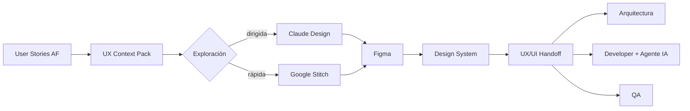

# Track UX/UI Potenciado por IA — Malla UX-101 a UX-106

COMSATEL · Programa de Formación de Competencias 2026 · Sep 26, 2026 · @ILVER ANACHE

## 1. Propósito y principio rector

El track forma al Diseñador UX/UI para dirigir agentes IA y producir artefactos gobernados, trazables y consumibles por Arquitectura, Development y QA. Son 6 cursos: 2 de base metodológica, 3 laboratorios tecnológicos y 1 de handoff.

**Principio rector: el método es uno, las herramientas son caminos.** Claude Design, Google Stitch y Figma no compiten. Cada una enseña una forma distinta de trabajar con IA sobre el mismo método y el mismo caso de estudio:

- **Claude Design** — diseño dirigido: el diseñador razona con un agente, genera alternativas y documenta decisiones.
- **Google Stitch** — generación rápida: del requerimiento al prompt, a la UI y a la iteración en minutos.
- **Figma** — diseño gobernado: Design System, tokens, componentes y handoff industrializado con Figma MCP.

Lo que se evalúa no es la pantalla generada, sino la calidad de las decisiones, la trazabilidad y la verificabilidad del artefacto.

## 2. Marco metodológico común

Todo el track sigue un flujo único; las herramientas solo cambian cómo se ejecutan las etapas 3 y 4.



**Ciclo de trabajo con agentes (se aplica en todos los cursos):** Contexto → Intención → Generación → Crítica → Decisión → Registro.

1. **Contexto** — el agente recibe un Context Pack, nunca un prompt suelto.
2. **Intención** — el diseñador declara objetivo, restricciones y criterio de éxito antes de generar.
3. **Generación** — el agente produce alternativas (mínimo 2).
4. **Crítica** — se evalúan contra heurísticas, accesibilidad, Design System y criterios de aceptación.
5. **Decisión** — el humano decide y justifica; el agente no decide.
6. **Registro** — la decisión queda como artefacto OKF con provenance.

**Rol de cada herramienta en el flujo**

| Herramienta | Modo de trabajo | Etapa donde aporta más | Salida hacia Figma / Dev |
| --- | --- | --- | --- |
| Claude Design | Diseño dirigido por razonamiento | Alternativas, flujos, decisiones | HTML, PDF, PPTX, Canva, handoff bundle a Claude Code (no exporta a Figma) |
| Google Stitch | Generación rápida por prompt | Exploración visual y variantes | Paste to Figma (plugin), código HTML/Tailwind, servidor MCP |
| Figma | Diseño gobernado | Design System, componentes, handoff | Dev Mode, Figma MCP, Code Connect |

**Base conceptual (se enseña en UX-101/102 y se reutiliza en los labs):** Design Thinking y Double Diamond para discovery; Jobs To Be Done y journeys; Atomic Design para componentes; heurísticas de Nielsen; WCAG 2.2 AA como piso de accesibilidad; design tokens como contrato Diseño ↔ Código.

## 3. Estándar de artefactos: OKF v0.2 y trazabilidad

Todo entregable Markdown generado por un Skill es un concepto [OKF v0.2](https://github.com/GoogleCloudPlatform/open-knowledge-format/blob/main/SPEC.md): un archivo `.md` con frontmatter YAML dentro de un bundle. OKF solo exige el campo `type`; el track estandariza además provenance, trust y lifecycle.

**Cadena de trazabilidad obligatoria:** User Story → UX Requirement → Screen/Flow → Component → Acceptance Criteria. OKF expresa el lineage mediante links Markdown entre conceptos, no con un campo dedicado; por eso cada artefacto enlaza a su padre con rutas absolutas del bundle.

| Concepto | `type` OKF | Prefijo ID | Enlaza a | Curso que lo introduce |
| --- | --- | --- | --- | --- |
| User Story (entrada AF) | User Story | US- | — | UX-101 (consume) |
| Requisito UX | UX Requirement | UXR- | US- | UX-101 |
| Flujo | User Flow | FLW- | UXR- | UX-101 |
| Pantalla | Screen | SCR- | FLW-, UXR- | UX-102 |
| Componente | UI Component | CMP- | SCR-, token | UX-102 |
| Token | Design Token | TKN- | — | UX-102 |
| Decisión de diseño | Design Decision | DD- | UXR-, SCR- | UX-103 |
| Criterio de aceptación UX | Acceptance Criterion | AC- | SCR-, CMP- | UX-102 |
| Paquete de handoff | Handoff Pack | HOF- | todos | UX-106 |

**Campos obligatorios en el track** (además de `type`): `title`, `description`, `tags`, `status` (`draft` | `stable` | `deprecated`), `generated` (actor + fecha), `sources` con `id` y `resource`. `verified` es obligatorio para pasar a `stable`: un `verified` con actor `human:` eleva el concepto al nivel *human-reviewed*, que es el mínimo exigido para el handoff.

Convención de actores: agentes como `claude-design/<versión>`, `stitch/<modo>`, `ux-requirements-analyzer/1.0`; personas como `human:<usuario>`.

**Estructura de bundle del caso de estudio**

```
ux-bundle/
  index.md            # okf_version: "0.2"
  log.md
  context/            # UX Context Pack
  requirements/       # UXR-*
  flows/              # FLW-*
  screens/            # SCR-*
  components/         # CMP-*
  tokens/             # TKN-*
  decisions/          # DD-*
  acceptance/         # AC-*
  handoff/            # HOF-*, matriz de trazabilidad, ASR
  quality/            # UX Quality Report
  references/         # capturas, exports, links a Figma/Stitch/Claude Design
```

**Ejemplo de concepto**

```markdown
---
type: Screen
title: SCR-014 Detalle de alerta de unidad
description: Pantalla que muestra el detalle y las acciones sobre una alerta de geocerca.
tags: [clocator-v2, alertas, mobile]
status: draft
generated: { by: stitch/gemini-3-flash, at: 2026-10-05T15:00:00-05:00 }
verified: { by: human:disenador-ux, at: 2026-10-06T10:00:00-05:00 }
sources:
  - id: us-231
    resource: /inputs/user-stories/US-231.md
    title: US-231 Gestionar alertas de geocerca
  - id: stitch-export
    resource: /references/stitch/scr-014.html
---

# Trazabilidad
- Requisito: [UXR-031](/requirements/UXR-031.md)
- Flujo: [FLW-007](/flows/FLW-007.md)
- Componentes: [CMP-AlertCard](/components/CMP-AlertCard.md)
- Criterios: [AC-014-01](/acceptance/AC-014-01.md)

# Estados
loading · empty · success · error · sin permiso
```

La fecha, el producto y los IDs del ejemplo son ilustrativos.

## 4. Resumen de la malla

Seis cursos de una semana cada uno: 81 horas en total, con sesiones de 3 h. Los cursos base (UX-101, UX-102) y el de handoff (UX-106) tienen 4 sesiones; cada laboratorio tecnológico tiene 5.

| Curso | Nombre | Tipo | Sesiones / horas | Resultado principal | Skill Package |
| --- | --- | --- | --- | --- | --- |
| UX-101 | UX con IA | Base metodológica | 4 / 12 h | UX Context Pack | ux-requirements-analyzer, user-flow-designer |
| UX-102 | Diseño de Interfaces con IA | Base metodológica | 4 / 12 h | UI Specification | ui-spec-writer, accessibility-reviewer |
| UX-103 | Claude Design Lab | Laboratorio | 5 / 15 h | Prototipo + Design Decisions | claude-design-orchestrator |
| UX-104 | Google Stitch Lab | Laboratorio | 5 / 15 h | Prototipo Stitch refinado | stitch-ui-generator |
| UX-105 | Figma AI Lab | Laboratorio | 5 / 15 h | Prototipo Figma gobernado | figma-design-validator |
| UX-106 | UX/UI Handoff Agentic | Integración | 4 / 12 h | Development/QA Context Pack | ux-development-handoff |

**Secuencia:** UX-101 → UX-102 son prerrequisito de todo. UX-103, UX-104 y UX-105 son independientes entre sí y resuelven el mismo caso; UX-105 puede partir del resultado de UX-104 (Paste to Figma) o directamente de la UI Specification. UX-106 consume el mejor resultado de los labs.

**Correspondencia con el programa 2026 (UX-101 a UX-104 originales):** Contexto → UX-101; Construcción → UX-102 + labs; Ejecución (Design-to-Code) → UX-105 + UX-106; Calidad → criterios de UX-102 aplicados en UX-106. Los outcomes originales se conservan; solo se redistribuyen.

## 5. UX-101 — UX con IA

**Objetivo:** Construir un UX Context Pack trazable a partir de User Stories reales, usando agentes para el discovery, los journeys y los flujos, sin delegar el juicio de diseño.

**Competencias (Bloom)**

1. Analizar User Stories y reglas de negocio para derivar requisitos UX verificables.
2. Diferenciar hechos, supuestos, vacíos y preguntas abiertas en el contexto del usuario.
3. Construir journeys y user flows con estados y caminos de error.
4. Aplicar el ciclo Contexto → Intención → Generación → Crítica → Decisión → Registro con un agente.
5. Estructurar el UX Context Pack como bundle OKF v0.2.

**Sesiones**

| # | Tema | Contenido | Práctica |
| --- | --- | --- | --- |
| 1 | Diseñar con agentes | Modelo Diseñador ↔ Agente ↔ Artefacto; ciclo de 6 pasos; Human-in-the-Loop; OKF v0.2 | Crear el bundle vacío del caso y su `index.md` |
| 2 | Del requerimiento al requisito UX | JTBD, actores, tareas, restricciones; hechos vs supuestos | Ejecutar `ux-requirements-analyzer` sobre 3 User Stories |
| 3 | Journeys y flujos | Customer journey, user flow, happy path, excepciones, permisos | Ejecutar `user-flow-designer`; validar flujos contra reglas AF |
| 4 | UX Context Pack | Personas operativas, glosario, restricciones técnicas, preguntas abiertas | Cerrar el Context Pack y revisarlo en par con un AF |

**Skill Package:** `ux-requirements-analyzer` (US → UXR con supuestos y preguntas abiertas), `user-flow-designer` (UXR → FLW en Mermaid con estados y excepciones).

**Artefactos OKF:** `context/ux-context-pack.md` (type: UX Context Pack), `requirements/UXR-*.md`, `flows/FLW-*.md`, `context/open-questions.md`.

**Laboratorio:** Caso común (sección 12). A partir de las User Stories entregadas por AF, el participante produce el Context Pack completo con el agente y lo defiende ante un AF que actúa como revisor.

**Entradas:** User Stories y reglas de negocio (AF-102), Requirement Context Pack (AF-101), capturas o accesos a la interfaz actual.

**Salidas:** UX Context Pack, catálogo de UXR, flujos FLW y preguntas abiertas escaladas a AF.

**Criterios de aceptación**

- [ ] Cada UXR enlaza al menos a una US y declara su fuente en `sources`.
- [ ] Los supuestos están marcados como tales y separados de los hechos.
- [ ] Cada flujo cubre happy path, al menos 2 excepciones y el caso sin permiso.
- [ ] Ninguna pregunta abierta fue resuelta por el agente sin confirmación humana.
- [ ] El bundle es conforme a OKF v0.2 (todo concepto tiene `type`) y los conceptos entregados tienen `verified` humano.

## 6. UX-102 — Diseño de Interfaces con IA

**Objetivo:** Traducir el UX Context Pack en una UI Specification independiente de la herramienta: pantallas, estados, componentes, tokens y criterios de aceptación UX que cualquiera de los tres labs pueda ejecutar.

**Competencias (Bloom)**

1. Diseñar la arquitectura de información y el inventario de pantallas desde los flujos.
2. Especificar estados (loading, empty, success, error, sin permiso, offline) por pantalla.
3. Estructurar componentes con Atomic Design y design tokens (color, tipografía, espaciado, radio, elevación).
4. Evaluar accesibilidad contra WCAG 2.2 AA y heurísticas de Nielsen con apoyo de un agente.
5. Redactar criterios de aceptación UX verificables por QA.

**Sesiones**

| # | Tema | Contenido | Práctica |
| --- | --- | --- | --- |
| 1 | De flujo a pantallas | Arquitectura de información, inventario de pantallas, navegación | Generar las pantallas SCR desde los flujos FLW con `ui-spec-writer` |
| 2 | Estados y reglas de interacción | Matriz pantalla × estado, microcopy, validaciones, feedback | Completar la matriz de estados del caso |
| 3 | Design System y tokens | Atomic Design, tokens semánticos vs primitivos, variantes; Design System COMSATEL | Definir los componentes CMP y los tokens TKN del caso |
| 4 | Accesibilidad y criterios UX | WCAG 2.2 AA, contraste, foco, targets táctiles, lectores de pantalla; AC en Gherkin | Ejecutar `accessibility-reviewer`; escribir los criterios AC |

**Skill Package:** `ui-spec-writer` (FLW → SCR + matriz de estados; *Skill nuevo, no estaba en la lista original*), `accessibility-reviewer` (revisión WCAG 2.2 AA sobre especificación, captura o HTML; se reutiliza en los 3 labs y en UX-106).

**Artefactos OKF:** `screens/SCR-*.md`, `components/CMP-*.md`, `tokens/TKN-*.md`, `acceptance/AC-*.md`, `ui-specification.md` (type: UI Specification, índice del paquete).

**Laboratorio:** El participante produce la UI Specification del caso común. Es la entrada idéntica para UX-103, UX-104 y UX-105, lo que hace comparables los tres laboratorios.

**Entradas:** UX Context Pack (UX-101), Design System o guía de marca vigente de COMSATEL.

**Salidas:** UI Specification, catálogo de componentes y tokens, criterios de aceptación UX, reporte de accesibilidad de la especificación.

**Criterios de aceptación**

- [ ] Cada SCR enlaza a su FLW y a sus UXR.
- [ ] Cada SCR declara los 5 estados base o justifica por qué alguno no aplica.
- [ ] Los componentes usan tokens semánticos; no hay valores sueltos de color o espaciado.
- [ ] Cada SCR tiene al menos un AC en Given/When/Then que QA puede ejecutar.
- [ ] El reporte de accesibilidad no tiene hallazgos críticos abiertos.

## 7. UX-103 — Claude Design Lab

**Objetivo:** Dirigir a un agente de diseño para razonar sobre flujos, generar alternativas, iterar con feedback visual y documentar cada decisión como artefacto gobernado. El foco es el modelo Diseñador ↔ Claude ↔ artefactos gobernados, no la generación de pantallas.

**Qué ofrece la herramienta (verificado):** [Claude Design](https://www.anthropic.com/news/claude-design-anthropic-labs) es un producto de Anthropic Labs en research preview para planes Pro, Max, Team y Enterprise. Construye el design system del equipo leyendo el codebase y los archivos de diseño; se refina por conversación, comentarios inline, edición directa y controles de ajuste; exporta a URL interna, carpeta, Canva, PDF, PPTX o HTML, y genera un handoff bundle para Claude Code.

**Competencias (Bloom)**

1. Configurar el design system de COMSATEL en Claude Design a partir de código y archivos existentes.
2. Formular intenciones de diseño con contexto, restricciones y criterio de éxito.
3. Generar y comparar al menos 3 alternativas por flujo crítico.
4. Justificar decisiones con trade-offs y registrarlas como DD-\* en OKF.
5. Preparar el handoff bundle y evaluar qué conserva y qué pierde.

**Sesiones**

| # | Tema | Contenido | Práctica |
| --- | --- | --- | --- |
| 1 | Setup y design system | Onboarding, design system desde codebase/archivos, múltiples sistemas, permisos de organización | Crear el design system COMSATEL y validarlo contra TKN-\* de UX-102 |
| 2 | Dirigir al agente | Prompt de intención vs prompt de pantalla; cargar UI Specification y Context Pack; web capture de la interfaz actual | Primer prototipo del flujo principal |
| 3 | Alternativas y crítica | Exploración divergente; matriz de trade-offs; `claude-design-orchestrator` como crítico | 3 alternativas del flujo crítico + matriz de decisión |
| 4 | Iteración fina y prototipo | Comentarios inline, edición directa, controles de ajuste; aplicar cambios a todo el diseño; estados | Prototipo interactivo con los 5 estados |
| 5 | Registro y handoff | DD-\* en OKF; export HTML; handoff bundle a Claude Code; revisión de accesibilidad | Paquete del lab + demo del handoff con un Developer |

**Skill Package:** `claude-design-orchestrator` — recibe UI Specification + Context Pack y produce: (a) el brief de intención para Claude Design, (b) la matriz de alternativas, (c) los DD-\* con `sources` apuntando al prototipo exportado.

**Artefactos OKF:** `decisions/DD-*.md` (type: Design Decision, con alternativas, criterio y consecuencias), `screens/SCR-*.md` actualizados con `generated.by: claude-design/<versión>`, `references/claude-design/` (export HTML y link interno).

**Entradas:** UI Specification, UX Context Pack, acceso al codebase o archivos del design system.

**Salidas:** Prototipo interactivo, catálogo de Design Decisions, handoff bundle para Claude Code.

**Criterios de aceptación**

- [ ] Cada flujo crítico tiene al menos 3 alternativas evaluadas y una DD que registra la elegida y por qué.
- [ ] El prototipo usa el design system COMSATEL; no hay estilos fuera de los tokens definidos.
- [ ] Los 5 estados base están prototipados para cada pantalla del flujo crítico.
- [ ] Cada DD tiene `verified` con actor `human:`.
- [ ] `accessibility-reviewer` sobre el export HTML sin hallazgos críticos.

**Restricciones a considerar:** Claude Design no exporta a Figma; si el prototipo debe continuar en Figma, UX-105 parte de la UI Specification, no del export. En Enterprise, la herramienta viene desactivada por defecto y la habilita el administrador; el uso consume los límites del plan de cada participante.

## 8. UX-104 — Google Stitch Lab

**Objetivo:** Convertir requerimientos y referencias visuales en interfaces de forma rápida, explorar variantes, refinar mediante prompts y llevar el resultado a un prototipo utilizable. Patrón central: Requirement → Prompt → UI → Iteración → Refinamiento.

**Qué ofrece la herramienta (verificado):** [Stitch](https://blog.google/innovation-and-ai/models-and-research/google-labs/stitch-ai-ui-design/) es un experimento de Google Labs con un canvas infinito, un agente de diseño y un Agent manager para trabajar varias ideas en paralelo. Extrae design systems desde una URL o desde [DESIGN.md](https://blog.google/innovation-and-ai/models-and-research/google-labs/stitch-design-md/), cuya especificación borrador es open source. Enlaza pantallas en prototipos con "Play", acepta voz y se integra con agentes mediante MCP server, SDK y Skills. La copia a Figma funciona con un plugin oficial pantalla por pantalla, preservando capas y Auto Layout ([fuente](https://justinmckelvey.com/blog/google-stitch-vs-figma)).

**Competencias (Bloom)**

1. Traducir UXR y SCR en prompts estructurados (objetivo, usuario, contenido, restricciones, estilo).
2. Configurar DESIGN.md alineado con los tokens de UX-102.
3. Generar y comparar variantes para seleccionar la más adecuada contra los AC.
4. Refinar con prompts, anotaciones y edición directa hasta cumplir la UI Specification.
5. Construir un prototipo navegable y trasladarlo a Figma o a código vía MCP.

**Sesiones**

| # | Tema | Contenido | Práctica |
| --- | --- | --- | --- |
| 1 | Stitch y DESIGN.md | Canvas, modos de generación, cuotas; DESIGN.md desde TKN-\* o desde URL de un producto COMSATEL | DESIGN.md del caso validado contra UX-102 |
| 2 | Prompting de UI | Anatomía de un prompt de pantalla; zoom-out/zoom-in; referencias visuales; `stitch-ui-generator` | Generar pantallas del flujo principal desde SCR-\* |
| 3 | Variantes y selección | Agent manager, exploración paralela, voz; selección contra AC y heurísticas | 3 variantes por pantalla crítica + selección justificada |
| 4 | Refinamiento y prototipo | Anotaciones, edición directa, estados; prototipo con Play y pantallas sugeridas | Prototipo navegable con los 5 estados |
| 5 | Salida del lab | Paste to Figma (plugin); export HTML/Tailwind; MCP a Claude Code; revisión de accesibilidad | Paquete del lab + pantallas llevadas a Figma para UX-105 |

**Skill Package:** `stitch-ui-generator` — convierte SCR-\* + DESIGN.md en prompts de pantalla trazables, registra cada generación con su prompt y modo, y actualiza el SCR con `generated.by: stitch/<modo>` y `sources` hacia el export.

**Artefactos OKF:** `references/stitch/DESIGN.md` (enlazado desde `tokens/`), `references/stitch/prompts/SCR-*.md` (type: Generation Prompt), `screens/SCR-*.md` actualizados, `decisions/DD-*.md` para la selección de variantes.

**Entradas:** UI Specification, tokens, referencias visuales aprobadas.

**Salidas:** DESIGN.md, prototipo Stitch refinado, prompts versionados, pantallas en Figma y export de código.

**Criterios de aceptación**

- [ ] Cada pantalla generada es reproducible: su prompt y modo están versionados en OKF.
- [ ] DESIGN.md coincide con los TKN-\* de UX-102; toda diferencia está registrada como DD.
- [ ] El prototipo cubre el flujo crítico completo con los 5 estados.
- [ ] `accessibility-reviewer` sin hallazgos críticos (contraste y etiquetas son el riesgo conocido de la salida generada).
- [ ] Las pantallas llegan a Figma con capas editables, listas para UX-105.

**Restricciones a considerar:** Stitch sigue en Google Labs, sin SLA ni plan de pago confirmado, con cuotas mensuales de generación; conviene trabajar con datos anonimizados del caso. La disponibilidad del botón de copia a Figma puede variar según el modo del agente.

## 9. UX-105 — Figma AI Lab

**Objetivo:** Industrializar el diseño: convertir la UI Specification (o las pantallas traídas de Stitch) en un prototipo Figma gobernado por el Design System, con tokens, Auto Layout, componentes y variantes, responsive y accesible, y exponerlo a agentes de desarrollo mediante Figma MCP.

**Qué ofrece la herramienta (verificado):** El [Figma MCP server](https://help.figma.com/hc/en-us/articles/32132100833559-Guide-to-the-Figma-MCP-server) tiene versión remota, disponible en todos los seats y planes, y versión desktop, que requiere seat Dev o Full en plan pago. Entrega a los agentes variables, componentes y datos de layout; Code Connect mapea componentes Figma a los del codebase; los agentes pueden además crear y modificar contenido nativo en Figma. Figma recomienda la versión remota ([configuración con Claude Code](https://help.figma.com/hc/en-us/articles/39888612464151-Claude-Code-and-Figma-Set-up-the-MCP-server)).

**Competencias (Bloom)**

1. Implementar tokens como Figma Variables (modos claro/oscuro, primitivos y semánticos).
2. Construir componentes con variantes, propiedades y Auto Layout siguiendo Atomic Design.
3. Diseñar comportamiento responsive con breakpoints y constraints.
4. Validar accesibilidad y consistencia del archivo con agentes.
5. Configurar Figma MCP y Code Connect para que un agente de desarrollo consuma el diseño sin capturas.

**Sesiones**

| # | Tema | Contenido | Práctica |
| --- | --- | --- | --- |
| 1 | Design System en Figma | Variables, modos, estilos, librerías publicadas; convención de nombres semántica | TKN-\* de UX-102 como Variables |
| 2 | Componentes y variantes | Atomic Design, propiedades, variantes de estado, Auto Layout | CMP-\* del caso como componentes publicados |
| 3 | Pantallas y responsive | Ensamblar pantallas desde componentes; breakpoints; importar pantallas de Stitch y normalizarlas al Design System; Figma Make para exploración | SCR-\* responsive con los 5 estados |
| 4 | Prototipo y validación | Prototipado, interacciones; `figma-design-validator` y `accessibility-reviewer` vía MCP | Prototipo navegable + reporte de validación |
| 5 | Handoff industrializado | Dev Mode, anotaciones, Figma MCP remoto con Claude Code, Code Connect | Un Developer genera un componente desde Figma MCP y se compara contra el diseño |

**Skill Package:** `figma-design-validator` — usa Figma MCP para leer el archivo y verificar: uso de Variables en lugar de valores sueltos, componentes desconectados de la librería, capas sin nombre semántico, estados faltantes frente a la UI Specification y correspondencia con los conceptos `CMP-` y `TKN-` del bundle OKF.

**Artefactos OKF:** `components/CMP-*.md` y `tokens/TKN-*.md` con `resource` apuntando al nodo Figma, `screens/SCR-*.md` actualizados, `references/figma/validation-report.md` (type: Design Validation Report).

**Entradas:** UI Specification; opcionalmente pantallas de UX-104 vía Paste to Figma; Design System COMSATEL.

**Salidas:** Librería Figma publicada, prototipo gobernado, reporte de validación, configuración MCP + Code Connect lista para Developers.

**Criterios de aceptación**

- [ ] 100% de colores, tipografías y espaciados usan Variables; 0 valores sueltos según `figma-design-validator`.
- [ ] Todo componente del caso tiene variantes para sus estados y usa Auto Layout.
- [ ] Las pantallas se adaptan al menos a 2 breakpoints (mobile y desktop) sin romper el layout.
- [ ] Cada CMP y TKN del bundle tiene `resource` con el enlace al nodo Figma.
- [ ] Un agente de desarrollo obtiene el contexto de al menos una pantalla vía Figma MCP sin usar capturas.

**Restricciones a considerar:** Confirmar los seats de Figma de los participantes: el MCP desktop y la selección directa en el canvas requieren seat Dev o Full. Si UX-105 parte de pantallas Stitch, el lab incluye su normalización al Design System; no se aceptan componentes importados sin reconectar a la librería.

## 10. UX-106 — UX/UI Handoff Agentic

**Objetivo:** Empaquetar el resultado de diseño como Development/QA Context Pack consumible por Arquitectura, Developers con Claude Code y QA, y validar con ellos que la implementación preserve la intención de experiencia.

**Competencias (Bloom)**

1. Consolidar la trazabilidad completa US → UXR → SCR/FLW → CMP → AC en un Handoff Pack OKF.
2. Identificar decisiones de UX con impacto arquitectónico (candidatos ASR: performance percibida, offline, permisos, seguridad de datos en pantalla).
3. Preparar contexto para agentes de desarrollo: Figma MCP, handoff bundle de Claude Design o MCP de Stitch, según el camino usado.
4. Comparar diseño e implementación con apoyo de agentes y generar un UX Quality Report.
5. Coordinar con QA los criterios visuales, de UX y de accesibilidad como parte del Quality Gate.

**Sesiones**

| # | Tema | Contenido | Práctica |
| --- | --- | --- | --- |
| 1 | Handoff Pack | Estructura del Development/QA Context Pack; Definition of Ready UX; `ux-development-handoff` | Generar el HOF del caso desde el bundle |
| 2 | UX ↔ Arquitectura ↔ Dev | Candidatos ASR desde UX; sesión de refinamiento con ARQ y DEV; consumo vía MCP | Developer implementa una pantalla con Claude Code usando el pack |
| 3 | UX ↔ QA | AC → escenarios de prueba; evidencia visual; accesibilidad automatizada | QA deriva escenarios desde los AC; se acuerdan los criterios del gate |
| 4 | Validación continua | Comparación diseño vs implementación; heurísticas; UX Quality Report; retroalimentación a la Knowledge Base | UX Quality Report de la pantalla implementada + retrospectiva de los 3 caminos |

**Skill Package:** `ux-development-handoff` — lee el bundle OKF y genera el Handoff Pack: índice de pantallas con enlaces a Figma/Stitch/Claude Design, matriz de trazabilidad, estados, tokens, AC en Gherkin, candidatos ASR y preguntas abiertas. Reutiliza `accessibility-reviewer` para la comparación final.

**Artefactos OKF:** `handoff/HOF-*.md` (type: Handoff Pack), `handoff/traceability-matrix.md`, `handoff/asr-candidates.md`, `quality/ux-quality-report.md` (type: UX Quality Report), entradas en `log.md`.

**Entradas:** Resultado de al menos un laboratorio (UX-103, UX-104 o UX-105), UI Specification y bundle OKF completo.

**Salidas:** Development/QA Context Pack, matriz de trazabilidad, candidatos ASR, UX Quality Report.

**Criterios de aceptación**

- [ ] La matriz de trazabilidad no tiene huecos: toda US llega a al menos un AC, y todo AC vuelve a una US.
- [ ] Todos los conceptos del Handoff Pack tienen status `stable` y `verified` humano.
- [ ] Un Developer implementa al menos una pantalla usando solo el pack y el MCP, sin reuniones de aclaración.
- [ ] QA confirma que los AC son ejecutables sin reinterpretación.
- [ ] El UX Quality Report lista las desviaciones con severidad y responsable.

## 11. Catálogo de Skill Packages

Ocho Skills, uno o dos por curso; cada uno se entrega como paquete reutilizable (SKILL.md + plantillas OKF + ejemplos del caso) y se incorpora a la Knowledge Base del equipo.

| Skill | Curso | Entrada | Salida OKF | Herramienta / MCP |
| --- | --- | --- | --- | --- |
| `ux-requirements-analyzer` | UX-101 | User Stories, reglas AF | UX Requirement, UX Context Pack, preguntas abiertas | Claude |
| `user-flow-designer` | UX-101 | UX Requirements | User Flow (Mermaid, estados, excepciones) | Claude |
| `ui-spec-writer` (nuevo) | UX-102 | User Flows, Design System | Screen, UI Component, Design Token, Acceptance Criterion | Claude |
| `accessibility-reviewer` | UX-102, reutilizado en 103–106 | Especificación, captura, HTML o nodo Figma | Accessibility Report (WCAG 2.2 AA) | Claude, Figma MCP |
| `claude-design-orchestrator` | UX-103 | UI Specification, Context Pack | Brief de intención, matriz de alternativas, Design Decision | Claude Design |
| `stitch-ui-generator` | UX-104 | Screens, DESIGN.md | Generation Prompt, Screen actualizado | Stitch, Stitch MCP |
| `figma-design-validator` | UX-105 | Archivo Figma, bundle OKF | Design Validation Report | Figma MCP |
| `ux-development-handoff` | UX-106 | Bundle OKF completo | Handoff Pack, matriz de trazabilidad, candidatos ASR | Claude, Figma MCP |

**Contrato común de todos los Skills:** reciben un Context Pack (nunca un prompt suelto), escriben conceptos OKF con `status: draft` y `generated.by` del Skill, nunca marcan `verified`, y listan las preguntas abiertas en lugar de resolverlas por su cuenta.

## 12. Caso de estudio común y rúbrica comparativa

Los seis cursos trabajan una sola necesidad real, de modo que los tres laboratorios reciben la misma UI Specification y sus resultados se comparan con la misma rúbrica.

**Requisitos del caso:** un flujo de un producto COMSATEL (propuesta: CLocator v2 o SmartSuite) con 3 a 5 User Stories ya refinadas por AF, entre 6 y 10 pantallas, al menos un flujo con permisos por rol y una versión mobile y otra desktop. Datos anonimizados para poder usarlos en Stitch.

**Rúbrica comparativa de los laboratorios** (se aplica igual a UX-103, UX-104 y UX-105; 1 = insuficiente, 4 = ejemplar)

| Dimensión | Qué se mide | Evidencia |
| --- | --- | --- |
| Fidelidad a la especificación | Pantallas y estados cubiertos frente a la UI Specification | Matriz SCR × estado |
| Trazabilidad | Porcentaje de SCR y CMP con enlaces OKF válidos a UXR y AC | Bundle OKF |
| Consistencia con el Design System | Uso de tokens; desviaciones justificadas como DD | Reporte del Skill del lab |
| Accesibilidad | Hallazgos críticos y altos de WCAG 2.2 AA | `accessibility-reviewer` |
| Calidad de decisiones | Alternativas evaluadas y justificación registrada | Design Decisions |
| Implementabilidad | Esfuerzo del Developer para consumir la salida | Prueba de handoff (MCP o bundle) |
| Tiempo y esfuerzo | Horas y número de iteraciones hasta cumplir los AC | Registro del participante |

**Resultado esperado de la comparación:** no un ganador único, sino una guía de uso por etapa para COMSATEL. Por ejemplo: Stitch para exploración temprana, Claude Design para flujos complejos con decisiones, Figma como fuente de verdad del Design System y del handoff. Esta guía se publica en la Knowledge Base como concepto OKF.

## 13. Validación de contenido y próximos pasos

**Resultado: aprobado con observaciones.** Las herramientas, capacidades y formatos citados se verificaron contra fuentes oficiales; no hay hallazgos que bloqueen la generación de fichas.

| Severidad | Hallazgo | Acción |
| --- | --- | --- |
| Media | El Design System COMSATEL, la Knowledge Base y los 8 Skills son tecnología interna | Marcados como \[TECNOLOGÍA INTERNA\]; el instructor debe proveer accesos y repositorio antes del curso |
| Media | La malla pasa de 4 a 6 cursos y cambia el contenido de UX-103 y UX-104 frente al Programa 2026 | Actualizar el documento del programa (sección 6 y tabla de integración transversal) |
| Media | `ui-spec-writer` no estaba en la lista original de Skills | Confirmar su inclusión o fusionarlo con `user-flow-designer` |
| Baja | Claude Design está en research preview y Stitch en Google Labs: sus funciones pueden cambiar | Revalidar las guías de laboratorio al inicio de cada edición |
| Baja | Seats de Figma y planes de Claude de los participantes sin confirmar | Levantar inventario antes de UX-103 y UX-105 |

**Próximos pasos**

- [ ] Confirmar duración (sesiones de 3 h) y el carácter obligatorio o electivo de los tres labs.
- [ ] Elegir el producto y las User Stories del caso de estudio común.
- [ ] Generar las 6 fichas técnicas (.docx) con course-builder.
- [ ] Construir por separado las lecciones y guías de laboratorio de UX-103, UX-104 y UX-105 con lesson-builder.
- [ ] Especificar los 8 Skill Packages (SKILL.md + plantillas OKF).

**Fuentes consultadas**

- [Open Knowledge Format v0.2 — especificación](https://github.com/GoogleCloudPlatform/open-knowledge-format/blob/main/SPEC.md)
- [Introducing Claude Design by Anthropic Labs](https://www.anthropic.com/news/claude-design-anthropic-labs)
- [Introducing "vibe design" with Stitch — Google](https://blog.google/innovation-and-ai/models-and-research/google-labs/stitch-ai-ui-design/)
- [Stitch DESIGN.md open source — Google](https://blog.google/innovation-and-ai/models-and-research/google-labs/stitch-design-md/)
- [Google Stitch vs Figma: Export to Figma](https://justinmckelvey.com/blog/google-stitch-vs-figma)
- [Guide to the Figma MCP server — Figma Help Center](https://help.figma.com/hc/en-us/articles/32132100833559-Guide-to-the-Figma-MCP-server)
- [Claude Code and Figma: Set up the MCP server — Figma Help Center](https://help.figma.com/hc/en-us/articles/39888612464151-Claude-Code-and-Figma-Set-up-the-MCP-server)
